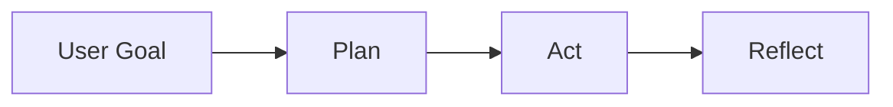

# Agent Atlas

Agent Atlas（智能体学习地图）是一个面向开发者的 AI Agent 技术学习文档站。它用中文系统梳理智能体学习路线、核心概念、工程实践、框架工具和案例拆解，目标是帮助开发者把 Agent 从“概念演示”推进到“可运行、可调试、可评测、可维护”的工程系统。


## Overview

Agent Atlas is a developer-oriented documentation site for learning AI Agent engineering in Chinese. It is built as a real docs product rather than a marketing landing page: the homepage immediately exposes the learning path, concept map, framework entries, case studies, resources, and changelog.

The first content batch covers:

- Agent Loop and the basic mental model of agent systems.
- Tool calling, memory, state, and context engineering.
- Evaluation, traceability, safety boundaries, and regression checks.
- LangGraph and Mastra as representative framework entries.
- A research-agent case study with workflow and data-structure examples.

## Features

- **Docs-first homepage**: no empty hero page; the first screen links directly to learning content.
- **Fumadocs + MDX content system**: documentation lives under `content/docs`.
- **Code highlighting**: MDX code blocks use the Fumadocs/Shiki pipeline.
- **Mermaid diagrams**: homepage and docs support Agent flow diagrams.
- **shadcn/ui components**: consistent cards, badges, sheets, tabs, separators, and tooltips.
- **Light/dark theme**: powered by `next-themes`.
- **Responsive reading**: mobile header, drawer navigation, readable docs layout, and horizontal-safe code blocks.
- **Static build friendly**: docs pages are statically generated through Fumadocs page params.

## Tech Stack

| Layer | Choice |
| --- | --- |
| Framework | Next.js App Router |
| Language | TypeScript |
| Content | Fumadocs + MDX |
| Styling | Tailwind CSS v4 |
| UI | shadcn/ui + lucide-react |
| Code Highlighting | Shiki via Fumadocs MDX |
| Diagrams | Mermaid |
| Theme | next-themes |
| Package Manager | pnpm |

## Getting Started

### Prerequisites

- Node.js 20.9 or newer is recommended for current Next.js versions.
- pnpm 11 or newer.

### Install

```bash
pnpm install
```

### Start Development Server

```bash
pnpm dev
```

Open:

```text
http://localhost:3000
```

If port `3000` is already in use:

```bash
pnpm dev -- -p 3001
```

## Scripts

```bash
pnpm dev              # Start the local dev server
pnpm lint             # Run ESLint
pnpm exec tsc --noEmit # Run TypeScript type checking
pnpm build            # Create a production build
pnpm start            # Start the production server after build
```

## Project Structure

```text
.
├── content/
│   └── docs/                 # Chinese MDX documentation
│       ├── index.mdx
│       ├── roadmap.mdx
│       ├── concepts/
│       ├── practices/
│       ├── frameworks/
│       ├── cases/
│       └── resources/
├── src/
│   ├── app/                  # Next.js App Router pages
│   │   ├── docs/[[...slug]]/ # Fumadocs dynamic docs route
│   │   ├── roadmap/
│   │   ├── concepts/
│   │   ├── practices/
│   │   ├── frameworks/
│   │   ├── cases/
│   │   ├── resources/
│   │   ├── changelog/
│   │   ├── layout.tsx
│   │   └── page.tsx
│   ├── components/           # Site components and shadcn/ui components
│   └── lib/
│       ├── site.ts           # Navigation, roadmap, cards, resources
│       ├── source.ts         # Fumadocs loader
│       └── utils.ts
├── source.config.ts          # Fumadocs MDX collection config
├── next.config.mjs           # Next.js + Fumadocs MDX config
├── components.json           # shadcn/ui config
└── package.json
```

Generated directories such as `.next/`, `.source/`, `node_modules/`, and TypeScript build info files are intentionally ignored.

## Routes

| Route | Purpose |
| --- | --- |
| `/` | Homepage with learning path, concept cards, frameworks, cases, and resources |
| `/roadmap` | Stage-based AI Agent learning roadmap |
| `/concepts` | Core concept index |
| `/practices` | Engineering practice index |
| `/frameworks` | Framework and tooling index |
| `/cases` | Case-study index |
| `/resources` | Resource list |
| `/changelog` | Project and content updates |
| `/docs` | Fumadocs MDX documentation |

## Related Projects

These repositories are personal projects by the same author. They are intentionally presented as related/extended projects rather than part of the Agent Atlas learning path.

| Project | Description | Link |
| --- | --- | --- |
| secbot | Authorized security testing workspace and TypeScript terminal product for security automation scenarios. | [github.com/iammm0/secbot](https://github.com/iammm0/secbot) |
| execgo | Execution-layer project for mapping upper-level agent decisions to reliable, safe, and observable tools/runtime environments. | [github.com/iammm0/execgo](https://github.com/iammm0/execgo) |

Project sites:

- [secbot.site](https://secbot.site)
- [execgo.site](https://execgo.site)

## Content Authoring

Documentation files live in `content/docs`.

Each MDX file should include frontmatter:

```mdx
---
title: Page Title
description: Short page description
---
```

Use `meta.json` files to control sidebar grouping and order:

```json
{
  "title": "核心概念",
  "pages": ["agent-loop", "tools-and-memory"]
}
```

### Code Blocks

````mdx
```ts title="agent-loop.ts" lineNumbers
export async function runAgent(goal: string) {
  return goal;
}
```
````

### Mermaid

````mdx

````

The homepage also uses `src/components/agent-flow-diagram.tsx` for client-side Mermaid rendering.

## Quality Checks

Before pushing changes, run:

```bash
pnpm lint
pnpm exec tsc --noEmit
pnpm build
```

The current project has been verified with:

- ESLint passing.
- TypeScript type checking passing.
- Production build passing.
- Browser verification for desktop and mobile routes.

## Design Principles

- Documentation first, not a marketing page.
- Clear, restrained developer-tool visual style.
- Dense but readable information architecture.
- No large purple gradient backgrounds or decorative hero-only layout.
- Every primary page should expose real learning entry points.

## Roadmap

- Add deeper articles for planning, reflection, observability, and safety.
- Expand framework comparison pages for AutoGen, CrewAI, OpenAI Agents SDK, and Vercel AI SDK.
- Add runnable examples for research agents, code-review agents, and operations agents.
- Add structured resource filtering by topic and difficulty.
- Add search once the content volume grows.

## Contributing

Contributions are welcome once the repository workflow is formalized.

Suggested contribution flow:

1. Create or update MDX content under `content/docs`.
2. Update the corresponding `meta.json` when adding new pages.
3. Reuse existing components and site data from `src/lib/site.ts`.
4. Run lint, type check, and build before opening a pull request.

## License

No license has been selected yet. Until a license file is added, all rights are reserved by the repository owner.
