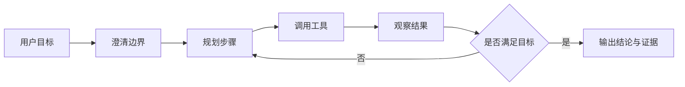

  

# Damn Agent

Damn Agent 是一个中文 AI Agent 工程学习文档站，面向希望系统理解、构建和评估智能体系统的读者。它不把 Agent 当成一个模糊概念或框架宣传词，而是拆成模型基础、Agent Loop、工具调用、记忆与上下文、评测、安全、框架选型、编码 Agent 和真实案例等可学习、可复核、可落地的工程知识。

访问站点：[damnagent.org](https://damnagent.org)

当前版本：**Beta 0.2.0**。内容目录和正文仍在持续完善，部分页面会继续扩写、校对和补充引用。

## 适合谁阅读

- 想从零建立 AI Agent 工程知识框架的中文读者。
- 已经会调用大模型 API，但还不清楚 Agent 和普通 LLM 应用边界的人。
- 正在学习 Claude Code、Codex、Cursor、OpenHands、Aider 等编码 Agent 的使用者。
- 需要比较 LangGraph、Mastra、AutoGen、CrewAI、OpenAI Agents SDK、Vercel AI SDK 等框架的工程实践者。
- 想把 Agent 从演示推进到可调试、可评测、可维护系统的团队成员。

## 你会学到什么

- **模型基础**：LLM 能力边界、Token 与上下文窗口、推理参数、结构化输出和模型选型。
- **Agent 基础**：Agent Loop、ReAct、工具调用、记忆、状态、规划、反思和多 Agent 协作。
- **工程实践**：上下文工程、RAG、评测、可观测性、安全权限、人类接管和 Harness 工程。
- **语言与生态**：TypeScript、Python、Go、Rust 在 Agent 工程中的不同位置。
- **框架与工具**：主流 Agent 框架、开源智能体项目和编码 Agent 产品的对比与拆解。
- **案例与资料**：研究型 Agent、代码 Agent、Claude Code 源码分析，以及可下载的学习资料。

## 推荐阅读路线

如果你刚开始学习，可以按下面顺序阅读：

1. [模型基础知识](https://damnagent.org/docs/model-basics)：先理解 LLM 的能力、限制和上下文成本。
2. [智能体基础](https://damnagent.org/docs/concepts/agentic-basics)：建立 Agent、工具、记忆、规划和多 Agent 的基础概念。
3. [Agent Loop](https://damnagent.org/docs/concepts/agent-loop)：理解观察、规划、执行、检查这条循环为什么是 Agent 的核心。
4. [工具调用与记忆](https://damnagent.org/docs/concepts/tools-and-memory)：区分工具接口、上下文、长期记忆和运行状态。
5. [Harness 工程构件](https://damnagent.org/docs/practices/harness-engineering)：把 Agent 放进 Session、Sandbox、权限和恢复机制中理解。
6. [框架选型总览](https://damnagent.org/docs/frameworks/framework-selection)：再去比较不同框架适合解决什么问题。
7. [编码 Agent](https://damnagent.org/docs/coding-agents)：最后观察真实产品如何组织任务、工具、上下文和人类协作。

如果你已经有明确目标，可以直接从下面入口开始：

| 目标 | 建议入口 |
| --- | --- |
| 建立 Agent 概念体系 | [智能体基础](https://damnagent.org/docs/concepts/agentic-basics) |
| 理解上下文与成本 | [Token 与上下文窗口](https://damnagent.org/docs/model-basics/tokens-and-context) |
| 学工具调用与结构化输出 | [结构化输出与工具调用](https://damnagent.org/docs/model-basics/structured-output) |
| 设计可评测的 Agent | [评测与回归检查](https://damnagent.org/docs/practices/evaluation) |
| 做知识库和 RAG | [RAG 与知识系统](https://damnagent.org/docs/practices/rag-and-knowledge) |
| 比较 Agent 框架 | [框架选型总览](https://damnagent.org/docs/frameworks/framework-selection) |
| 学编码 Agent | [Claude Code](https://damnagent.org/docs/coding-agents/claude-code) / [Codex](https://damnagent.org/docs/coding-agents/codex) / [Cursor](https://damnagent.org/docs/coding-agents/cursor) |
| 看真实案例 | [案例拆解](https://damnagent.org/docs/cases) |
| 找延伸资料 | [资源总览](https://damnagent.org/docs/resources/overview) |

## 内容板块

| 板块 | 内容 |
| --- | --- |
| [模型基础](https://damnagent.org/docs/model-basics) | LLM 概览、Transformer、Token、上下文、结构化输出、模型选型 |
| [核心概念](https://damnagent.org/docs/concepts) | Agent Loop、工具、记忆、规划、反思、多 Agent |
| [编程语言](https://damnagent.org/docs/programming-languages) | TypeScript、Python、Go、Rust 与 Agent 工程生态 |
| [工程实践](https://damnagent.org/docs/practices) | 上下文工程、RAG、评测、可观测性、安全治理、Harness 工程 |
| [框架工具](https://damnagent.org/docs/frameworks) | LangGraph、Mastra、AutoGen、CrewAI、OpenAI Agents SDK、Vercel AI SDK |
| [开源智能体](https://damnagent.org/docs/open-source-agents) | OpenHands、Open-SWE、SWE-agent、Aider、browser-use 等项目拆解 |
| [编码 Agent](https://damnagent.org/docs/coding-agents) | Claude Code、Codex、Cursor 等产品形态与工程机制 |
| [案例](https://damnagent.org/docs/cases) | 研究型 Agent、代码 Agent、Claude Code 源码分析 |
| [资源](https://damnagent.org/docs/resources/overview) | 书籍、PDF、论文、资料映射和引用规则 |

## 一个最小心智模型

Agent 不是“让模型多想一会儿”这么简单。一个可维护的 Agent 通常需要明确目标、拆分任务、选择工具、记录状态、观察结果、判断停止条件，并在高风险动作前引入权限控制或人工接管。

## 当前资源

站内已收录并维护以下学习资料索引：

- [《智能体设计模式》](https://damnagent.org/docs/resources/agentic-design-patterns)
- [《Claude Code Harness Engineering：从入门到实战》](https://damnagent.org/docs/resources/harness-engineering-book)
- [《Demystifying Claude Code v1.8》](https://damnagent.org/docs/resources/demystifying-claude-code)

资源页会尽量保留来源、版本、页码、下载入口和站内使用方式，方便读者回到原文复核。

## 参与共建

Damn Agent 仍处在 Beta 阶段，欢迎补充更清晰的定义、更可复核的资料来源、更贴近工程实践的案例，以及对现有页面的勘误建议。

内容贡献优先关注：

- 概念是否讲清楚边界，而不是堆术语。
- 工程建议是否能落到流程、代码、检查清单或案例。
- 引用是否能追溯到论文、书籍、官方文档、仓库或具体版本。
- 高风险主题是否明确说明限制、权限、审计和人工接管。

协作者信息见：[维护者](https://damnagent.org/docs/maintainers)。

## 相关项目

这些项目与 Damn Agent 的学习主题有关，但不是阅读本站的前置条件：

| 项目 | 说明 |
| --- | --- |
| [secbot](https://github.com/iammm0/secbot) | 面向授权安全测试场景的 Agent 工作台和终端产品。 |
| [execgo](https://github.com/iammm0/execgo) | 面向工具执行层、运行时和可观测性的工程项目。 |

项目站点：

- [secbot.site](https://secbot.site)
- [execgo.site](https://execgo.site)

## 许可说明

当前仓库尚未选择开源许可证。在正式添加许可证文件前，所有权利由仓库所有者保留。
