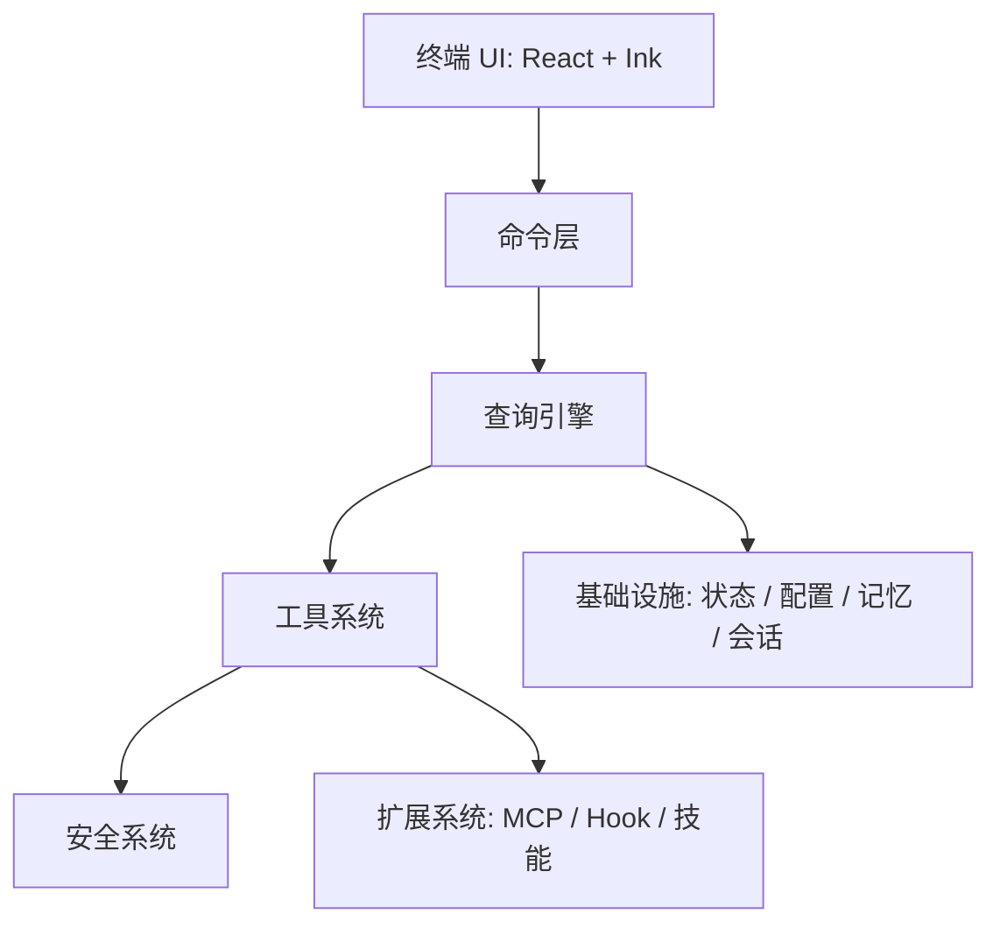

这篇案例不是复刻 Claude Code 的源码，而是把《Demystifying Claude Code v1.8》和《Claude Code Harness Engineering》中的结构化观察整理成可迁移的工程判断：一个代码 Agent 如何从 CLI 产品变成可恢复、可扩展、可审计的 Harness 系统。

## 架构总览

《Demystifying Claude Code v1.8》把 Claude Code 总结为多层结构：React + Ink 终端 UI、斜杠命令、查询引擎、工具系统、安全系统、扩展系统和基础设施。其核心并不是某个神奇 prompt，而是围绕 Agent Loop 组织出来的工程系统。来源：《Demystifying Claude Code v1.8》，pp. 183-184。

## 查询引擎：Agent Loop 的中心

《Demystifying Claude Code v1.8》将查询引擎称为 Claude Code 的“大脑中枢”，核心由消息处理、API 调用、流式事件处理、工具执行、重试、token 预算和 stop reason 共同组成。来源：《Demystifying Claude Code v1.8》，pp. 62-69。

> 引句：“思考 → 行动 → 观察 → 再思考。” 来源：《Demystifying Claude Code v1.8》，p. 69。

一次用户输入可能触发多轮循环：模型先回复并请求工具，工具结果再作为新消息返回给模型，直到没有工具调用或 stop reason 表示结束。这个设计让代码 Agent 可以读文件、改文件、跑测试、根据错误继续修改，而不是一次性给出建议。来源：《Demystifying Claude Code v1.8》，pp. 62-69。

## 流式响应：体验和执行可以重叠

Claude Code 使用流式 API 处理文字、工具名和工具参数的增量事件。这样用户能看到实时输出，系统也能在工具名出现后提前准备权限检查或执行准备。来源：《Demystifying Claude Code v1.8》，pp. 64-65；pp. 155-157。

这个细节说明：Agent 产品的性能不只来自模型速度，也来自工程调度。把“等待完整回答后再做事”改成“流式过程中并行准备”，可以减少感知延迟和真实延迟。来源：《Demystifying Claude Code v1.8》，pp. 154-157。

## 工具系统：统一接口是扩展的入口

Claude Code 的工具系统采用统一接口：工具要有名称、输入 schema、执行函数、权限检查、安全属性和展示逻辑。所有工具都会经过查找、输入验证、前置 Hook、权限检查、执行、后置 Hook、格式化结果，再返回给模型。来源：《Demystifying Claude Code v1.8》，pp. 83-87。

| 设计点 | 源码启示 | 可迁移原则 |
| --- | --- | --- |
| `inputSchema` | 工具参数先被结构化描述和验证 | 不相信模型自然语言参数 |
| `isReadOnly` | 影响权限、并发和受限模式 | 把副作用显式建模 |
| `isConcurrencySafe` | 只读工具可并行，写工具串行 | 并发策略来自工具属性 |
| 稳定排序 | 工具定义顺序稳定以提高缓存命中率 | 性能优化要服务提示缓存 |
| ToolSearch | 低频工具延迟加载 | 不把全部工具定义塞进上下文 |

来源：《Demystifying Claude Code v1.8》，pp. 83-87；pp. 155-157。

## Bash 工具：能力越强，边界越厚

Bash 是最强也最危险的工具。书中指出，真正执行命令的代码很短，但围绕它的安全检测、权限规则、沙箱、输出处理、超时和后台执行非常复杂。来源：《Demystifying Claude Code v1.8》，pp. 88-94。

Bash 防线可以拆成几层：

1. 危险模式检测：例如删除根目录、格式化磁盘、读取密钥等。
2. 命令语义分析：不仅正则匹配，还分析管道、可执行文件、参数和路径。
3. 权限规则：deny、ask、allow 分层，且拒绝优先。
4. 沙箱：限制命令可访问的文件系统、网络和系统能力。
5. 输出治理：大输出截断、流式进度、超时和后台执行。

来源：《Demystifying Claude Code v1.8》，pp. 89-94。

这对任何 Agent 工具系统都有启发：不要把“能执行 shell”当成一个普通函数。它是一个高风险执行面，必须有安全策略、审计和用户确认。来源：《Demystifying Claude Code v1.8》，pp. 88-94；《智能体设计模式》，pp. 193-198。

## 文件工具：为什么不用 Bash 读写文件

Claude Code 把 Read、Write、Edit 拆成专用工具，而不是让模型通过 Bash 自己 `cat`、`echo` 或 `sed`。原因是专用工具能带来更细的权限控制、更好的安全检查和更好的用户体验，例如路径验证、diff 展示、先读后写要求和历史追踪。来源：《Demystifying Claude Code v1.8》，pp. 95-101。

这背后的原则是：高频、可结构化、可审计的动作应该变成专用工具；Bash 留给难以预先封装的低频动作。来源：《Demystifying Claude Code v1.8》，pp. 95-106。

## Agent 工具：子智能体是上下文隔离

Claude Code 的 Agent 工具允许主 Agent 创建子 Agent。子 Agent 有自己的上下文窗口、任务描述和工具集，完成后把结果报告给主 Agent。这样可以把大型任务拆给多个上下文相互隔离的执行者。来源：《Demystifying Claude Code v1.8》，pp. 107-112。

但子 Agent 不是免费的并行魔法。它们可能冲突、消耗更多 token、缺少主对话历史。适用场景是大规模、可拆分、需要不同专长的任务；不适合简单单文件修改或强耦合任务。来源：《Demystifying Claude Code v1.8》，pp. 150-154。

## Coordinator + Swarm：多 Agent 的工程化形态

《Claude Code Harness Engineering》将 Claude Code 的多 Agent 实践拆成 Coordinator 和 Swarm：Coordinator 负责分析、计划、分配和综合，Worker 负责具体执行。Swarm 负责进程管理、通信、权限同步、共享文件访问和崩溃恢复。来源：《Claude Code Harness Engineering：从入门到实战》，pp. 107-116。

关键约束有三条：

- 结果综合由 Coordinator 做，不让 Worker 做最终决策。
- 读操作可以并行，写操作要串行或隔离。
- 给 Worker 的 prompt 必须自包含。

来源：《Claude Code Harness Engineering：从入门到实战》，pp. 108-116。

## Hook：开放-封闭原则在 Agent 里的落点

Hook 让用户在工具执行前后、消息提交、会话结束等节点挂脚本。它可以阻止操作、修改输入、添加上下文或做后处理。来源：《Demystifying Claude Code v1.8》，pp. 134-140。

这是一种比权限规则更灵活的扩展点：权限规则适合简单 allow/deny/ask，Hook 适合业务逻辑，比如 `git push` 前运行测试、文件编辑后格式化、禁止修改锁文件。来源：《Demystifying Claude Code v1.8》，pp. 136-140。

## MCP：外部能力的标准插口

Claude Code 用 MCP 连接外部工具。MCP 工具被发现、命名、加入工具池，并同样受权限系统管控。这个设计把“内置工具”和“外部工具”放进统一执行链路里。来源：《Demystifying Claude Code v1.8》，pp. 128-133。

MCP 的价值不只是多接几个服务，而是工具层标准化：工具提供者实现 Server，Agent 实现 Client，双方通过协议交互。来源：《智能体设计模式》，pp. 109-111；《Claude Code Harness Engineering：从入门到实战》，pp. 152-153。

## 上下文和性能：省 token 也是架构能力

Claude Code 的上下文管理包含 token 预算检查、估算与精算、自动压缩、提示缓存、工具定义稳定排序、文件缓存、延迟加载和结果截断。来源：《Demystifying Claude Code v1.8》，pp. 66-69；pp. 154-157。

这说明 Agent 系统的性能优化不是单点技巧，而是贯穿模型调用、工具定义、上下文组织和 UI 反馈的整体设计。来源：《Demystifying Claude Code v1.8》，pp. 154-180；《Claude Code Harness Engineering：从入门到实战》，pp. 88-95。

## 可迁移的工程结论

| 结论 | Claude Code 证据 | 迁移到自己的项目 |
| --- | --- | --- |
| Agent Loop 是核心控制结构 | 查询引擎围绕 API、工具和 stop reason 循环 | 先写可观察 loop，再引框架 |
| 工具必须有统一接口 | 40+ 工具共享 schema、权限和执行链 | 用 registry 管理工具，不散落调用 |
| 安全默认保守 | 工具并发和读写属性默认保守 | 默认拒绝高风险动作 |
| 上下文是预算 | 压缩、缓存、延迟加载、截断 | 设计 token 策略，而不是等爆窗 |
| 多 Agent 需要协调者 | Coordinator 分配和综合 | 不做自由混战式多 Agent |
| 扩展点要分层 | 配置、技能、插件、MCP、Hook | 给不同水平用户不同扩展方式 |

## 反查资料

- [下载《Demystifying Claude Code v1.8》](/resources/books/demystifying-claude-code-v1.8.pdf)
- [下载《Claude Code Harness Engineering：从入门到实战》](/resources/books/harness-engineering-book.pdf)
- [下载《智能体设计模式》](/resources/books/agentic-design-patterns-chinese.pdf)
