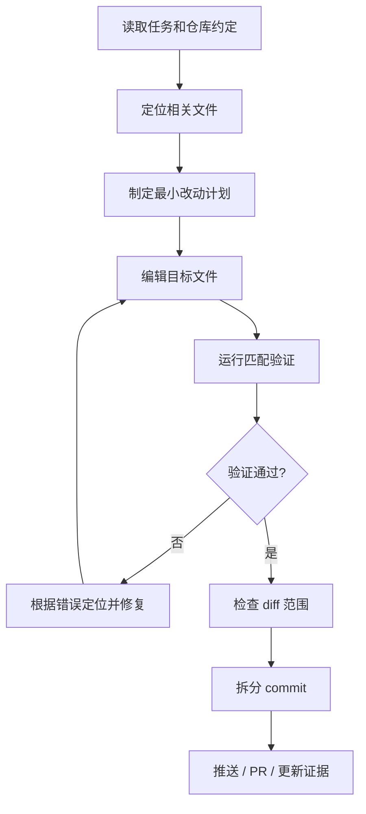

这个页面用于承载 Coding Agent 案例。它不是框架 API 页面，而是从真实工程流程看代码代理如何工作。

## 建设边界

- 仓库理解：README、AGENTS、package scripts、测试入口、代码风格。
- 搜索和定位：文件树、符号、全文检索、调用链、错误日志。
- 编辑和验证：patch、格式化、lint、typecheck、test、build、browser check。
- Git 协作：暂存目标文件、commit 拆分、PR 描述、review 修复。
- 失败模式：覆盖用户改动、过度重构、测试漏跑、提交夹带噪音。

## 执行链路



Coding Agent 的核心不是“写代码”，而是把仓库理解、编辑、验证、Git 协作和交付证据放进同一条闭环。

## 最小状态结构

```ts title="coding-agent-state.ts" lineNumbers
export type CodingAgentState = {
  goal: string;
  constraints: string[];
  touchedFiles: string[];
  commandsRun: Array<{
    command: string;
    exitCode: number;
    purpose: string;
  }>;
  commits: Array<{
    hash: string;
    message: string;
    files: string[];
  }>;
  openRisks: string[];
};
```

这份状态不是给模型好看的，而是为了在失败、恢复、review 或交接时能快速知道发生了什么。

## 提交前检查清单

- 是否读取了仓库约定，例如 `AGENTS.md`、README、package scripts。
- 是否只改了任务相关文件。
- 是否保留了用户已有未提交改动。
- 是否运行了与风险匹配的检查。
- 是否核对 `git diff --cached --name-status`。
- 是否用中文 commit message，并按功能点拆分。
- 是否推送并更新 issue、PR 或任务证据。

## Commit 拆分模板

| 改动类型 | 提交前缀 | 例子 |
| --- | --- | --- |
| 文档内容 | `docs:` | `docs: 补充开源智能体文档` |
| Bug 修复 | `fix:` | `fix: 修复维护者同步时间构建错误` |
| 功能新增 | `feat:` | `feat: 添加任务轨迹回放视图` |
| 重构 | `refactor:` | `refactor: 拆分工具执行器` |
| 工程维护 | `chore:` | `chore: 更新依赖锁文件` |

一个 commit 应该能用一句话说明“为什么这组文件属于同一个功能点”。

## PR 描述模板

```md
## 变更

- 补充了哪些页面或模块。
- 修复了哪个具体问题。

## 验证

- pnpm lint
- pnpm build
- 其他测试或截图

## 风险

- 哪些内容仍需人工复核。
- 哪些外部资料可能随时间变化。
```

## 失败模式

| 失败模式 | 处理方式 |
| --- | --- |
| 覆盖用户改动 | 提交前检查工作区和 diff，只暂存目标文件 |
| 过度重构 | 控制改动范围，保留原结构 |
| 测试漏跑 | 按风险选择 lint、typecheck、test、build |
| 提交夹带噪音 | 使用显式路径暂存，核对 cached diff |
| 构建环境缺 token | 明确说明环境变量和复现命令 |

## 延伸阅读

- [编码 Agent](/docs/coding-agents)
- [OpenHands](/docs/open-source-agents/openhands)
- [SWE-agent](/docs/open-source-agents/swe-agent)
- [评测与回归](/docs/practices/evaluation)

## 参考来源

- [OpenHands Repository](https://github.com/OpenHands/OpenHands)：仓库理解、任务执行、代码修改和验证链路参考。
- [SWE-agent Documentation](https://swe-agent.com/latest/)：围绕真实 GitHub issue 的修复与评测流程。
- [aider Documentation](https://aider.chat/docs/)：终端内结对编程、Git diff 和提交工作流参考。
