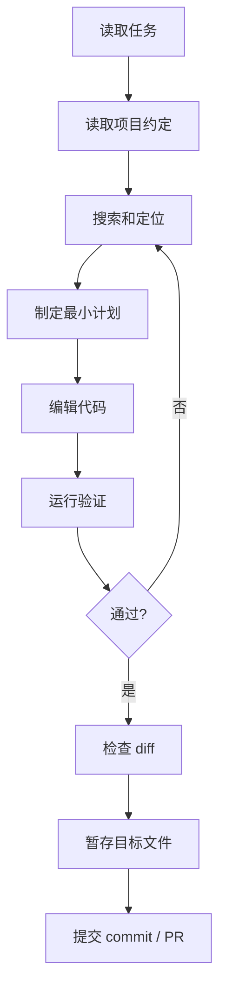

Coding Agent 不是“会写代码的聊天机器人”，而是围绕真实仓库执行一条可审计的工程链路：理解任务、读取项目约定、定位代码、做最小修改、运行验证、检查 diff、提交 commit，并把风险说明清楚。

这个页面不介绍某个具体产品 API，而是拆解一个通用代码代理在真实工程里的工作方式。

## 任务边界

Coding Agent 适合处理：

- 小到中等规模的 bug 修复、文档补全、测试补齐和组件调整。
- 有明确成功标准的重构，例如替换 API、抽出公共函数、修复类型错误。
- 可以通过 lint、typecheck、test、build 或浏览器验证的改动。
- 需要跨文件搜索，但不需要大规模产品决策的任务。

不适合直接放手处理：

- 需求边界不清、成功标准需要业务负责人判断的改动。
- 高风险数据库迁移、生产运维、支付、权限和安全策略改动。
- 没有测试、没有可复现环境、没有项目约定的大型重构。
- 需要访问敏感凭证或私有用户数据的任务。

## 执行链路



这条链路的关键不是“每一步都必须线性执行”，而是每次修改都要能解释来源、范围和验证结果。

## 1. 仓库理解

进入仓库后，Coding Agent 应先读能改变行为边界的文件：

| 文件或信息 | 作用 |
| --- | --- |
| README / docs | 了解项目定位和运行方式 |
| AGENTS.md / CLAUDE.md / CONTRIBUTING | 读取代理协作约定和提交规则 |
| package scripts / Makefile / task runner | 找到 lint、test、build、dev 命令 |
| tsconfig、eslint、formatter 配置 | 了解语言和风格约束 |
| 目录结构 | 判断代码、文档、测试、配置的边界 |
| git status | 避免覆盖用户未提交改动 |

这一步的目标不是读完整个仓库，而是知道“应该怎么动”和“哪些地方不能乱动”。

## 2. 搜索和定位

好的 Coding Agent 会先搜索再编辑。常见搜索顺序：

1. 用文件名、路由名、组件名、错误信息定位候选文件。
2. 用全文搜索找同类实现和测试。
3. 读取调用方和被调用方，确认修改影响范围。
4. 如果有报错，先找最小复现路径。

搜索工具应该优先用 `rg`、符号索引或语言服务器，而不是让模型凭文件名猜。对大型仓库，先看目录和入口，再逐步打开相关文件，避免上下文被无关文件撑满。

## 3. 计划和最小修改

计划不是为了写漂亮流程，而是为了限制修改范围。一个有效计划应该包含：

- 要改哪些文件。
- 为什么这些文件和任务相关。
- 不改哪些看似相关但超出范围的地方。
- 如何验证。
- 如果验证失败，回到哪一步。

Coding Agent 最常见的问题是过度重构。用户要求修一个文案错字，Agent 顺手重排组件、升级依赖、改目录结构，这会增加 review 成本，也更容易引入回归。

## 4. 编辑策略

编辑时遵循三个原则：

| 原则 | 说明 |
| --- | --- |
| 小步修改 | 一次只解决当前目标，不夹带无关重构 |
| 尊重局部风格 | 先模仿同文件已有写法，再考虑抽象 |
| 可回滚 | diff 能看清意图，失败后容易撤销 |

对于跨文件改动，先改核心逻辑，再改调用方，最后补测试或文档。不要先做格式化全仓库这种高噪音操作。

## 5. 验证

验证强度取决于改动风险：

| 改动 | 最低验证 |
| --- | --- |
| 纯文档 / MDX | lint 或构建相关检查 |
| TypeScript 类型和逻辑 | typecheck、相关测试 |
| UI 组件 | lint、typecheck、浏览器截图或交互检查 |
| 路由 / 构建配置 | build |
| 数据库 / 权限 / 部署 | dry run、测试环境、人工确认 |

验证失败时，不要只重复运行同一命令。要保存错误信息，定位失败层：语法、类型、测试断言、环境缺失、依赖问题，还是原需求判断错误。

## 6. Diff 审查

提交前，Coding Agent 应自己审一遍 diff：

- 是否只改了任务相关文件。
- 是否有格式化噪音、临时日志、调试文件。
- 是否覆盖了用户已有改动。
- 是否遗漏测试、文档或索引文件。
- 是否引入了新的外部依赖。
- 是否有敏感信息进入代码或日志。

这一步相当于给自己做 code review。很多低级问题不需要等人类 reviewer 发现。

## 7. Git 协作

工程型 Coding Agent 必须尊重 Git 边界：

1. 创建或切换到任务分支。
2. 修改前检查 `git status`。
3. 提交前只暂存本次任务文件。
4. 用 `git diff --cached --name-status` 复核暂存范围。
5. 按功能拆分 commit。
6. commit message 说明变更类别和目标。

如果工作区已有用户改动，不要直接回滚。先判断是否相关；相关就基于它继续做，不相关就避开。

## Commit 拆分示例

一次同时补文档和修 UI 时，不要混成一个提交：

```text
docs: 补齐 Agent 评测与回归文档
fix: 修复文档卡片在移动端溢出
```

一个 commit 应该能回答一个问题：“这次提交完成了什么独立目标？”

## PR 描述模板

```md title="pull-request.md"
## 背景

说明这次改动解决什么问题。

## 变更

- 补齐 Agent 评测页面正文。
- 增加发布前检查清单。

## 验证

- pnpm lint
- pnpm exec tsc --noEmit

## 风险

- 只改文档，无运行时风险。
```

PR 描述不需要复述每一行代码，但要让 reviewer 知道改动范围、验证方式和剩余风险。

## 失败模式

| 失败模式 | 表现 | 防护 |
| --- | --- | --- |
| 覆盖用户改动 | 直接 reset、checkout 或重写同一文件 | 修改前后都看 git status 和 diff |
| 过度重构 | 为小任务改大量无关结构 | 计划里写明不做什么 |
| 搜索不足 | 改了一个入口，漏掉同类实现 | 用 rg 找调用方和同类代码 |
| 验证不足 | 只靠模型判断“应该没问题” | 至少跑匹配风险的命令 |
| 提交夹带 | 把临时文件、无关格式化一起 commit | 暂存后检查 name-status |
| 解释不清 | final 或 PR 没写验证和风险 | 记录命令结果和未验证项 |

## 最小工作流

如果只能记一版流程，就按这个来：

1. 读任务和项目约定。
2. 看 `git status`。
3. 用搜索定位相关文件。
4. 小步编辑。
5. 跑与风险匹配的验证。
6. 查 `git diff`。
7. 暂存目标文件并复核。
8. 按功能提交。
9. 汇报改动、验证和风险。

## 延伸阅读

- [Harness 工程构件](/docs/practices/harness-engineering)：Session、Sandbox 和工具链边界。
- [上下文工程](/docs/practices/context-engineering)：如何给代码任务组织上下文。
- [评测与回归](/docs/practices/evaluation)：如何把代码任务变成可重复验证样例。
- [Codex](/docs/coding-agents/codex)：OpenAI 编码 Agent 的产品形态与工程特点。
