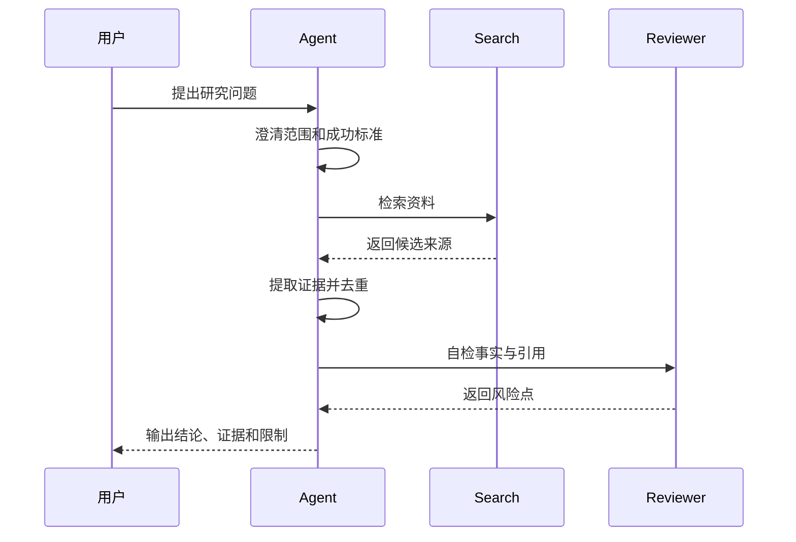
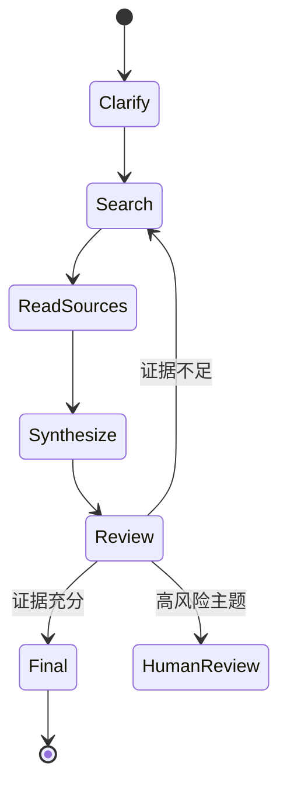

研究型 Agent 的难点不是“能不能搜索”，而是能不能持续保持问题边界、引用可靠来源，并区分事实、推断和建议。

## 流程拆解



## 关键设计

- 检索 query 要可记录。
- 来源要保留标题、URL、发布时间和访问时间。
- 摘要必须区分原文事实和 Agent 推断。
- 对不确定结论要显式标注。
- 高风险主题需要人工复核。

## 最小数据结构

```ts title="research-state.ts" lineNumbers
export type SourceEvidence = {
  title: string;
  url: string;
  quote?: string;
  summary: string;
  confidence: "low" | "medium" | "high";
};

export type ResearchState = {
  question: string;
  scope: string[];
  sources: SourceEvidence[];
  openQuestions: string[];
};
```

## 评测重点

研究型 Agent 的评测要特别关注编造来源、过度推断、遗漏反例和引用过期。最终答案看起来流畅并不代表它可信。

## 状态机视角



研究型 Agent 最容易失败在两处：检索阶段拿不到好来源，综合阶段把来源摘要误写成事实。因此状态机里必须允许回到检索，也必须允许转人工复核。

## 证据分层

| 层级 | 内容 | 是否能直接当结论 |
| --- | --- | --- |
| 原始来源 | 论文、官方文档、公告、数据表、原网页 | 可以作为证据，但要引用具体位置 |
| 检索摘要 | 搜索引擎 snippet、网页摘要、RAG chunk 摘要 | 不能直接当事实，需要回源 |
| Agent 推断 | 比较、归纳、建议、风险判断 | 需要标注为推断 |
| 最终结论 | 面向用户的回答或报告 | 必须能追溯到来源和推断链 |

这能防止 Agent 把“搜索结果里看起来像事实的句子”直接写成结论。

## 失败模式

| 失败模式 | 表现 | 应对 |
| --- | --- | --- |
| 引用幻觉 | URL 不存在或不支持结论 | 链接校验、引用回源、限制无来源结论 |
| 来源过期 | 使用旧版本文档或旧价格政策 | 记录访问时间，优先官方当前文档 |
| 过度综合 | 把多个弱信号合成强结论 | 标注置信度和反例 |
| 检索偏置 | 只找到支持某观点的资料 | 设计反向 query，要求寻找反例 |
| 结论不可复核 | 最终报告没有证据定位 | 输出时带来源和引用说明 |

## 交付清单

- 研究问题和范围。
- 检索 query 列表。
- 来源表：标题、URL、时间、可信度、用途。
- 证据摘要：事实、推断、未解决问题分开。
- 最终报告：结论、限制、引用和建议。
- 回放数据：工具调用、失败检索、人工复核记录。

## 延伸阅读

- [RAG 与知识系统](/docs/practices/rag-and-knowledge)
- [可观测性与轨迹回放](/docs/practices/observability)
- [GPT Researcher](/docs/open-source-agents/gpt-researcher)
