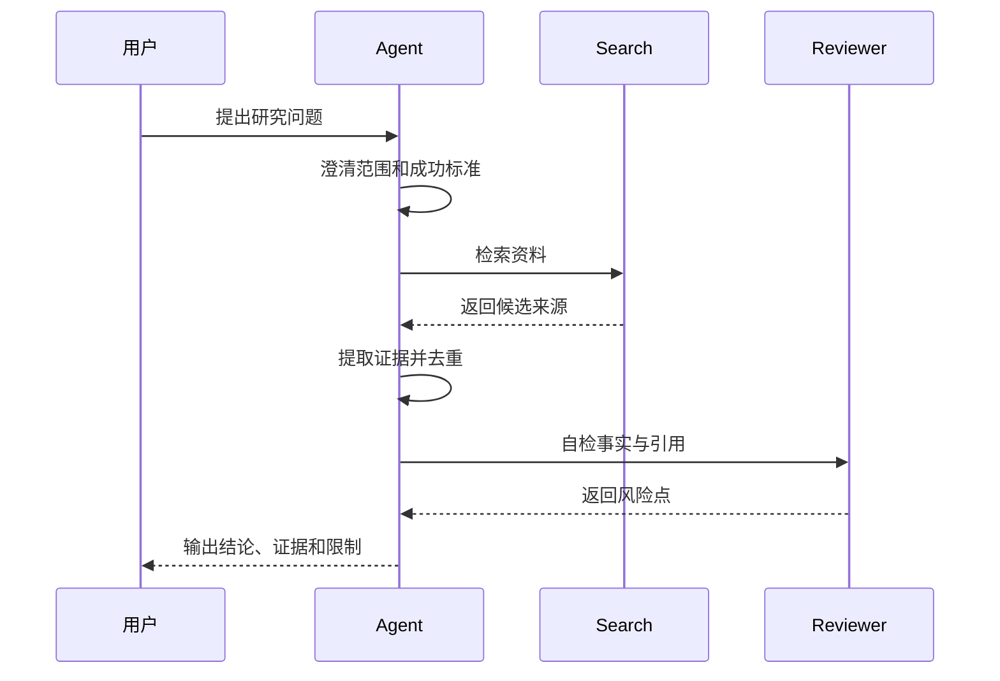

研究型 Agent 的难点不是“能不能搜索”，而是能不能持续保持问题边界、引用可靠来源，并区分事实、推断和建议。

## 流程拆解



## 关键设计

- 检索 query 要可记录。
- 来源要保留标题、URL、发布时间和访问时间。
- 摘要必须区分原文事实和 Agent 推断。
- 对不确定结论要显式标注。
- 高风险主题需要人工复核。

## 最小数据结构

```ts title="research-state.ts" lineNumbers
export type SourceEvidence = {
  title: string;
  url: string;
  quote?: string;
  summary: string;
  confidence: "low" | "medium" | "high";
};

export type ResearchState = {
  question: string;
  scope: string[];
  sources: SourceEvidence[];
  openQuestions: string[];
};
```

## 评测重点

研究型 Agent 的评测要特别关注编造来源、过度推断、遗漏反例和引用过期。最终答案看起来流畅并不代表它可信。
