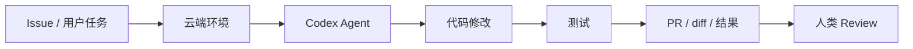

Codex 是 OpenAI 面向软件开发场景的编码 Agent 产品线。它从早期的代码模型能力，演进为可独立使用的 Agent 形态，覆盖终端 CLI、IDE 扩展和云端异步执行等多种入口。

## 基础信息

| 字段 | 信息 |
| --- | --- |
| 厂商 | OpenAI |
| 官方文档 | [Codex Documentation](https://developers.openai.com/codex/) |
| 主要形态 | CLI、IDE 扩展（如 VS Code、Cursor 等生态）、云端 Agent 任务 |
| 典型用户 | 希望用 OpenAI 模型做代码理解、修改、测试和 PR 的开发者 |

## 一句话定位

Codex 适合作为「多入口、可云端 offload 的编码 Agent」样本：同一套 Agent 能力既能在本地终端交互，也能把长任务放到云端沙箱异步执行。

## 产品形态

- **Codex CLI**：在终端里以 Agent 方式操作本地或关联网页上下文，适合日常开发流。
- **IDE 扩展**：嵌入 VS Code、Cursor 等编辑器，把 Agent 放进现有 IDE 工作流。
- **云端 Codex**：在隔离环境中异步执行更长的开发任务，适合 issue 修复、测试和 PR 类工作。
- **多模态上下文**：除代码文件外，还可结合截图、设计稿等输入（以官方当前能力为准）。
- **GitHub 集成**：围绕 issue、PR 和代码协作场景组织任务（能力随产品更新变化）。

## 值得关注的工程点

| 主题 | 为什么重要 |
| --- | --- |
| 本地 vs 云端 | 交互延迟、环境隔离和任务时长如何分工 |
| 动作空间 | 读改文件、跑测试、开浏览器、提交变更的边界 |
| 任务异步化 | 长任务的状态跟踪、通知和结果回收 |
| 模型路由 | 不同步骤是否使用不同能力层级模型 |
| 企业边界 | 团队权限、代码访问和审计要求 |

## 优势与边界

**适合：**

- 已深度使用 OpenAI 生态、希望统一模型与 Agent 工作流的团队。
- 需要把长任务 offload 到云端沙箱的场景。
- 想在 IDE 内继续使用熟悉编辑器，而不是切到独立终端产品。

**注意：**

- CLI、IDE 插件和云端 Agent 可能是不同产品层，功能和计费需分别核对。
- 云端执行涉及代码出境、密钥和仓库访问策略，上线前要做安全评审。
- 与 Claude Code、Cursor 相比，扩展协议和 Hook 机制各不相同，不宜假设接口一致。

## 与 Claude Code、Cursor 的对比维度

| 维度 | Codex |
| --- | --- |
| 主战场 | CLI + IDE 插件 + 云端 |
| 长任务 | 云端异步 Agent 较突出 |
| 生态 | OpenAI 模型与 ChatGPT 体系 |
| 本地深度 | 依赖具体入口（CLI/插件） |

## 延伸阅读

- [Coding Agent 工程案例](/docs/cases/coding-agent)：通用代码 Agent 工作流边界
- [Harness 工程构件](/docs/practices/harness-engineering)：云端/本地执行拆分思路
- [开源智能体 · Open SWE](/docs/open-source-agents/open-swe)：异步云端 coding agent 开源对照

## 三种入口的分工

| 入口 | 适合 | 关键边界 |
| --- | --- | --- |
| CLI | 本地仓库即时协作、命令验证、快速修改 | 文件系统、Shell、未提交改动、用户确认 |
| IDE 扩展 | 编辑器内上下文、打开文件、diff 和局部修改 | IDE 状态、项目规则、用户正在编辑的内容 |
| 云端任务 | 长任务、issue 修复、测试、PR 草稿 | 仓库访问、沙箱、密钥、异步状态和审计 |

同一个“Codex”名称可能覆盖不同入口。写文档或设计流程时，应明确说的是 CLI、IDE 还是云端任务，避免把能力混在一起。

## 典型云端任务流

云端 coding agent 的价值在于 offload 长任务，但它不能替代 review。最终交付物仍应落到 diff、测试结果、commit 或 PR 上。

## 工程关注点

- 本地和云端是否使用同一套项目规则，例如 `AGENTS.md`。
- 云端环境如何获得依赖、测试命令、密钥和仓库权限。
- 任务状态如何通知用户：排队、执行中、需要输入、失败、完成。
- 结果如何回到团队协作对象：diff、commit、PR、评论、检查结果。
- 高风险动作是否默认需要人工确认，例如推送、部署、删除文件。

## 使用边界

- CLI 适合快速、小步、可交互任务。
- IDE 扩展适合和当前编辑上下文结合的任务。
- 云端任务适合长耗时、可隔离、能用 PR review 收口的任务。
- 高敏仓库、私有依赖、生产凭据和客户数据需要单独做访问策略。

## 官方来源

- [Codex Documentation](https://developers.openai.com/codex/)
- [Codex CLI Documentation](https://developers.openai.com/codex/cli)
- [Codex Cloud Tasks Documentation](https://developers.openai.com/codex/cloud)
