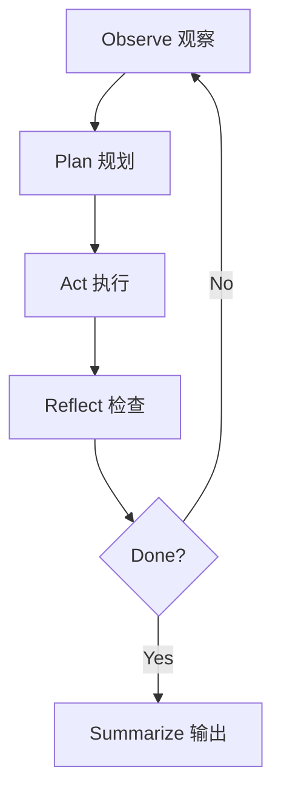
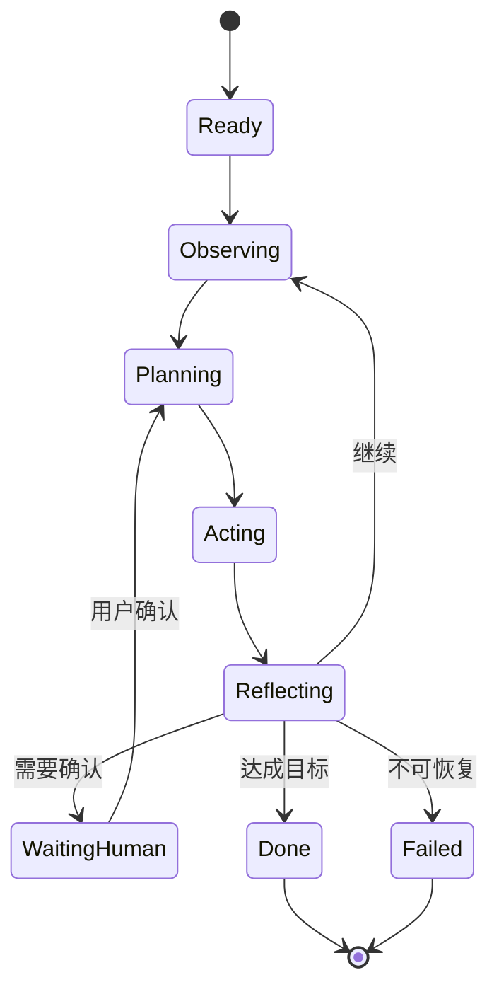

Agent Loop 描述智能体如何从目标出发，不断观察环境、规划动作、调用工具、检查结果，直到完成任务或触发退出条件。

## 为什么 Loop 重要

单次 LLM 调用通常是输入到输出。Agent 则需要在多步任务里不断修正自己：



## Loop 的必要字段

一个可调试的 loop 至少需要记录：

- `goal`：用户目标和成功标准。
- `state`：当前任务状态。
- `actions`：每一步工具调用。
- `observations`：工具返回和环境变化。
- `decisions`：模型为什么选择下一步。
- `stopReason`：结束、失败或转人工的原因。

## 四个阶段的责任

| 阶段 | 输入 | 输出 | 常见实现 |
| --- | --- | --- | --- |
| Observe | 用户目标、当前状态、工具结果 | 可用证据和环境变化 | 读取文件、检索、浏览器观察、日志解析 |
| Plan | 目标、证据、约束、历史失败 | 下一步计划或候选行动 | 模型规划、规则路由、人工确认 |
| Act | 工具名、参数、权限上下文 | 工具执行结果 | API 调用、文件编辑、命令执行、数据库查询 |
| Reflect | 工具结果、成功标准、风险 | 继续、重试、修正、停止 | 测试、schema 校验、diff 检查、模型自检 |

这四步不一定每次都由 LLM 完成。权限检查、schema 校验、预算限制、重复检测更适合写成确定性代码。

## 状态机视角

Agent Loop 可以被实现成状态机：



状态机的好处是每个出口都有语义：完成、失败、等待用户、预算耗尽、权限不足都能被记录，而不是在长回答里隐形发生。

## Trace 示例

一个简化 trace 可以长这样：

```json
{
  "goal": "补充模型基础文档并提交",
  "step": 4,
  "state": "Reflecting",
  "action": {
    "tool": "pnpm lint",
    "args": {}
  },
  "observation": {
    "ok": true,
    "exit_code": 0
  },
  "decision": "lint 通过，继续运行 build 验证 MDX 构建",
  "stopReason": null
}
```

Trace 不只是日志。它是回放、评测、成本分析、权限审计和事故复盘的共同数据源。

## 常见失败模式

| 失败模式 | 表现 | 处理方式 |
| --- | --- | --- |
| 无限循环 | 重复调用同一个工具 | 设置步数上限和重复检测 |
| 目标漂移 | 回答偏离原始需求 | 每步检查 goal 和 success criteria |
| 工具幻觉 | 调用不存在的工具参数 | 使用 schema 和运行前校验 |
| 不可复现 | 失败后无法定位 | 保存 trace、输入、输出和模型版本 |
| 过早总结 | 没有执行验证就宣称完成 | 把验证步骤写进停止条件 |
| 观察污染 | 工具返回太长或无关 | 截断、摘要、引用原始证据 |

## 停止条件

Loop 不能只靠模型说“我完成了”。停止条件应该显式编码：

- 成功：所有验收标准满足，必要检查通过，交付物存在。
- 失败：关键工具不可用、输入缺失、权限不足、连续重试仍失败。
- 预算：步数、时间、费用、token 或 API 配额达到上限。
- 风险：将产生不可逆副作用，需要用户或管理员确认。
- 等待：需要用户选择方案、提供凭据、确认外部状态。

## 实作建议

先把 loop 写成清晰的状态机，再考虑引入框架。这样你能更准确地判断框架帮你解决的是状态管理、工具调度、人工接管，还是仅仅包装了模型调用。

## 检查清单

- 是否有明确的 `goal` 和 `successCriteria`。
- 是否限制最大步数、最大工具调用次数和最大预算。
- 是否能检测重复行动，例如同一个工具同一参数连续失败。
- 是否把工具观察结果结构化，而不是塞一段不可解析文本。
- 是否记录每次模型调用的 model、prompt version、输入摘要和 stop reason。
- 是否能从 trace 复现“为什么执行了这一步”。

## 延伸阅读

- [规划、反思与任务分解](/docs/concepts/planning-and-reflection)：长任务中 Loop 如何和计划、反思配合。
- [工具调用与记忆](/docs/concepts/tools-and-memory)：Loop 中工具和状态的边界。
- [ReAct](https://arxiv.org/abs/2210.03629)：推理与行动交替的经典 Agent 范式。
