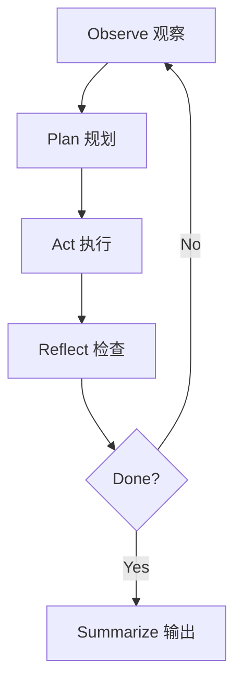

Agent Loop 描述智能体如何从目标出发，不断观察环境、规划动作、调用工具、检查结果，直到完成任务或触发退出条件。

## 为什么 Loop 重要

单次 LLM 调用通常是输入到输出。Agent 则需要在多步任务里不断修正自己：

## Loop 的必要字段

一个可调试的 loop 至少需要记录：

- `goal`：用户目标和成功标准。
- `state`：当前任务状态。
- `actions`：每一步工具调用。
- `observations`：工具返回和环境变化。
- `decisions`：模型为什么选择下一步。
- `stopReason`：结束、失败或转人工的原因。

## 常见失败模式

| 失败模式 | 表现 | 处理方式 |
| --- | --- | --- |
| 无限循环 | 重复调用同一个工具 | 设置步数上限和重复检测 |
| 目标漂移 | 回答偏离原始需求 | 每步检查 goal 和 success criteria |
| 工具幻觉 | 调用不存在的工具参数 | 使用 schema 和运行前校验 |
| 不可复现 | 失败后无法定位 | 保存 trace、输入、输出和模型版本 |

## 实作建议

先把 loop 写成清晰的状态机，再考虑引入框架。这样你能更准确地判断框架帮你解决的是状态管理、工具调度、人工接管，还是仅仅包装了模型调用。
