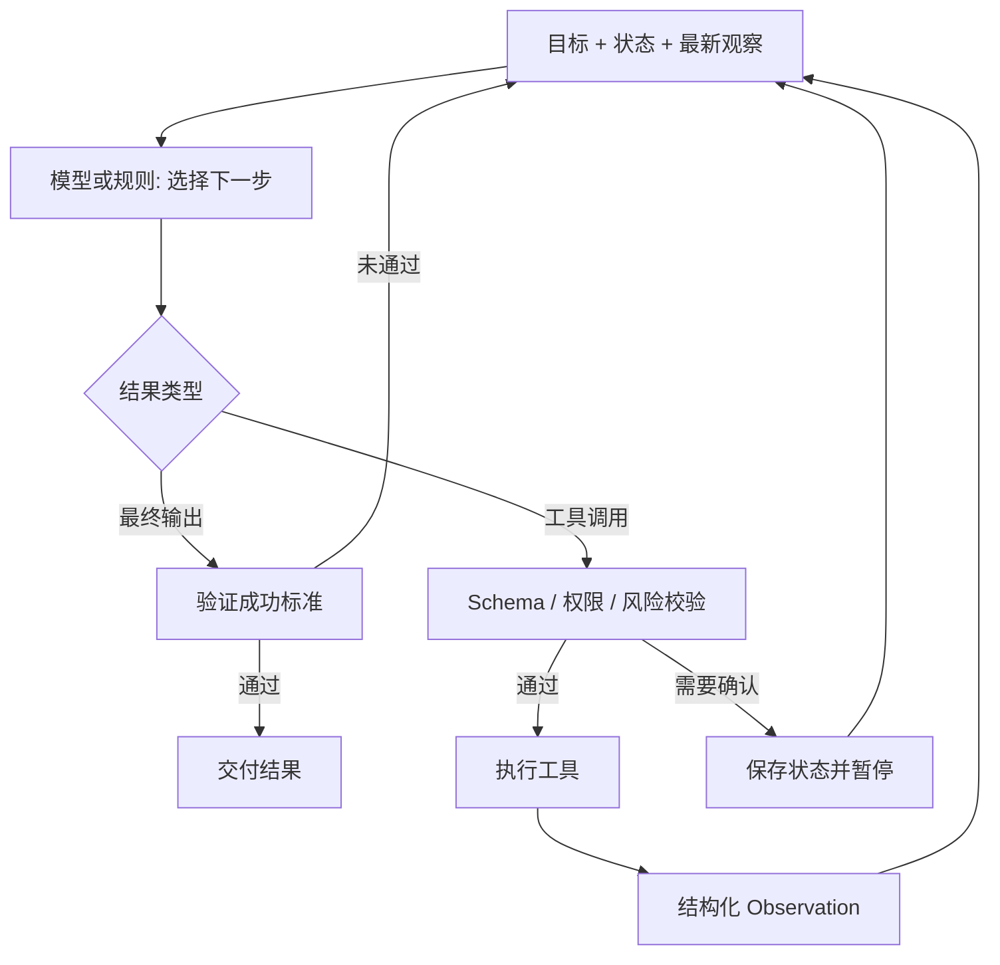
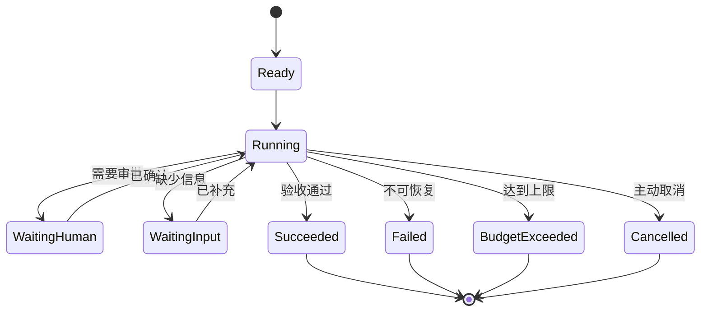

Agent Loop 是 Agent Runtime 中反复执行的控制循环：编排层把目标、状态和最新观察装配给模型或规则模块，读取其下一步决策，执行允许的动作，再把结果写回状态，直到成功、失败、暂停或触发预算上限。

Loop 的价值不在于“让模型多想几次”，而在于让每一步行动都有输入、结果、状态变化和明确出口。模型负责提出候选决策，Runtime 负责校验、执行、记录和停止。

## 为什么 Loop 重要

单次 LLM 调用通常只完成一次“输入 → 输出”。一个用户轮次中的 Agent Run 则可能包含多次模型调用和工具调用：


```mermaid
flowchart TD
  I[目标 + 状态 + 最新观察] --> D[模型或规则: 选择下一步]
  D --> K{结果类型}
  K -- 最终输出 --> V[验证成功标准]
  V -- 未通过 --> I
  V -- 通过 --> S[交付结果]
  K -- 工具调用 --> G[Schema / 权限 / 风险校验]
  G -- 通过 --> A[执行工具]
  A --> O[结构化 Observation]
  O --> I
  G -- 需要确认 --> H[保存状态并暂停]
  H --> I
```

模型还可能要求补充信息、拒绝执行或把任务交接给另一个 Agent。无论结果类型是什么，Runtime 都应把它转换成显式状态，而不是从一段自然语言中猜测任务是否结束。

## 四个概念阶段

Agent Loop 常被拆成 Observe、Plan、Act、Reflect，便于讨论每一层的责任：

| 阶段 | 输入 | 输出 | 更可靠的实现 |
| --- | --- | --- | --- |
| Observe | 用户目标、当前状态、工具结果 | 与当前步骤相关的证据和环境变化 | 结构化工具结果、来源引用、内容截断与过滤 |
| Decide / Plan | 目标、证据、约束、历史失败 | 最终输出、下一动作、交接或确认请求 | 模型决策、规则路由、可用工具白名单 |
| Act | 工具名、参数、权限上下文 | 成功结果、错误或真实副作用 | Schema 校验、鉴权、超时、幂等执行 |
| Evaluate / Reflect | 动作结果、成功标准、风险 | 继续、重试、修正、暂停或结束 | 测试、业务规则、Diff、模型评审、人工确认 |

这四步是概念拆分，不是强制执行顺序。简单任务可以直接输出；固定流程可以跳过显式规划；Reflect 也不必每轮都调用模型。确定性校验能解决的问题，应优先交给代码、测试和规则。

## 一个最小 Runtime 循环

下面的伪代码不依赖具体框架，重点是说明谁真正控制循环和执行工具：

```python
def run_agent(goal, max_steps=12):
    state = create_state(goal=goal, status="running")

    for step in range(max_steps):
        context = build_context(state)
        decision = call_model(context)
        record_decision(state, decision.summary, decision.evidence)

        if decision.type == "final":
            verification = verify_success(state, decision.output)
            if verification.ok:
                return finish(state, status="succeeded", output=decision.output)
            append_observation(state, verification)
            continue

        if decision.type == "needs_approval":
            save_checkpoint(state)
            return pause(state, status="waiting_for_approval")

        if decision.type == "tool_call":
            validate_tool_call(decision.tool, decision.arguments)
            observation = execute_once(
                tool=decision.tool,
                arguments=decision.arguments,
                action_id=new_action_id(),
            )
            append_observation(state, observation)
            continue

        if decision.type == "handoff":
            state.current_agent = decision.target
            continue

        return finish(state, status="failed", reason="unsupported_decision")

    return finish(state, status="budget_exceeded", reason="max_steps")
```

真正执行工具的是 `execute_once()` 背后的 Runtime，不是模型。模型只能生成工具名和参数；Runtime 仍要检查工具是否存在、参数是否合法、用户是否有权限，以及动作是否需要人工审批。

## Loop 的必要字段

一个可调试、可恢复的 Loop 至少需要保存：

| 字段 | 作用 |
| --- | --- |
| `goal` | 用户目标、约束和成功标准 |
| `status` | `running`、等待、成功、失败、取消等生命周期状态 |
| `step` / `maxSteps` | 当前步数和硬性上限 |
| `events` | 模型输出、工具调用、工具结果和状态变化 |
| `decision` | 选择了什么下一步，以及使用了哪些可观察证据或规则 |
| `budget` | 时间、Token、费用和工具调用额度 |
| `checkpoint` | 可恢复的状态快照或事件位置 |
| `stopReason` | 成功、失败、暂停、取消或预算耗尽的明确原因 |

不要把模型完整的内部推理当成必需字段。Trace 更应该记录可观察的决策结果、证据、规则命中和工具调用，而不是依赖模型未公开的思维过程。

## 生命周期状态机

“正在观察”和“正在执行”属于运行阶段；“等待确认”和“成功”属于生命周期状态。把两者混在一个字段里，会让暂停恢复和失败统计变得困难。


```mermaid
stateDiagram-v2
  [*] --> Ready
  Ready --> Running
  Running --> WaitingHuman: 需要审批
  WaitingHuman --> Running: 已确认
  Running --> WaitingInput: 缺少信息
  WaitingInput --> Running: 已补充
  Running --> Succeeded: 验收通过
  Running --> Failed: 不可恢复
  Running --> BudgetExceeded: 达到上限
  Running --> Cancelled: 主动取消
  Succeeded --> [*]
  Failed --> [*]
  BudgetExceeded --> [*]
  Cancelled --> [*]
```

暂停不是失败。进入 `waiting_for_approval` 或 `waiting_for_input` 前应保存状态，收到用户决定后从同一个 Run 恢复，而不是从头重新执行。

## 工具执行要可恢复

长任务可能在工具调用前后崩溃。对于发邮件、写数据库、支付和部署等有副作用的动作，仅设置最大步数还不够，还要避免恢复后重复执行：

1. 为每次动作生成稳定的 `action_id`。
2. 执行前校验 Schema、权限、风险等级和预算。
3. 在副作用发生前写入 checkpoint 或 pending 事件。
4. 支持时向外部系统传递 `idempotency_key`。
5. 把成功、错误、耗时和外部资源 ID 写成结构化 Observation。
6. 崩溃恢复时先核对动作状态，再决定重试、补偿或转人工。

工具错误也需要明确语义，例如 `error_code`、`retryable` 和 `retry_after`。如果错误不可重试，Runtime 不应让模型用同一参数无限尝试。

## Trace 示例

一个更接近真实 Runtime 的简化 Trace 可以写成：

```json
{
  "run_id": "run-20260801-001",
  "goal": "补充 Agent Loop 文档并提交",
  "step": 4,
  "status": "running",
  "decision": {
    "type": "tool_call",
    "tool": "run_command",
    "evidence": ["成功标准要求 lint 通过"]
  },
  "action": {
    "id": "action-004",
    "idempotency_key": "run-20260801-001-action-004",
    "arguments": {
      "command": "pnpm lint"
    }
  },
  "observation": {
    "ok": true,
    "exit_code": 0,
    "duration_ms": 2840,
    "truncated": false
  },
  "stopReason": null
}
```

Trace 支持调试、回放、评测和成本分析，但不必然等同于审计日志。涉及合规和安全时，还要单独定义不可篡改性、访问权限、脱敏、采样策略和保留周期。

## 常见失败模式

| 失败模式 | 表现 | 处理方式 |
| --- | --- | --- |
| 无限循环 | 相同动作和错误反复出现，任务没有进展 | 最大步数、失败签名、进展检测和熔断 |
| 目标漂移 | 后续行动偏离原始需求 | 每步携带成功标准和当前计划摘要 |
| 工具或参数幻觉 | 调用不存在的工具，或生成非法字段 | 工具白名单、Schema 与业务规则校验 |
| 过早完成 | 模型未验证就宣称任务成功 | 独立验证器检查交付物和成功标准 |
| 观察污染 | 工具结果过长、过期、无关或包含恶意指令 | 截断、来源标记、内容隔离和 Prompt Injection 防护 |
| 重复副作用 | 崩溃恢复后重复写库、发信或扣费 | `action_id`、幂等键、checkpoint 和状态核对 |
| 不可复现 | 失败后无法定位当时的模型和输入 | 保存模型版本、Prompt 版本、事件和工具结果 |

重复调用同一工具不一定是错误，例如分页读取或轮询可能是预期行为。重复检测应结合参数、错误签名、状态变化和是否取得进展，而不是只比较工具名。

## 结束、暂停与接管

Loop 不能只靠模型说“我完成了”。Runtime 应把不同出口编码为明确状态：

| 状态 | 触发条件 | 系统行为 |
| --- | --- | --- |
| `succeeded` | 验收标准满足，必要检查通过 | 交付结果和证据 |
| `failed` | 关键工具不可用或错误不可恢复 | 报告原因、证据和已尝试路径 |
| `budget_exceeded` | 步数、时间、Token、费用或配额达到上限 | 降级、保存状态或转人工 |
| `waiting_for_approval` | 高风险或不可逆动作需要确认 | checkpoint 后暂停，等待批准或拒绝 |
| `waiting_for_input` | 缺少继续执行所需的信息 | 提出具体问题并保存当前状态 |
| `cancelled` | 用户或上层系统主动取消 | 停止新动作并清理可安全释放的资源 |

成功标准、预算和权限检查应由 Runtime 强制执行。提示词可以提醒模型遵守限制，但不能代替硬性控制。

## 实作建议

先用普通循环和明确的数据结构实现最小版本，再考虑引入框架。这样更容易看清框架究竟帮你解决了状态持久化、工具调度、人工接管、可观测性，还是只包装了模型 API。

第一版可以只实现：单工具串行执行、最大步数、结构化 Observation、显式停止原因和完整 Trace。等这条链路可靠后，再加入并行工具、长期任务恢复和多 Agent 交接。

## 检查清单

- 是否区分一次用户轮次与 Agent 内部的多个 Step。
- 是否有明确的 `goal`、`successCriteria`、状态和停止原因。
- 是否由 Runtime 限制最大步数、工具次数、时间和费用。
- 是否对工具调用做 Schema、权限、风险和业务规则校验。
- 是否把工具结果视为不可信数据，并保留来源和截断信息。
- 是否用外部证据验证成功，而不是相信模型自我声明。
- 是否通过 `action_id`、幂等键和 checkpoint 防止重复副作用。
- 是否能暂停、序列化并恢复等待人工确认的 Run。
- 是否记录 model、provider、Prompt 版本、Token、延迟和工具错误。
- 是否能从 Trace 解释执行了什么，而不依赖模型内部推理。

## 延伸阅读

- [规划、反思与任务分解](/docs/concepts/planning-and-reflection)：不同规划与反思模式如何接入 Loop。
- [工具调用与记忆](/docs/concepts/tools-and-memory)：工具 Schema、Observation 和任务状态的边界。
- [Harness 工程构件](/docs/practices/harness-engineering)：Session、Sandbox、checkpoint 与可恢复执行。
- [评测与回归](/docs/practices/evaluation)：如何用固定任务集验证 Loop 策略。

## 参考来源

- [ReAct](https://arxiv.org/abs/2210.03629)：推理与行动交替、利用环境观察更新后续行动的代表性研究。
- [Reflexion](https://arxiv.org/abs/2303.11366)：通过语言反馈和记忆改进后续尝试的反思模式。
- [OpenAI Agents SDK：运行智能体](https://openai.github.io/openai-agents-python/zh/running_agents/)：最终输出、工具调用、Handoff 和最大轮次构成的 Runtime 循环示例。
- [OpenAI Agents SDK：Human-in-the-loop](https://openai.github.io/openai-agents-python/human_in_the_loop/)：高风险工具调用的暂停、审批与恢复机制。
