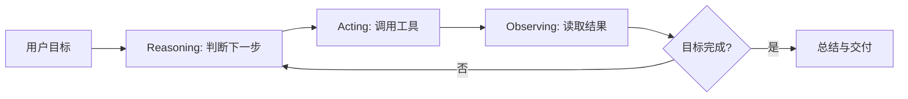

这篇笔记把三本资料放在同一张学习地图里：先用《智能体设计模式》整理常见模式，再用《Claude Code Harness Engineering》补足工程边界，最后把这些概念映射到 Claude Code 的源码实践。

> 引句：“Agent = LLM + Tools + Memory + Planning。” 来源：《Claude Code Harness Engineering：从入门到实战》，p. 9。

## 一句话定义

Agent 不是“更会聊天的模型”，而是一个能在循环中使用工具、观察结果、维护状态并持续推进目标的系统。《Claude Code Harness Engineering》把 LLM 的局限概括为三类：不能直接行动、缺少跨会话记忆、难以完成需要多步反馈的任务；Agent 的核心动机，就是给模型补上工具、记忆和行动-观察循环。来源：《Claude Code Harness Engineering：从入门到实战》，pp. 8-11。

| 层次 | 作用 | 典型问题 | 关键来源 |
| --- | --- | --- | --- |
| LLM | 生成、推理、语言理解 | 容易停留在单轮建议 | 《Claude Code Harness Engineering：从入门到实战》，pp. 8-10 |
| Tool Use | 连接外部 API、文件、命令、数据库 | 权限、失败、超时、参数校验 | 《智能体设计模式》，pp. 49-62 |
| Memory | 保存会话状态、长期偏好、项目经验 | 记什么、何时过期、如何纠错 | 《智能体设计模式》，pp. 87-98 |
| Planning | 把目标拆成步骤并动态调整 | 计划漂移、失败后重规划 | 《智能体设计模式》，pp. 65-74 |
| Reflection | 检查输出、纠错、降低幻觉 | 评审标准、迭代成本 | 《智能体设计模式》，pp. 294-295 |
| Multi-Agent | 用专业角色分工 | 通信、冲突、级联失败 | 《智能体设计模式》，pp. 75-85；《Claude Code Harness Engineering：从入门到实战》，pp. 107-116 |

## ReAct 是最小执行循环

《Claude Code Harness Engineering》将 ReAct 拆成思考、行动、观察三步：模型先判断下一步，随后调用工具，再根据工具结果调整后续动作。真正关键的是“观察”：如果模型不认真解释工具结果，Agent 就会退化成盲目执行脚本的程序。来源：《Claude Code Harness Engineering：从入门到实战》，pp. 10-11。

这个循环和 Chain-of-Thought 的差别在于是否有外部反馈。CoT 更像脑内推演，ReAct 则把每一步落到环境里，用真实返回值修正下一步。来源：《Claude Code Harness Engineering：从入门到实战》，p. 11。

## 工具让模型接触外部世界

《智能体设计模式》把工具使用拆成六步：定义工具、让 LLM 判断是否调用、生成结构化参数、由编排层执行、返回观察结果、再让 LLM 处理结果。这个模式让模型越过静态训练数据，访问实时信息、执行计算、调用 API 或触发现实动作。来源：《智能体设计模式》，pp. 49-50。

工具设计不是“给模型一个函数名”这么简单。一个可上线的工具至少要定义输入 schema、输出格式、超时、错误语义、权限等级和是否需要人工审批。Claude Code 的工具系统也采用统一接口，让 Bash、Read、Edit、Grep、Agent 等工具都能经过同一条查找、验证、Hook、权限、执行、格式化链路。来源：《Demystifying Claude Code v1.8》，pp. 83-87。

## 规划把目标变成可执行路径

规划模式解决的问题是：复杂目标不能靠单步回答完成。一个成熟 Agent 应该先把高层目标拆成步骤，在执行过程中跟踪进度，并在步骤失败或环境变化时重新规划。来源：《智能体设计模式》，pp. 65-74；《智能体设计模式》，p. 295。

计划是否展示给用户，是产品设计问题。高风险任务、长链路任务和会改动真实系统的任务，应优先让用户确认计划；这与人机协同模式一致，能在执行前给用户透明度和控制权。来源：《智能体设计模式》，pp. 295-296。

## 记忆是状态，不是资料堆积

记忆管理的目标不是把所有历史塞进 prompt，而是让 Agent 在有限上下文中保留必要信息。《智能体设计模式》区分了短期记忆、长期记忆和 RAG 式知识检索；《Claude Code Harness Engineering》进一步强调跨会话记忆能避免 Agent 每次都像新手一样重新学习。来源：《智能体设计模式》，pp. 87-98；《Claude Code Harness Engineering：从入门到实战》，pp. 96-106。

| 记忆类型 | 保存什么 | 常见风险 | 推荐边界 |
| --- | --- | --- | --- |
| 会话上下文 | 当前目标、工具结果、临时推理状态 | 上下文爆炸 | 压缩和摘要 |
| 项目记忆 | 项目约定、当前阶段、未完成事项 | 过期信息污染决策 | 标注时间和适用范围 |
| 用户反馈 | 偏好、禁忌、协作方式 | 过度泛化 | 只注入与当前任务相关的部分 |
| 审计轨迹 | 工具输入输出、审批记录 | 隐私和成本 | 结构化、可检索、可清理 |

## 多 Agent 不是越多越好

多 Agent 协作的价值在于专业化、并行和上下文隔离。《智能体设计模式》把多 Agent 视为由多个独立或半独立 Agent 协同完成共同目标的模式，常见形态包括顺序交接、并行处理、辩论共识和协调者架构。来源：《智能体设计模式》，pp. 75-85。

但多 Agent 的复杂度也更高。一个 Agent 的错误可能成为另一个 Agent 的输入，从线性失败变成网状传播。《Claude Code Harness Engineering》指出，从有状态单 Agent 走向多 Agent 是复杂度质变，需要新的错误隔离和恢复机制。来源：《Claude Code Harness Engineering：从入门到实战》，pp. 151-152。

## MCP 是工具层标准化

MCP 解决的是“Agent 如何发现并使用外部资源”的标准化问题。《智能体设计模式》把 MCP 描述为客户端-服务器架构：服务器暴露资源、提示和工具，客户端代表 LLM 发现能力、发送标准化调用并接收结果。来源：《智能体设计模式》，pp. 109-111。

MCP 和函数调用不是同一层抽象。函数调用通常是某个应用和某个模型之间的一对一集成；MCP 更像开放协议，让工具提供者只实现一次 Server，多个 Agent 客户端都能复用。来源：《智能体设计模式》，pp. 109-110；《Claude Code Harness Engineering：从入门到实战》，pp. 152-153。

## 安全是基础能力

Agent 的风险不同于普通 LLM：普通模型主要是“说错话”，Agent 可能会“做错事”。删除文件、发邮件、改数据库、部署服务这类动作有现实副作用，所以安全边界必须在工具层、权限层、沙箱层和人类审批层同时存在。来源：《Claude Code Harness Engineering：从入门到实战》，pp. 155-156。

《智能体设计模式》把 guardrails 归纳为多层防御：输入验证、输出过滤、行为提示、工具使用限制、外部审核与持续监控。生产级 Agent 应该像复杂软件一样被测试、观测和回滚，而不是只靠提示词约束。来源：《智能体设计模式》，pp. 193-198。

## 学习顺序

0. 先阅读 [模型基础知识](/docs/model-basics)：弄清 LLM 能力边界、Token 预算和结构化输出，再进入 Agent 模式。
1. 先理解 ReAct：思考、行动、观察、再行动。
2. 再理解工具：schema、权限、失败和可观察输出。
3. 然后理解上下文与记忆：什么进入窗口，什么沉淀为长期状态。
4. 接着理解规划与反思：如何把目标拆开，并在失败后修正。
5. 最后理解多 Agent、MCP 和 Harness：当单 Agent 不够时，如何分层扩展。

## 反查资料

- [下载《智能体设计模式》](/resources/books/agentic-design-patterns-chinese.pdf)
- [下载《Claude Code Harness Engineering：从入门到实战》](/resources/books/harness-engineering-book.pdf)
- [下载《Demystifying Claude Code v1.8》](/resources/books/demystifying-claude-code-v1.8.pdf)
