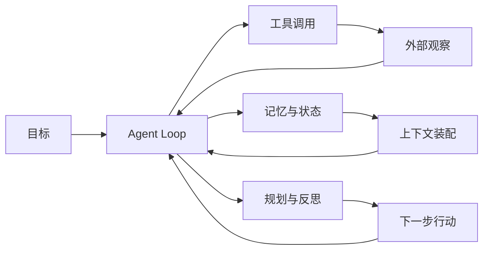

这些概念是不同框架之间的共同底层语言。建议先阅读 [模型基础知识](/docs/model-basics)，再理解 Agent 层概念，最后选择框架和工具。

## 阅读入口

| 主题 | 解决的问题 |
| --- | --- |
| [智能体基础](/docs/concepts/agentic-basics) | 从 ReAct、工具、记忆、规划到多 Agent 和 MCP，建立统一的 Agent 心智模型。 |
| [Agent Loop](/docs/concepts/agent-loop) | 理解智能体的观察、规划、执行、检查循环。 |
| [工具调用与记忆](/docs/concepts/tools-and-memory) | 把外部能力包装成可验证接口，并区分上下文、长期记忆和任务状态。 |
| [规划、反思与任务分解](/docs/concepts/planning-and-reflection) | 处理长任务中的计划、动态调整、反思和停止条件。 |
| [多 Agent 协作](/docs/concepts/multi-agent) | 理解多角色协作、共享状态、通信机制和协作风险。 |

## 判断方式

阅读概念页时，不需要先记框架 API。更重要的是回答三个问题：

1. 这个概念对应 Agent 系统里的哪个边界。
2. 它失败时会造成什么真实后果。
3. 它应该被记录、评测还是交给人工确认。

## 概念之间的关系

Agent 系统不是把概念并排堆起来，而是形成一条执行链：

这条链路里，LLM 负责生成候选判断；工具负责接触外部世界；记忆保存状态；规划负责拆解和排序；反思负责检查结果；Loop 把它们串起来。

## 读者实践

读完核心概念后，可以用一个小任务检验理解：让 Agent 修改一个文档页面，要求它先读取文件、制定计划、编辑、运行检查、提交 diff。这个任务足够小，但能覆盖核心边界：

- 如果没有 Loop，它只会给建议，不会推进到完成。
- 如果没有工具，它无法读取和修改真实文件。
- 如果没有记忆和状态，它会忘记已完成步骤。
- 如果没有规划，它容易在编辑前就急着生成结论。
- 如果没有反思和验证，它无法证明改动可用。

## 工程检查清单

- 是否能画出当前 Agent 的 Loop，而不是只描述一次模型调用。
- 是否为每个工具定义输入、输出、权限、超时和错误语义。
- 是否区分上下文、会话状态、长期记忆和审计日志。
- 是否有清晰的停止条件，包括完成、失败、预算耗尽和人工接管。
- 是否知道多 Agent 带来的新增成本：通信、状态同步、冲突和错误传播。
