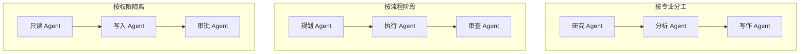
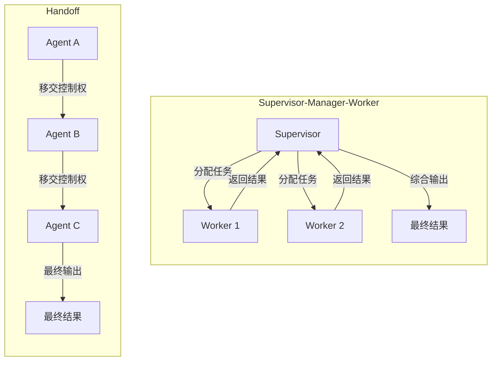
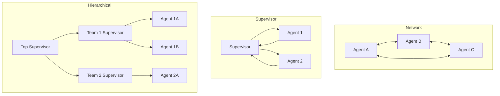
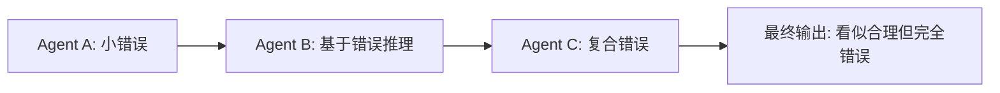

多 Agent 协作解决的核心问题是：当单个 Agent 的上下文、工具集或专业能力不足以应对复杂任务时，如何让多个专精 Agent 分工协作、可靠交付。

> "多 Agent 的价值在于专业化、并行和上下文隔离。"——《智能体设计模式》，pp. 75-85

## 定义与边界

### 什么是多 Agent 系统

多 Agent 系统（Multi-Agent System, MAS）是由多个各自拥有 LLM 驱动的 Agent 协同工作来解决复杂问题的架构。每个 Agent 专注于特定子任务，通过通信和协调完成单个 Agent 难以胜任的工作。

真正的多 Agent 系统需要满足三个条件：

1. **角色分化**：每个 Agent 有明确的职责边界和专用工具集，而非共享全部能力。
2. **自主决策**：Agent 能基于其他 Agent 的输出自主调整行为，而非仅按固定顺序调用。
3. **状态隔离**：每个 Agent 维护自己的上下文窗口，而非把所有信息塞进同一个 prompt。

两个 LLM 调用不一定是多 Agent——如果只是顺序链式调用且中间无自主决策，那仍然是单 Agent 的多步执行。

### 多 Agent 不是越多越好

Anthropic 在《Building Effective Agents》中明确建议：从最简单的方案开始，只在需要时才增加复杂度。Agentic systems 往往用延迟和成本换取更好的任务表现，需要判断这个权衡是否合理。来源：Anthropic, "Building Effective Agents", 2024.12, https://www.anthropic.com/engineering/building-effective-agents。

《Claude Code Harness Engineering》也指出，从有状态单 Agent 走向多 Agent 是复杂度质变，需要新的错误隔离和恢复机制。来源：《Claude Code Harness Engineering：从入门到实战》，pp. 151-152。

### 适用边界

| 场景 | 是否适合多 Agent | 说明 |
| --- | --- | --- |
| 任务可分解为独立子任务 | 适合 | 拆分后各 Agent 可独立完成 |
| 需要不同专业视角 | 适合 | 如编码 + 安全审查、研究 + 写作 |
| 子任务可以并行执行 | 适合 | 并行缩短墙钟时间 |
| 工具数量过多，单 Agent 选择困难 | 适合 | 拆分工具集，降低选择错误率 |
| 需要权限隔离（读写分离、审批分离） | 适合 | 不同 Agent 持不同权限 |
| 需要 Checker / Reviewer 验证质量 | 适合 | 生成与审查由不同 Agent 承担 |
| 任务简单、线性、工具少于 10 个 | 不适合 | 多 Agent 的通信开销超过收益 |
| 强实时、成本极度敏感 | 不适合 | 多轮 Agent 通信增加延迟和 token |
| 快速原型验证 | 不适合 | 先用单 Agent 验证可行性 |

判断原则：**从单 Agent 开始，当遇到明确的瓶颈时再拆分**。瓶颈通常表现为：上下文过载、工具选择错误率上升、角色冲突（同时要求严谨分析和创意写作）。

## 角色划分

### 角色设计原则

角色划分的目标是让每个 Agent 的职责窄而深，而非宽而浅。《智能体设计模式》将多 Agent 视为由多个独立或半独立 Agent 协同完成共同目标的模式，常见形态包括顺序交接、并行处理、辩论共识和协调者架构。来源：《智能体设计模式》，pp. 75-85。

好的角色设计应该回答四个问题：

1. 这个 Agent 负责什么（职责边界）。
2. 这个 Agent 不负责什么（排除边界）。
3. 这个 Agent 需要哪些工具（最小权限）。
4. 这个 Agent 的产出物是什么（契约定义）。

### 角色划分的典型模式



| 划分方式 | 核心思想 | 典型场景 | 代表项目 |
| --- | --- | --- | --- |
| 按专业分工 | 每个 Agent 专精一个领域 | 研究报告、多领域分析 | CrewAI（Role + Task + Crew） |
| 按流程阶段 | 模拟 SOP 的阶段分工 | 软件开发、文档审核 | MetaGPT（PM/架构/工程师/QA） |
| 按权限隔离 | 读写分离、审批分离 | 生产部署、金融操作 | Claude Code（Coordinator + Worker） |

### MetaGPT 的 SOP 模式

MetaGPT 是 SOP 模式的代表。它把软件开发流程建模为标准操作流程（SOP），每个角色有明确的输入契约和输出契约：ProductManager 输出 PRD，Architect 输出系统设计，Engineer 输出代码，QAEngineer 输出测试用例。来源：Hong et al., "MetaGPT: Meta Programming for A Multi-Agent Collaborative Framework", arXiv:2308.00352, 2023。

SOP 的关键约束是：上游角色的输出必须满足下游角色的输入格式。这种结构化通信比自由对话更可靠，但也更僵化——适合流程稳定的场景，不适合探索性任务。

### Claude Code 的 Coordinator-Worker 模式

《Claude Code Harness Engineering》描述了 Coordinator-Worker 模式：Coordinator 做计划、分配、综合，Worker 执行具体任务并汇报。写入型任务要通过 worktree、文件锁或串行调度避免冲突；只读任务才适合并行。给 Worker 的 prompt 必须自包含：背景、目标、文件路径、禁止事项、输出格式都要写清楚。子 Agent 不知道主对话历史，也不知道其他 Agent 正在做什么。来源：《Claude Code Harness Engineering：从入门到实战》，pp. 107-116。

## 通信机制

### 四种通信模式

通信机制决定 Agent 之间如何交换信息与引用共享事实。

| 机制 | 核心思想 | 优点 | 缺点 |
| --- | --- | --- | --- |
| 直接消息 | A 显式发给 B（点对点） | 简单、易追踪 | N² 连接复杂；需知道对端 |
| 共享黑板 | 公共读写区，各 Agent 读全局、写局部 | 解耦"谁知道谁" | 并发写需锁/版本；易成垃圾堆 |
| 发布-订阅 | 主题广播，订阅者自选感兴趣事件 | 扩展性好 | 主题设计不好会混乱 |
| 消息队列 | 先入先出，异步解耦 | 削峰、重试、持久化 | 延迟增加；需死信与幂等设计 |

选型提示：强审计、强顺序、高吞吐选队列；探索式协作、快速原型选黑板；简单多角色选直接消息。

### Handoff：Agent 间的任务交接

Handoff 是多 Agent 系统中一个 Agent 将控制权、任务和对话上下文转交给另一个 Agent 的过程。LangGraph 官方文档将 Handoff 定义为多 Agent 交互的核心模式，包含两个要素：目标 Agent（destination）和传递数据（payload）。来源：LangGraph Multi-agent Concepts, https://langchain-ai.github.io/langgraph/concepts/multi_agent/。

Handoff 和工具调用的关键区别：工具调用后控制权回到原 Agent；Handoff 后控制权完全转移到新 Agent。工具是"用完即还"，Handoff 是"交接班"。

#### Supervisor（Manager-Worker）vs Handoff 对比

两种模式的核心区别在于**控制权的归属**：Supervisor 模式中控制权始终在 Supervisor，Worker 完成后必须回到 Supervisor；Handoff 模式中控制权完全转移给目标 Agent，原 Agent 不再参与。



| 维度 | Supervisor（Manager-Worker） | Handoff |
| --- | --- | --- |
| 控制权 | Supervisor 始终持有 | 逐级转移，原 Agent 退出 |
| 上下文 | Supervisor 维护全局上下文 | 每次交接需显式传递 |
| 并行能力 | 可并行派发多个 Worker | 本质是串行接力 |
| 调试难度 | 集中在 Supervisor，相对可控 | 需追踪整条交接链 |
| 适用场景 | 多子任务并行、需要全局协调 | 专家转诊、流程阶段交接 |
| 代表框架 | LangGraph Supervisor、CrewAI Hierarchical | OpenAI Agents SDK、OpenAI Swarm |

来源：LangGraph Multi-agent Concepts, https://langchain-ai.github.io/langgraph/concepts/multi_agent/；OpenAI Agents SDK Documentation, https://openai.github.io/openai-agents-python/handoffs/。

OpenAI Agents SDK 将 Handoff 包装为工具调用——当 Agent 判断任务超出自身能力时，调用 `transfer_to_XXX` 函数触发交接。核心 API 参数包括：`tool_name_override`（自定义工具名）、`on_handoff`（交接回调）、`input_filter`（过滤传给目标 Agent 的对话历史）、`input_type`（用 Pydantic 模型约束交接入参）。来源：OpenAI Agents SDK Documentation, https://openai.github.io/openai-agents-python/handoffs/。

### 上下文传递策略

Handoff 最大的挑战不是触发，而是上下文传递的可靠性。三种策略：

| 策略 | 做法 | 优点 | 缺点 |
| --- | --- | --- | --- |
| 完整历史传递 | 把所有对话历史复制给目标 Agent | 简单 | 可能超出上下文窗口 |
| 摘要传递 | 只传摘要 + 最新消息 | 节省 token | 可能丢失细节 |
| 结构化上下文 | 用 JSON Schema 传递结构化数据 | 可靠、可校验 | 需要设计契约 |

最佳实践是**结构化上下文传递**——像对待公开 API 一样对待 Agent 间接口。自由文本 Handoff 是上下文丢失的主要原因。

### A2A 协议：Agent 间通信的标准化

A2A（Agent-to-Agent）是 Google 于 2025 年 4 月发布的开放协议，旨在让不同厂商、不同框架构建的 AI Agent 之间实现标准化通信与协作。2025 年 6 月由 Google 捐赠给 Linux Foundation 托管，AWS、Cisco、Microsoft、Salesforce、SAP 等作为创始成员参与。协议基于 HTTP + JSON-RPC 2.0 + SSE 构建，核心概念包括 Agent Card（服务发现）、Task（任务生命周期管理）、Message 和 Artifact（交互载体）。来源：Google A2A Protocol, https://google.github.io/A2A/。

A2A 与 MCP 的定位差异：MCP 解决的是 Agent 与 Tool 之间的纵向能力扩展（"Agent 如何调用工具"），A2A 解决的是 Agent 与 Agent 之间的横向协作（"Agent 如何委托另一个 Agent"）。两者定位互补——一个 Agent 可以同时用 MCP 连接工具、用 A2A 与其他 Agent 协作。来源：《智能体设计模式》，pp. 109-111。

## 编排模式

### 五种编排架构

LangGraph 官方文档定义了五种多 Agent 架构：Network、Supervisor、Supervisor (tool-calling)、Hierarchical 和 Custom multi-agent workflow。来源：LangGraph Multi-agent Concepts, https://langchain-ai.github.io/langgraph/concepts/multi_agent/。



### Network（对等网络）

每个 Agent 可以与其他任何 Agent 通信，任何 Agent 都可以决定下一步调用谁。适合没有明确层级或固定顺序的问题。

优点：灵活、去中心化。缺点：难以追踪和调试，容易产生循环调用。

### Supervisor（监督者）

一个中心 Supervisor Agent 决定下一步调用哪个 Worker Agent。Worker 完成后回到 Supervisor。这是目前生产环境最常用的模式。

Supervisor 的核心不是复杂的 prompt，而是基于状态机的路由函数。Supervisor 读取当前状态，决定下一步调用哪个 Agent，然后 Agent 执行后回到 Supervisor。来源：LangGraph Multi-agent Supervisor Tutorial, https://langchain-ai.github.io/langgraph/tutorials/multi_agent/agent_supervisor/。

### Supervisor (tool-calling)

Supervisor 的变体：把每个 Worker Agent 包装为工具，Supervisor 用 tool-calling LLM 决定调用哪个 Agent 工具。这是 OpenAI Agents SDK 的核心模式。

```ts title="supervisor-tool-calling.ts" lineNumbers
// Supervisor 把 Agent 当作工具调用
const tools = [researchAgent, codeAgent, reviewAgent];
const supervisor = createReActAgent(model, tools);
```

### Hierarchical（层级式）

当 Agent 数量增多，单个 Supervisor 管不过来时，可以设计层级结构：顶层 Supervisor 管理团队 Supervisor，团队 Supervisor 管理各自的 Worker。这是 Supervisor 架构的泛化。

LangGraph 官方指出：随着 Agent 数量增加，Supervisor 可能开始做出糟糕的路由决策，或上下文变得过于复杂——这正是最初引入多 Agent 架构要解决的问题。层级式架构通过分层管理来应对这个矛盾。来源：LangGraph Multi-agent Hierarchical Tutorial, https://langchain-ai.github.io/langgraph/tutorials/multi_agent/hierarchical_agent_teams/。

### Custom Workflow（自定义工作流）

部分流程是确定性的（固定边），部分流程是动态的（Agent 自主决策）。这是最灵活但也最复杂的模式。

### 编排模式选型

| 模式 | 控制度 | 灵活度 | 复杂度 | 适合场景 |
| --- | --- | --- | --- | --- |
| Network | 低 | 高 | 中 | 探索性研究、头脑风暴 |
| Supervisor | 中 | 中 | 低 | 大多数生产场景 |
| Supervisor (tool-calling) | 中 | 中 | 低 | OpenAI Agents SDK 生态 |
| Hierarchical | 高 | 中 | 高 | 大型团队、多部门协作 |
| Custom Workflow | 可调 | 可调 | 高 | 混合确定性/动态流程 |

Anthropic 的建议是：先用 Supervisor 模式，不做自由聊天式协作。来源：《Claude Code Harness Engineering：从入门到实战》，p. 116。

### Anthropic 的工作流模式

Anthropic 在《Building Effective Agents》中定义了从简单到复杂的六种模式，这些模式既可以用于单 Agent 也可以组合为多 Agent 系统：

1. **Prompt Chaining**：任务拆成顺序步骤，每步的输出是下步的输入。适合可干净分解的固定子任务。
2. **Routing**：分类输入，路由到专门的后续处理。适合不同类别需要不同处理的场景。
3. **Parallelization**：子任务并行执行，结果聚合。分为 Sectioning（拆分独立子任务）和 Voting（多次执行取多数）。
4. **Orchestrator-Workers**：中心 LLM 动态拆分任务、委派 Worker、综合结果。适合无法预知子任务数量的复杂任务。
5. **Evaluator-Optimizer**：一个 LLM 生成，另一个评估反馈，循环迭代。适合有明确评估标准且迭代有价值的场景。
6. **Autonomous Agent**：Agent 自主规划、执行、检查，在循环中使用工具。适合开放式问题。

来源：Anthropic, "Building Effective Agents", 2024.12, https://www.anthropic.com/engineering/building-effective-agents。

## 冲突处理

### 冲突类型

多 Agent 系统中常见的冲突类型：

| 冲突类型 | 示例 | 严重程度 |
| --- | --- | --- |
| 结论冲突 | Agent A 说"买入"，Agent B 说"卖出" | 高 |
| 资源冲突 | 两个 Agent 同时修改同一数据库记录 | 高 |
| 优先级冲突 | 安全 Agent 说"阻止"，效率 Agent 说"放行" | 高 |
| 方案冲突 | Agent 对解决同一问题提出不同方案 | 中 |
| 事实冲突 | Agent 引用了互相矛盾的数据源 | 中 |

### 四种冲突解决机制

#### 1. 投票（Voting）

让多个 Agent 投票表决。包括多数决、加权投票（按专业度加权）、排序投票（Borda 计分法）。投票在 Agent 意见独立且噪声可平均时有效。

但投票有陷阱：如果大多数 Agent 都基于同一个错误数据源推理，多数投票会放大错误。LLM Agent 的"独立意见"往往不独立（相似训练分布、相似 system 提示），需要多样化提示或引入反方角色。

#### 2. 共识协议（Consensus Protocol）

多轮辩论，逐步达成一致。关键设计点：动态共识阈值（根据任务紧急度调整）、最大轮次限制（防止无限辩论）、降级机制（共识失败时切换到投票或人工裁决）。

研究表明，正式共识协议可以显著降低对抗攻击成功率。来源：Tran et al., "Multi-Agent Collaboration Mechanisms: A Survey of LLMs", arXiv:2501.06322, 2025。

#### 3. 优先级仲裁

规则驱动的冲突解决：安全 > 合规 > 产品 > 体验。适合合规和强约束领域。例如：任何安全 Agent 可以一票否决操作。

#### 4. 中介仲裁

指定一个权威 Agent 或人类做最终裁决。适合高风险决策。仲裁者分析各方推理过程，指出优缺点，给出最终裁决和理由。

### 防止趋同效应（Sycophancy）

LLM Agent 在辩论中容易出现趋同——Agent 倾向于迎合对方观点而非坚持自己的正确判断。这被称为 Sycophancy 问题。

缓解方法：强制要求 Agent 先独立推理，再考虑他人观点；如果改变立场，必须解释具体哪个论据说服了；如果不改变，必须解释为什么自己的分析更正确。

### 级联幻觉（Cascading Hallucination）

一个 Agent 的小错误被下一个 Agent 当作事实输入，错误被逐级放大和复合，最终产生看似合理但完全错误的结论。这是多 Agent 系统中最危险的风险之一。



防御手段：校验门（每个 Agent 的输出经过结构化校验）、断路器（检测到异常模式时暂停系统）、独立验证（关键结论由独立 Agent 交叉验证）。

## 工程流程

### 从单 Agent 到多 Agent 的演进路径

不要一开始就设计多 Agent 系统。推荐的演进路径：

1. **先做单 Agent**：用最简单的方式验证任务可行性。
2. **遇到瓶颈时拆分**：当单 Agent 出现上下文过载、工具选择困难或角色冲突时，考虑拆分。
3. **从 Supervisor 模式开始**：先引入一个 Coordinator，把子任务分派给专精 Worker。
4. **按需增加复杂度**：只在 Supervisor 管不过来时才引入层级式架构。

### 多 Agent 系统的工程清单

| 构件 | 责任 | 工程要点 |
| --- | --- | --- |
| Coordinator / Supervisor | 任务分解、分配、综合 | 路由逻辑基于状态机而非纯 prompt |
| Worker Agent | 执行具体子任务 | prompt 自包含，不依赖主对话历史 |
| 通信协议 | Agent 间信息交换 | 结构化数据（JSON Schema）而非自由文本 |
| 状态管理 | 任务进度、共享事实 | 单一 Source of Truth + 状态机 |
| 冲突解决 | 收敛到可执行决策 | 优先级规则 + 仲裁 + 人类在环 |
| 错误隔离 | 防止级联失败 | 沙箱、校验门、断路器、检查点 |
| 可观测性 | 调试和审计 | TraceId、结构化日志、全链路导出 |

### 状态管理

多 Agent 系统推荐使用状态机而非纯自然语言传递一切。状态机提供可验证迁移、清晰终止、可观测指标（卡在何阶段多久）。自然语言可作为附件说明，不应是唯一真相来源。

状态管理的核心模式包括：

| 模式 | 核心思想 | 适用场景 |
| --- | --- | --- |
| 共享状态图 | 全局状态流经每个节点，Reducer 函数合并并发更新 | LangGraph 多 Agent 编排 |
| 事件溯源 | 记录所有状态变更事件而非最终状态，支持回放和审计 | 需要审计追踪的系统 |
| 有限状态机 | 用明确的状态和转移规则管理流程 | 简单线性流程 |
| Checkpointing | 每个执行步骤自动保存状态快照，支持恢复 | 长任务、Human-in-the-Loop |

来源：LangGraph State Management, https://langchain-ai.github.io/langgraph/concepts/low_level/。

```ts title="task-state-machine.ts" lineNumbers
type Phase = "INIT" | "PLAN" | "EXEC" | "VERIFY" | "DONE";

const ALLOWED_TRANSITIONS: Record<Phase, Phase[]> = {
  INIT: ["PLAN"],
  PLAN: ["EXEC"],
  EXEC: ["VERIFY"],
  VERIFY: ["DONE", "EXEC"], // 不通过可打回重做
  DONE: [],
};

function transition(current: Phase, next: Phase): Phase {
  if (!ALLOWED_TRANSITIONS[current].includes(next)) {
    throw new Error(`非法状态转换: ${current} -> ${next}`);
  }
  return next;
}
```

状态设计原则：状态可序列化（用于持久化和传输）、幂等性（从同一检查点重放应产生相同结果）、最小化状态（只在状态中保留决策所需信息，中间推理过程在 Trace 中记录而非状态中保存）、显式 Reducer（明确定义状态更新规则是追加还是替换）。

### 并发控制：任务分片、结果合并、锁、取消与超时

多 Agent 系统中，并发是把双刃剑——并行能缩短墙钟时间，但并发写、资源竞争和部分失败会引入新的复杂度。

#### 任务分片与结果合并

任务分片的核心原则是**子任务之间无共享可变状态**。只读子任务（如搜索、分析）可以安全并行；写入子任务（如修改文件、更新数据库）必须串行或加锁。

结果合并策略取决于任务类型：

| 合并策略 | 做法 | 适用场景 |
| --- | --- | --- |
| 聚合 | 收集所有 Worker 结果，由 Coordinator 汇总 | 研究、分析类任务 |
| 投票 | 多数决或加权投票 | 需要共识的决策任务 |
| 级联 | 前一步输出作为后一步输入 | 有依赖的流水线任务 |
| 选择 | Coordinator 选最优结果 | 生成类任务（代码、文案） |

《Claude Code Harness Engineering》指出：写入型任务要通过 worktree、文件锁或串行调度避免冲突；只读任务才适合并行。来源：《Claude Code Harness Engineering：从入门到实战》，pp. 107-116。

#### 锁与串行调度

当多个 Agent 需要修改同一资源时，必须使用锁或串行调度：

- **文件锁**：Agent 修改文件前获取排他锁，修改完释放。适用于文件系统场景。
- **乐观并发控制**：Agent 先读后写，写入时检查版本号，冲突时重试。适用于低冲突场景。
- **串行调度**：Coordinator 按顺序分配写入任务，避免并发冲突。适用于高冲突场景。

LangGraph 通过共享状态图 + Reducer 函数处理并发更新：多个并发的状态更新通过 Reducer 函数（如追加、取最大值）合并为确定结果，而非依赖锁。来源：LangGraph State Management, https://langchain-ai.github.io/langgraph/concepts/low_level/。

#### 取消

取消是多 Agent 系统中容易被忽视但至关重要的机制。常见取消场景：

1. **上游任务失败**：Agent A 失败，Agent B 的任务不再有意义，应立即取消。
2. **用户中断**：用户在执行过程中要求停止。
3. **超时触发**：任务执行时间超过阈值，自动取消。
4. **依赖失效**：任务依赖的前提条件不再满足。

取消的实现方式：

| 方式 | 做法 | 代表框架 |
| --- | --- | --- |
| 检查点 + 回滚 | 保存执行前状态，取消时恢复 | LangGraph（Checkpointing） |
| 取消令牌 | 传递 CancellationToken，Agent 定期检查是否被取消 | 通用编程模式 |
| 优雅终止 | Agent 完成当前步骤后停止，不中断中间操作 | LangGraph（Human-in-the-Loop interrupt） |
| 强制终止 | 直接终止 Agent 进程或协程 | 适用于沙箱隔离的 Agent |

LangGraph 的检查点机制支持中断和恢复：每个 super-step 自动保存状态快照，中断后可以从最近的检查点恢复，而非从头开始。来源：LangGraph Persistence, https://langchain-ai.github.io/langgraph/concepts/persistence/。

#### 超时

超时是防止 Agent 无限运行的安全网。超时设计需要考虑三个层级：

| 层级 | 超时对象 | 典型阈值 | 说明 |
| --- | --- | --- | --- |
| 工具调用超时 | 单次工具调用 | 30s-120s | 防止外部 API 无响应 |
| Agent 步骤超时 | 单次 LLM 推理 + 工具执行 | 1min-5min | 防止单步卡死 |
| 任务超时 | 整个任务从开始到结束 | 5min-30min | 防止任务无限循环 |

超时后的处理策略不应是简单终止，而应分级降级：

1. **重试**：超时可能是临时问题，重试 1-2 次（带指数退避）。
2. **降级**：跳过当前步骤，用默认值或简化方案继续。
3. **上报**：降级仍无法继续时，上报给 Coordinator 或人工处理。

OpenAI Agents SDK 通过 `Runner.run()` 的 `max_turns` 参数限制 Agent 的最大执行轮次，防止无限循环。来源：OpenAI Agents SDK Documentation, https://openai.github.io/openai-agents-python/agents/。

AutoGen 框架支持 `max_consecutive_auto_reply` 限制 Agent 间的最大连续回复次数，防止对话无限循环。来源：AutoGen Documentation, https://microsoft.github.io/autogen/；Wu et al., "AutoGen: Enabling Next-Gen LLM Applications via Multi-Agent Conversation", arXiv:2308.08155, 2023。

### 给 Worker 的 Prompt 设计

给 Worker 的 prompt 必须自包含，包含以下要素：

- **背景**：为什么需要这个任务。
- **目标**：具体要做什么，成功标准是什么。
- **输入**：文件路径、数据位置、格式说明。
- **禁止事项**：不能做什么（如不能修改指定范围外的文件）。
- **输出格式**：产出的结构化格式要求。

来源：《Claude Code Harness Engineering：从入门到实战》，p. 116。

### 可观测性：Trace 和 Span

多 Agent 系统的调试难度远高于单 Agent，需要分布式追踪来理解"Agent 做了什么、花了多久、哪里出了问题"。

**Trace** 代表一次完整的 Agent 执行（从接收任务到返回结果），**Span** 代表 Trace 中的一个操作单元（如一次 LLM 调用、一次工具调用、一次 Handoff）。Span 之间有父子关系，形成树形结构，清晰展示 Agent 的决策链。

```
Trace: "帮我分析竞品A的定价策略"（总耗时 8.2s）
│
├── Span: LLM 调用 - 理解任务（1.2s）
│   └── 输出: "需要搜索竞品A的定价信息"
│
├── Span: 工具调用 - web_search（2.5s）
│   └── 输出: [搜索结果 5 条]
│
├── Span: LLM 调用 - 分析结果（3.1s）
│   └── 输出: "竞品A采用阶梯定价..."
│
└── Span: LLM 调用 - 生成报告（1.4s）
    └── 输出: 最终分析报告
```

可观测性的三大支柱在多 Agent 中的应用：

| 支柱 | 作用 | 关键指标/内容 | 工具 |
| --- | --- | --- | --- |
| Traces | 追踪 Agent 的完整执行路径 | 每步耗时、决策链路 | Langfuse, LangSmith, Jaeger |
| Metrics | 量化性能和健康状态 | P95 延迟、token 消耗、工具成功率 | Prometheus, Datadog, Grafana |
| Logs | 记录详细事件和错误 | LLM 输入输出、工具参数和返回值、错误栈 | ELK Stack, CloudWatch |

**OpenTelemetry (OTel)** 是 LLM 可观测性的主流方向——供应商无关，用 OTel 标准化的数据可以发送到任何后端，换监控工具不需要改代码。来源：OpenTelemetry Blog, "AI Agent Observability", https://opentelemetry.io/blog/2025/ai-agent-observability/。

## 关键例子

### 例子 1：ChatDev——虚拟软件公司

ChatDev 把软件开发建模为虚拟软件公司：CEO 定目标，CTO 做技术决策，程序员写代码，测试工程师找 bug，艺术设计师做 UI。Agent 之间通过多轮聊天协作，每个阶段有明确的输入输出。来源：Qian et al., "Communicative Agents for Software Development", arXiv:2307.07924, 2023。GitHub: https://github.com/OpenBMB/ChatDev。

ChatDev 的核心贡献是证明了 LLM Agent 可以通过角色扮演和结构化对话完成完整的软件开发流程。但它的局限也很明显：缺乏真实工程中的权限控制、错误恢复和成本管理。

### 例子 2：MetaGPT——SOP 驱动的多 Agent

MetaGPT 引入 SOP（标准操作流程）作为多 Agent 协作的核心约束。每个角色的输出必须满足下游角色的输入格式：ProductManager 输出 PRD → Architect 输出系统设计 → Engineer 输出代码 → QA 输出测试。这种结构化通信比自由对话更可靠。来源：Hong et al., "MetaGPT: Meta Programming for A Multi-Agent Collaborative Framework", arXiv:2308.00352, 2023。GitHub: https://github.com/FoundationAgents/MetaGPT。

MetaGPT 的核心创新是将 SOPs 引入多智能体协作，并通过共享消息池（Shared Message Pool）和发布-订阅机制实现结构化通信——Agent 向公共消息流发布结构化消息，其他 Agent 根据角色订阅相关信息，而非一对一的直接对话。这减少了信息冗余，同时保持了可追溯性。来源：Hong et al., "MetaGPT: Meta Programming for A Multi-Agent Collaborative Framework", arXiv:2308.00352, 2023, Section 3.2。

### 例子 3：CAMEL——角色扮演的探索式协作

CAMEL（Communicative Agents for "Mind" Exploration of Large Language Model Society）由 KAUST 团队提出，是最早探索 LLM Agent 角色扮演协作的研究之一。两个 Agent 以设定角色进行对话，通过 Inception Prompting 引导 Agent 保持角色一致性。来源：Li et al., "CAMEL: Communicative Agents for 'Mind' Exploration of Large Scale Language Model Society", NeurIPS 2023, arXiv:2303.17760。GitHub: https://github.com/camel-ai/camel。

CAMEL 的贡献在于证明了 Inception Prompting 可以让 LLM Agent 在多轮对话中保持角色一致性，而不需要人工干预每一步。

### 例子 4：OpenAI Swarm——轻量级 Handoff

OpenAI Swarm 是一个教育级框架，用于探索轻量级多 Agent 编排模式。核心概念只有两个：Agent（包含指令和工具）和 Handoff（Agent 间的控制权转移）。Swarm 的设计哲学是极简和可观测——让开发者理解多 Agent 的底层机制，而非隐藏复杂性。来源：OpenAI Swarm, https://github.com/openai/swarm, 2024。

Swarm 的 Handoff 模式后来被 OpenAI Agents SDK 正式采纳：Agent 的工具函数可以返回另一个 Agent 对象，触发控制权转移。

### 例子 5：LangGraph Supervisor——生产级编排

LangGraph 的 Supervisor 模式是目前生产环境最常用的多 Agent 编排方式。Supervisor 读取共享状态，决定下一步调用哪个 Worker Agent，Worker 完成后回到 Supervisor。整个流程表达为图结构，支持检查点、分支和人工接管。来源：LangGraph Multi-agent Concepts, https://langchain-ai.github.io/langgraph/concepts/multi_agent/。

### 例子 6：CrewAI——角色驱动的团队协作

CrewAI 把多 Agent 协作建模为"团队"：每个 Agent 有角色（Role）、目标（Goal）和背景故事（Backstory），任务（Task）分配给特定 Agent，Crew 定义执行流程。支持两种流程类型：Sequential（顺序执行）和 Hierarchical（Manager Agent 分配任务）。来源：CrewAI Documentation, https://docs.crewai.com/。GitHub: https://github.com/crewAIInc/crewAI。

## 常见坑

### 坑 1：为了用多 Agent 而用多 Agent

最常见的错误。简单任务用多 Agent 只会增加通信开销和调试难度。研究显示，多 Agent 系统中 Agent 间的对话存在大量冗余——多个 Agent 重复阅读相同上下文、重复调用相同工具，导致 token 消耗远超单 Agent。来源：Guo et al., "Large Language Model based Multi-Agents: A Survey of Progress and Challenges", arXiv:2402.01680, 2024。

**正确做法**：从单 Agent 开始，当遇到明确的瓶颈（上下文过载、工具选择困难、角色冲突）时再拆分。

### 坑 2：Handoff 时上下文丢失

大多数"Agent 失败"实际上是 Handoff 时的上下文丢失或格式错误——目标 Agent 收到的信息不足以做出正确决策。自由文本 Handoff 是主要原因。

**正确做法**：用结构化数据（JSON Schema）传递上下文，像对待公开 API 一样对待 Agent 间接口。使用 `input_filter` 控制传给目标 Agent 的对话历史。

### 坑 3：Handoff 循环

Agent A → B → A → B 无限循环，消耗 token 和时间。

**正确做法**：追踪 Handoff 链路，设置最大 Handoff 次数。如果检测到循环模式，触发断路器并升级给人工处理。

### 坑 4：级联幻觉

一个 Agent 的错误被下一个 Agent 当作事实输入，错误逐级放大。

**正确做法**：每个 Agent 的输出经过结构化校验；关键结论由独立 Agent 交叉验证；检测到异常模式时暂停系统。

### 坑 5：投票放大错误

如果大多数 Agent 都基于同一个错误数据源推理，多数投票会放大错误而非纠正。

**正确做法**：确保 Agent 的信息来源多样化；引入反方角色（Red Team Agent）；对关键决策使用证据门槛 + 优先级规则 + 人类在环。

### 坑 6：趋同效应

LLM Agent 在多轮辩论中倾向于迎合对方观点而非坚持正确判断。

**正确做法**：强制 Agent 先独立推理再考虑他人观点；要求改变立场时必须给出具体理由；设置合理的最大辩论轮次。

### 坑 7：忽视成本控制

多 Agent 系统的 token 消耗远高于单 Agent。多个 Agent 并行调用时，成本可能呈线性甚至超线性增长。

**正确做法**：小模型做子任务、大模型做仲裁；对工具输出做截断和摘要；使用 prompt cache 复用稳定前缀；设置 token 预算熔断。

### 坑 8：缺乏可观测性

多 Agent 系统的调试难度远高于单 Agent——问题可能出在任何一个 Agent 的任何一步决策中，没有 Trace/Span 就像在黑箱中找 bug。

**正确做法**：从第一天起就接入 Trace（详见[可观测性](#可观测性-trace-和-span)），为每个请求分配 TraceId，记录所有 Agent 间的通信内容和工具调用，支持全链路导出和回放。

## 检查清单

在设计和评审多 Agent 系统时，逐项检查：

### 必要性检查

- [ ] 是否先尝试了单 Agent 方案？
- [ ] 单 Agent 方案遇到了什么具体瓶颈？
- [ ] 多 Agent 的收益是否大于通信开销和复杂度成本？

### 角色设计检查

- [ ] 每个 Agent 的职责边界是否清晰？
- [ ] 每个 Agent 的工具集是否最小化？
- [ ] Agent 之间的产出物是否有明确的格式契约？
- [ ] 是否避免了"全能 Agent"（职责过多）？

### 通信检查

- [ ] Agent 间通信是否使用结构化数据？
- [ ] Handoff 的上下文是否完整且不冗余？
- [ ] 是否设置了最大 Handoff 次数防止循环？
- [ ] 通信协议是否可观测（可追踪、可回放）？

### 编排检查

- [ ] 编排模式是否匹配任务特征？
- [ ] Supervisor 的路由逻辑是否基于状态机而非纯 prompt？
- [ ] 是否有明确的终止条件？
- [ ] 并行任务是否真的无依赖？

### 冲突处理检查

- [ ] 是否定义了冲突解决策略？
- [ ] 高风险决策是否有优先级规则或人类在环？
- [ ] 是否考虑了趋同效应和级联幻觉？
- [ ] 投票机制是否确保了信息来源多样化？

### 工程检查

- [ ] 状态管理是否使用状态机？
- [ ] 是否有单一 Source of Truth？
- [ ] 错误隔离是否到位（沙箱、校验门、断路器）？
- [ ] 是否有检查点支持崩溃恢复？
- [ ] 是否有 token 预算和成本监控？
- [ ] 是否有全链路 TraceId 和结构化日志？是否接入了 Trace/Span？
- [ ] 写入型任务是否通过锁或串行调度避免冲突？
- [ ] 是否有超时机制（工具调用超时、步骤超时、任务超时）？
- [ ] 是否有取消机制（上游失败时取消下游、用户中断、超时触发）？
- [ ] 超时后是否有分级降级策略（重试→降级→上报）？

### 安全检查

- [ ] 每个 Agent 是否遵循最小权限原则？
- [ ] 敏感操作是否需要人工审批？
- [ ] 是否有审计日志记录所有关键决策？
- [ ] 是否考虑了 Prompt Injection 对多 Agent 系统的影响？

## 延伸阅读

### 核心论文

| 论文 | 作者 | 年份 | 链接 | 核心贡献 |
| --- | --- | --- | --- | --- |
| Large Language Model based Multi-Agents: A Survey of Progress and Challenges | Guo et al. | 2024 | https://arxiv.org/abs/2402.01680 | 系统综述 LLM 多 Agent 的进展与挑战 |
| Multi-Agent Collaboration Mechanisms: A Survey of LLMs | Tran et al. | 2025 | https://arxiv.org/abs/2501.06322 | 多 Agent 协作机制综述，含冲突解决和安全分析 |
| The Rise and Potential of Large Language Model Based Agents: A Survey | Xi et al. (复旦) | 2023 | https://arxiv.org/abs/2309.07864 | LLM Agent 的通用框架：大脑-感知-行动 |
| MetaGPT: Meta Programming for A Multi-Agent Collaborative Framework | Hong et al. | 2023 | https://arxiv.org/abs/2308.00352 | SOP 驱动的多 Agent 协作框架 |
| Communicative Agents for Software Development (ChatDev) | Qian et al. | 2023 | https://arxiv.org/abs/2307.07924 | 虚拟软件公司的多 Agent 协作 |
| CAMEL: Communicative Agents for "Mind" Exploration of Large Language Model Society | Li et al. | 2023 | https://arxiv.org/abs/2303.17760 | Inception Prompting 和角色扮演协作 |
| AutoGen: Enabling Next-Gen LLM Applications via Multi-Agent Conversation | Wu et al. | 2023 | https://arxiv.org/abs/2308.08155 | 对话式多 Agent 基础设施 |

### 官方文档

| 文档 | 链接 | 核心内容 |
| --- | --- | --- |
| Anthropic: Building Effective Agents | https://www.anthropic.com/engineering/building-effective-agents | 从简单到复杂的 Agent 模式，强调简单优先 |
| LangGraph Multi-agent Concepts | https://langchain-ai.github.io/langgraph/concepts/multi_agent/ | 五种多 Agent 架构、Handoff、状态管理 |
| LangGraph State Management | https://langchain-ai.github.io/langgraph/concepts/low_level/ | 共享状态图、Checkpointing、Human-in-the-Loop |
| OpenAI Agents SDK: Handoffs | https://openai.github.io/openai-agents-python/handoffs/ | Tool-based Handoff 模式、input_filter |
| CrewAI Documentation | https://docs.crewai.com/ | Role + Task + Crew 抽象 |
| Google A2A Protocol | https://google.github.io/A2A/ | Agent 间通信标准化协议 |
| MCP Specification | https://modelcontextprotocol.io/ | Agent 与 Tool 的纵向连接协议 |
| OpenTelemetry AI Agent Observability | https://opentelemetry.io/blog/2025/ai-agent-observability/ | LLM 可观测性的标准化方向 |

### 开源项目

| 项目 | GitHub | 核心模式 | 特点 |
| --- | --- | --- | --- |
| MetaGPT | https://github.com/FoundationAgents/MetaGPT | SOP + 角色分工 | 模拟软件公司流程 |
| ChatDev | https://github.com/OpenBMB/ChatDev | 多阶段聊天驱动 | 虚拟软件公司 |
| CAMEL | https://github.com/camel-ai/camel | 角色扮演 + Inception Prompting | 探索式协作 |
| OpenAI Swarm | https://github.com/openai/swarm | 轻量级 Handoff | 教育级，极简可观测 |
| CrewAI | https://github.com/crewAIInc/crewAI | Role + Task + Crew | 角色驱动团队协作 |
| LangGraph | https://github.com/langchain-ai/langgraph | 图 + 状态机编排 | 生产级，支持检查点 |

### 项目内参考资料

- [智能体基础](/docs/concepts/agentic-basics)：多 Agent 在 Agent 技术栈中的定位。
- [Agent Loop](/docs/concepts/agent-loop)：单个 Agent 的观察-规划-执行-检查循环。
- [工具调用与记忆](/docs/concepts/tools-and-memory)：工具设计和记忆管理。
- [Harness 工程构件](/docs/practices/harness-engineering)：Coordinator-Worker 模式和可观测性。
- [上下文工程](/docs/practices/context-engineering)：上下文分层和压缩策略。
- [LangGraph](/docs/frameworks/langgraph)：图和状态机构建可控工作流。
- [下载《智能体设计模式》](/resources/books/agentic-design-patterns-chinese.pdf)：pp. 75-85（多 Agent）、pp. 109-111（MCP）。
- [下载《Claude Code Harness Engineering：从入门到实战》](/resources/books/harness-engineering-book.pdf)：pp. 107-116（多 Agent Coordinator）、pp. 151-152（复杂度质变）。
- [下载《Demystifying Claude Code v1.8》](/resources/books/demystifying-claude-code-v1.8.pdf)：pp. 150-154（Agent 工具和子 Agent）。
