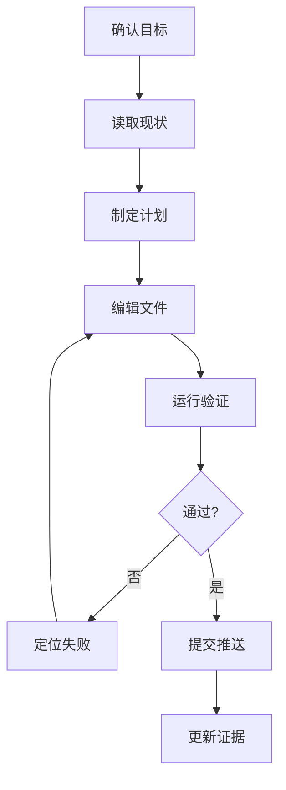

这个页面用于承载长任务 Agent 的任务拆解和自我检查机制。它关注 Agent 如何把一个模糊目标拆成可执行、可验证、可停止的步骤。

## 建设边界

- Task Decomposition：把目标拆成可执行、可验证、可回滚的小步骤。
- Planner、Executor、Critic、Reviewer 的职责边界。
- ReAct、Plan-and-Execute、Reflection、Self-Refine 等模式的适用场景。
- 动态调整：执行过程中如何根据工具结果修正计划。
- 停止条件：完成标准、最大步数、预算、风险阈值、人工接管。
- 失败模式：无限循环、过度反思、计划漂移、验证缺失。

## 从目标到计划

规划的第一步不是列 todo，而是把用户目标改写成可验收标准：

| 问题 | 例子 |
| --- | --- |
| 目标是什么 | 补齐一组文档页面 |
| 成功如何证明 | 文件已修改、lint/build 通过、commit 已推送、issue 有证据 |
| 有哪些约束 | 中文写作、只改本组文件、不要覆盖他人改动 |
| 哪些动作有风险 | 推送代码、修改 issue、删除文件 |
| 什么时候停止 | 所有验收项满足，或遇到凭据/权限阻塞 |

没有成功标准的计划，很容易变成“看起来做了很多事”，但无法证明任务完成。

## 计划模式对比

| 模式 | 适用场景 | 风险 |
| --- | --- | --- |
| ReAct | 每一步都依赖工具观察结果 | 可能陷入局部循环 |
| Plan-and-Execute | 目标较清楚、步骤可预估 | 初始计划错误会放大 |
| Reflection | 需要自检、纠错、复盘 | 过度反思导致成本上升 |
| Self-Refine | 文案、总结、代码片段等可迭代产物 | 没有外部验证时可能自我强化错误 |
| 人工确认计划 | 高风险、长任务、外部副作用 | 交互成本更高 |

工程实现里通常会混用这些模式：先计划，再执行；每步执行后观察；关键节点反思；高风险动作前交给人确认。

## 职责边界

| 角色 | 应该负责 | 不应该负责 |
| --- | --- | --- |
| Planner | 拆目标、排顺序、识别风险 | 编造未观察到的事实 |
| Executor | 调用工具、修改文件、收集证据 | 跳过权限和 schema 校验 |
| Critic | 对照成功标准找问题 | 无限提出主观改进 |
| Reviewer | 检查质量、测试和交付证据 | 代替工具结果做事实判断 |
| Human | 确认高风险动作和业务取舍 | 手动弥补系统缺失的 trace |

这些角色可以由同一个模型在不同提示下扮演，也可以由不同模型或规则模块实现。关键是职责要被记录和验证。

## 任务 DAG

长任务可以从线性 todo 升级为 DAG：



DAG 的价值是明确依赖关系：没有读取现状就不该编辑；没有验证就不该提交；没有推送就不能把 commit 当成交付证据。

## 反思的输入

反思不应该只问模型“你觉得做得好吗”。有效反思需要证据：

- 当前计划和成功标准。
- 工具结果、测试输出、diff、截图或日志。
- 已知失败和重试记录。
- 用户明确约束和风险偏好。
- 预算、步数、权限和时间限制。

反思输出也要结构化：继续执行、修改计划、请求确认、降级、停止失败或交付完成。

## 停止条件

停止条件建议写成可机器判断的规则：

```ts
type StopReason =
  | "success"
  | "needs_human_confirmation"
  | "blocked_by_missing_input"
  | "budget_exceeded"
  | "repeated_failure"
  | "unsafe_action";
```

不同停止原因对应不同产品行为。`success` 可以交付；`needs_human_confirmation` 应暂停等待；`repeated_failure` 应报告证据和已尝试路径；`unsafe_action` 应拒绝或升级审批。

## 常见失败模式

| 失败模式 | 现象 | 修正方式 |
| --- | --- | --- |
| 计划漂移 | 执行中忘记原始目标 | 每步带上成功标准和当前计划 |
| 过度拆解 | 简单任务被拆成大量无意义步骤 | 给计划粒度设上限 |
| 过度反思 | 每一步都生成长篇自评 | 只在关键节点反思 |
| 自我确认 | 没有运行工具就说通过 | 反思必须引用外部证据 |
| 失败重试无上限 | 同样动作反复失败 | 记录失败签名并触发降级 |

## 检查清单

- 是否先定义了可验收成功标准。
- 是否把高风险动作标记为需要人工确认。
- 是否能在工具失败后重规划，而不是重复同一步。
- 是否有最大步数、最大预算和重复失败阈值。
- 是否把反思输出转成下一步动作，而不是只写总结。
- 是否在交付前运行了与风险匹配的验证。

## 延伸阅读

- [Agent Loop](/docs/concepts/agent-loop)：规划与反思在 Loop 中的位置。
- [评测与回归](/docs/practices/evaluation)：用固定样例验证计划策略是否真的更好。
- [ReAct](https://arxiv.org/abs/2210.03629)：推理与行动交替。
- [Reflexion](https://arxiv.org/abs/2303.11366)：通过语言反馈和记忆改进后续尝试。
- [Self-Refine](https://arxiv.org/abs/2303.17651)：生成、反馈、改写的迭代式自我改进。
