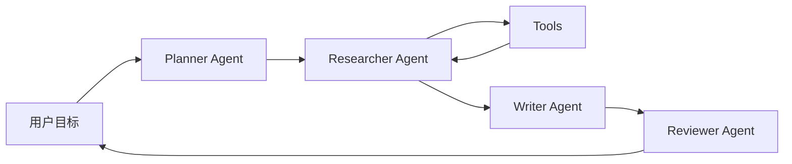

这个页面用于承载 AutoGen 的框架拆解，重点关注多 Agent 对话和角色协作。

## 建设边界

- Agent 角色、group chat、工具执行和人工接管。
- 多 Agent 对话如何表达任务协作。
- 适合研究、讨论、分工和原型验证的场景。
- 不适合过度依赖对话回合而缺少外部验证的场景。

## 核心抽象

AutoGen 是 Microsoft 推出的多 Agent 框架，重点是让多个 agent 通过消息协作，并可接入工具、人工输入和自定义运行时。当前文档中常见入口包括 AgentChat、高层多 Agent API、Core API 和扩展模块。

| 抽象 | 作用 |
| --- | --- |
| AssistantAgent | 由模型驱动的角色，负责生成回复、调用工具或推进任务。 |
| UserProxy / Human Input | 把人类反馈接入协作过程。 |
| Team / Group Chat | 组织多个 agent 以轮流、选择器或群组方式协作。 |
| Tool | 给 agent 提供外部函数、代码执行或业务 API。 |
| Runtime / Core | 更底层的消息、事件和 agent 生命周期控制。 |

## 最小协作模型

AutoGen 的强项是把“多个角色通过消息推进任务”表达得很自然，适合研究原型、方案讨论、多角色评审和复杂任务拆解。

## 适合场景

- 需要观察不同角色如何协作、辩论、审查或交接。
- 研究型原型，希望快速试多 Agent 组织方式。
- 任务需要人工在中途参与，例如批准计划、补充约束、评审输出。
- 工具调用主要用于支撑讨论和验证，而不是严格业务流程。

## 谨慎场景

- 生产工作流需要强状态机、严格 SLA、可恢复执行和清晰审批。
- 对话回合很多但缺少外部工具验证，容易形成“自说自话”。
- 每个 agent 都带大模型调用，成本和延迟会快速上升。
- 角色边界只写在 prompt 里，没有任务状态和验收标准。

## 与其他框架的差异

| 维度 | AutoGen | CrewAI | LangGraph |
| --- | --- | --- | --- |
| 主要心智模型 | 多 Agent 消息协作 | role / task / crew / process | 图和状态机 |
| 强项 | 对话式协作、研究原型、人类参与 | 快速组织角色任务 | 可控流程、恢复、分支循环 |
| 风险 | 回合膨胀、角色漂移 | 角色描述替代验证 | 图设计复杂 |

## 失败模式

- 角色漂移：Planner 开始写最终稿，Reviewer 开始重新规划。
- 回合膨胀：多个 agent 互相补充但没有收敛条件。
- 权威错觉：多个 agent 都同意，不代表事实正确。
- 工具断层：讨论中提到的检查没有真实执行。
- 成本不可控：每个回合多个模型调用，延迟和费用翻倍。

## 检查清单

- 是否为每个 agent 定义输入、输出和停止条件。
- 是否限制最大回合数和最大成本。
- 是否有外部工具或测试验证关键结论。
- 是否记录每个 agent 的消息、工具调用和决策。
- 是否能把成功/失败 trace 变成评测样例。

## 参考资料

- [AutoGen Documentation](https://microsoft.github.io/autogen/)
- [AutoGen AgentChat](https://microsoft.github.io/autogen/stable/user-guide/agentchat-user-guide/index.html)
- [AutoGen GitHub Repository](https://github.com/microsoft/autogen)
