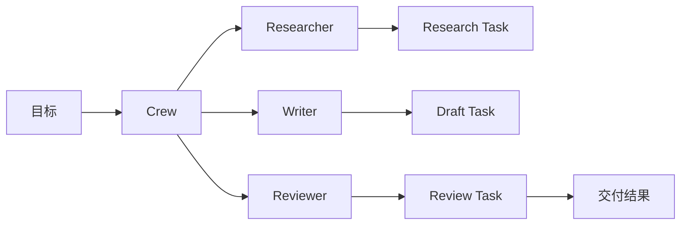

这个页面用于承载 CrewAI 的框架拆解，重点关注角色、任务和流程组织。

## 建设边界

- Role、Task、Crew、Process 的核心概念。
- 顺序执行、层级执行和任务交接方式。
- 适合快速组织多角色任务的场景。
- 与工作流引擎、队列系统、状态持久化之间的边界。

## 核心抽象

CrewAI 的核心心智模型是用角色、任务和流程组织一组 agent 完成目标。它不像 LangGraph 那样从图状态机出发，也不像 Vercel AI SDK 那样从产品 UI 出发，而是更强调“谁负责什么任务”。

| 抽象 | 含义 |
| --- | --- |
| Agent / Role | 角色身份、目标、背景、可用工具。 |
| Task | 具体工作项、期望输出、上下文和验收描述。 |
| Crew | 一组 agent 和 task 的组织单元。 |
| Process | 任务执行方式，例如顺序、层级或由管理者协调。 |
| Tools | 给角色提供外部能力，例如搜索、文件、API。 |
| Flows | 面向事件和流程控制的更显式编排方式。 |

## 最小心智模型

CrewAI 适合把一个较开放的任务拆给几个角色，让它们按流程完成研究、写作、审查、总结等工作。

## 适合场景

- 需要快速组织多角色任务，例如研究、内容生产、市场分析、客服流程原型。
- 任务可以拆成明确 role 和 task。
- 团队希望先用较自然的业务语言描述协作流程。
- Python 生态和现有工具更适合当前项目。

## 谨慎场景

- 需要强一致状态、精确恢复、复杂条件分支和严格事务。
- 高风险工具很多，权限和审批不能只靠角色描述。
- 任务结果必须由测试、引用或业务规则验证，而不能只靠 reviewer agent。
- 角色越多越好是误区，角色越多通信成本越高。

## 与 AutoGen、LangGraph 的差异

| 维度 | CrewAI | AutoGen | LangGraph |
| --- | --- | --- | --- |
| 主要抽象 | role / task / crew / process | 多 Agent 对话和消息 | 状态图 |
| 最适合 | 多角色任务组织 | 多 agent 协作研究和讨论 | 复杂控制流和恢复 |
| 设计重点 | 角色职责和任务验收 | 消息协议和协作策略 | 状态结构和节点边 |
| 常见风险 | 角色描述过强、验证不足 | 对话回合膨胀 | 图复杂度上升 |

## 任务验证

CrewAI 里的 task 描述应包含可验收输出，而不是只写“写得专业一点”。建议每个 task 都有：

- 输入上下文：上游任务产物、资料来源、限制条件。
- 期望输出：格式、字段、引用、长度或文件路径。
- 禁止行为：不得编造来源、不得执行高风险工具、不得跳过审查。
- 验证方式：人工评审、测试、引用检查、schema 校验或后续任务检查。

## 检查清单

- role 是否对应真实职责，而不是泛泛的“专家”。
- task 是否有明确交付物和验收标准。
- process 是否有停止条件和失败处理。
- 工具权限是否在代码层控制，而不是只在 role 里声明。
- 是否记录每个 task 的输入、输出、工具调用和成本。

## 参考资料

- [CrewAI Documentation](https://docs.crewai.com/)
- [CrewAI Agents](https://docs.crewai.com/v1.15.1/en/concepts/agents)
- [CrewAI Crews](https://docs.crewai.com/v1.15.1/en/concepts/crews)
- [CrewAI Flows](https://docs.crewai.com/v1.15.1/en/concepts/flows)
