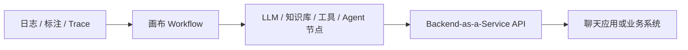

Dify 是开源 LLM 应用开发平台，把可视化工作流、RAG、Agent、模型管理和可观测性放在同一个协作空间里。它不是 LangGraph 那种代码优先图运行时，而是给产品/运营也能改节点的应用平台。

## 适合场景

- 知识库问答、内部助手、需要文档解析和检索的业务 Agent。
- 希望用画布编排 Prompt、工具、知识库和 Agent 节点，再通过 API 接到现有产品。
- 团队要私有化部署，但不能接受只在代码里改流程。
- 需要内建日志、标注和 Prompt 迭代（LLMOps），而不是另搭一套评测后台。

## 心智模型



Agent 节点可以跑命令、装软件、处理文件，并接 Marketplace 工具、MCP 或自建 API。来源：[Dify README](https://github.com/langgenius/dify)。

## 工程判断

如果你的痛点是「业务人员要改流程、知识库要入库、应用要有 API」，Dify 比手写 LangGraph 更快。如果你的痛点是「必须精细控制状态机、循环恢复和框架无关的 Session 日志」，先读 [LangGraph](/docs/frameworks/langgraph) 和 [Harness 工程构件](/docs/practices/harness-engineering)。

和 Google ADK 的差别：ADK 是代码仓库里的 Agent/Workflow SDK；Dify 是可部署的应用控制台。

## 最小运行路径

机器至少 2 核 4 GiB，Docker Compose v2.24.0+：

```bash
cd dify/docker
cp .env.example .env
docker compose up -d
```

浏览器打开 `http://localhost/install`。云端试用见 [dify.ai](https://dify.ai)。

## 注意事项

- 许可证是基于 Apache 2.0 的 [Dify Open Source License](https://github.com/langgenius/dify/blob/main/LICENSE)，有额外条件；企业分发前必须读原文，不要写成「纯 Apache 2.0」。
- 画布降低了上手成本，也容易把密钥、工具权限和不可逆动作藏进节点默认值。
- Agent 沙箱能执行命令，生产环境要单独做网络和文件系统隔离。
- 可观测性可接 Opik、Langfuse、Arize Phoenix，但默认不等于你已经有评测闸门。

## 参考来源

- [langgenius/dify](https://github.com/langgenius/dify)
- [Dify Docs](https://docs.dify.ai)
- [框架选型总览](/docs/frameworks/framework-selection)
- [LangGraph](/docs/frameworks/langgraph)
- [Google ADK](/docs/frameworks/google-adk)
