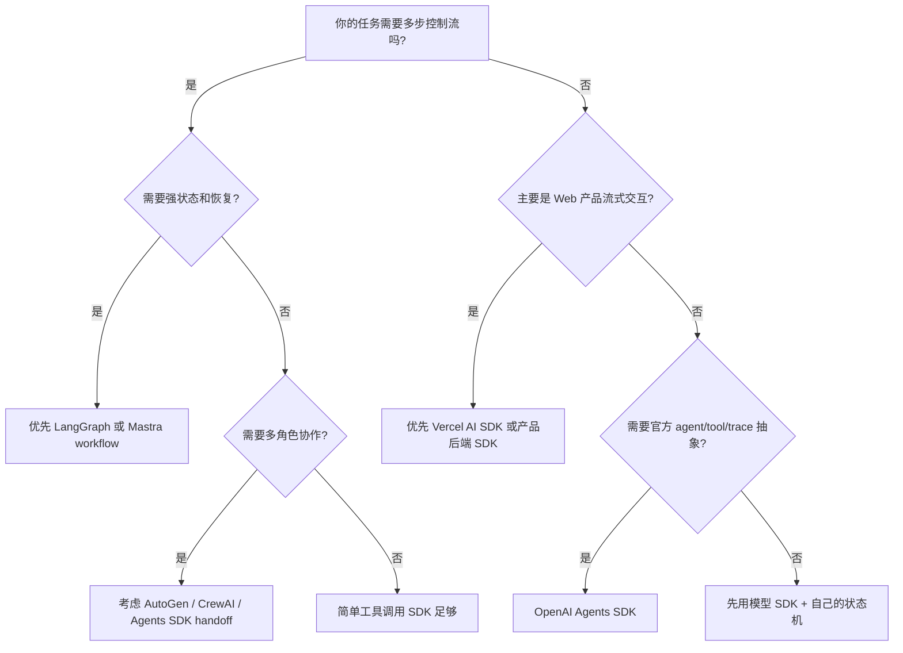

这个页面用于承载 Agent 框架选型方法。选框架前，需要先确认任务复杂度、团队语言栈、状态持久化、工具权限和产品集成方式。

## 建设边界

- 比较维度：核心抽象、状态管理、工具系统、工作流、多 Agent、持久化、评测、部署、生态。
- Python 生态：LangGraph、AutoGen、CrewAI、LlamaIndex、Haystack、Semantic Kernel。
- TypeScript 生态：Mastra、Vercel AI SDK、OpenAI Agents SDK 的 JS/TS 使用方式。
- 产品集成：streaming UI、server actions、API routes、任务状态、trace 展示。
- 迁移成本：框架绑定、工具 schema 复用、状态存储抽象。

## 比较维度

| 维度 | 要看什么 |
| --- | --- |
| 核心抽象 | 是 agent、graph、workflow、crew、chat，还是 UI SDK。 |
| 状态管理 | 是否能持久化、恢复、分支、回放和人工接管。 |
| 工具系统 | 是否支持 schema、权限、错误语义、流式工具结果。 |
| 多 Agent | 是否支持 handoff、group chat、role/task、协调者。 |
| 产品集成 | 是否方便接入 Web UI、API route、队列、后台任务和 trace 页面。 |
| 评测能力 | 是否有 eval、replay、observability 或可导出的轨迹数据。 |
| 部署方式 | 本地、容器、Serverless、长任务 worker、云服务是否匹配。 |
| 迁移成本 | 工具 schema、状态存储、prompt、trace 是否能脱离框架复用。 |

## 场景决策树

## 框架对比

| 框架 | 语言 / 生态 | 最适合 | 谨慎点 |
| --- | --- | --- | --- |
| LangGraph | Python / JS，LangChain 生态 | 状态图、循环、恢复、人工接管、复杂 workflow | 图和状态设计需要工程纪律 |
| Mastra | TypeScript | TS 产品工程中的 agent、tool、workflow、部署 | 框架生态和团队栈要匹配 |
| AutoGen | Python，Microsoft 生态 | 多 Agent 对话、研究原型、角色协作 | 对话回合多时要防止漂移和成本膨胀 |
| CrewAI | Python | role/task/crew/process 的快速多角色任务组织 | 角色描述不能替代验证和状态管理 |
| OpenAI Agents SDK | Python / JS，OpenAI 生态 | agent、tool、handoff、guardrail、trace 的统一抽象 | 与具体模型/provider 绑定度要评估 |
| Vercel AI SDK | TypeScript，Web / React | streaming UI、tool calling、structured output、Next.js 集成 | 不是完整工作流引擎，需要配状态和评测 |

## 避免框架绑定

框架可以替换，业务契约要稳定。建议把下面几类对象做成框架无关：

- 工具 schema：使用 JSON Schema、Zod 或 OpenAPI 表达输入输出。
- 任务状态：用自己的 task/session/run 表，而不是只存在框架内存。
- Trace 格式：至少导出模型调用、工具调用、错误和成本。
- 评测样例：输入、fixture、期望信号和禁止动作独立保存。
- 权限策略：高风险工具审批不依赖某个 prompt 模板。

## 选型检查清单

- 这个框架是否真的解决当前痛点，还是只让 demo 更好看。
- 团队是否熟悉它的主语言和部署方式。
- 框架失败时，是否能拿到足够 trace 做排障。
- 是否能把工具、状态、评测数据迁移到另一个框架。
- 是否支持你需要的人工确认、暂停恢复和权限边界。
- 是否有活跃文档、示例、版本说明和社区问题处理。

## 参考资料

- [LangGraph Documentation](https://langchain-ai.github.io/langgraph/)
- [Mastra Documentation](https://mastra.ai/docs)
- [AutoGen Documentation](https://microsoft.github.io/autogen/)
- [CrewAI Documentation](https://docs.crewai.com/)
- [OpenAI Agents SDK Documentation](https://openai.github.io/openai-agents-python/)
- [Vercel AI SDK Documentation](https://ai-sdk.dev/docs/introduction)
