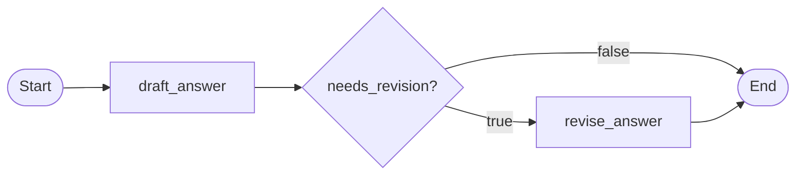

LangGraph 适合已经越过单次 LLM 调用、开始面对真实 Agent 控制流的工程场景：任务会分成多步，过程中可能调用工具、根据结果分支、循环修正、暂停等待人工确认，或者在失败后从中间状态恢复。

它的价值不在于“把流程画成图”，而在于把 Agent 的不确定执行过程拆成可观察、可恢复、可测试的工程结构。对已经理解 LLM 和基础 Agent loop 的读者来说，可以把 LangGraph 理解成一种显式的状态机建模方式：哪些信息进入状态，哪个节点修改状态，哪条边决定下一步，什么时候结束，什么时候交给人。

## 定义与边界

### 什么是 LangGraph

LangGraph 是 LangChain 团队维护的低层 Agent 编排框架和运行时。它可以与 LangChain 的模型、工具等组件配合使用，但不要求必须使用 LangChain。它用图（Graph）描述执行流程，用状态（State）承载任务上下文，用检查点（Checkpoint）保存执行过程，让复杂 Agent 不再只是隐藏在一段 prompt 或 `while` 循环里的黑盒。

一个 LangGraph 应用通常由几类元素组成：

| 元素 | 作用 | 可以先这样理解 |
| --- | --- | --- |
| Graph | 描述整个执行流程 | 一张可执行的状态机图 |
| State | 贯穿图执行过程的数据 | Agent 当前知道什么、做到哪一步 |
| Node | 执行一个具体步骤 | 计划、检索、调用工具、审查、总结 |
| Edge | 决定节点之间如何流转 | 固定下一步或根据状态选择下一步 |
| Checkpoint | 保存中间状态 | 用于恢复、回放、调试和人工介入 |

LangGraph 不要求所有节点都必须是模型调用。节点可以是普通 Python 函数，也可以封装 LLM、检索器、业务 API、代码执行器或审批流程。关键在于：节点读入状态，完成一个相对明确的动作，再把状态更新交还给图。

### 它适合什么

| 场景 | 为什么适合 |
| --- | --- |
| 多步骤 Agent | 每一步可以拆成独立节点，便于测试和调试 |
| 有条件分支的流程 | 可以根据状态选择不同路径，而不是把路由藏在 prompt 里 |
| 需要循环修正的任务 | 可以显式设置重试、审查和退出条件 |
| 需要 human-in-the-loop 的产品 | 可以在高风险节点暂停，等待人工确认或修改 |
| 需要长任务恢复的系统 | 检查点能保存中间状态，支持失败后继续执行 |
| 需要节点级 trace 的工程项目 | 每个节点的输入、输出和路由选择都更容易记录 |

如果你的 Agent 已经出现“下一步怎么选”“失败后从哪里继续”“人工什么时候介入”“为什么这一步选错了工具”这类问题，LangGraph 的显式图结构通常会比手写流程更容易维护。

### 它不适合什么

LangGraph 也不是所有 Agent 项目的默认答案。下面这些场景通常不需要先引入它：

- 单次问答或一次工具调用就能解决的问题。
- 两三个固定步骤组成的简单链路。
- 只想快速验证 prompt 效果的 demo。
- 团队还没有能力维护状态 schema、错误处理和评测。
- 主要目标是角色扮演式多 Agent 协作，而不是状态机式流程控制。

引入 LangGraph 的前提是你愿意把控制流、状态和失败处理显式建模。它能提高复杂流程的可控性，也会增加设计和维护成本。简单任务先用普通函数链或最小 Agent loop 跑通，往往更符合工程直觉。

## 核心抽象

理解 LangGraph 不要先从“怎么画图”开始，而要先看它如何处理状态、步骤和路由。图只是外层结构，真正决定系统是否可维护的是：State 怎么设计，Node 怎么拆，Edge 怎么选，执行过程能不能被保存和恢复。

| 抽象 | 解决的问题 | 设计重点 |
| --- | --- | --- |
| State | 承载贯穿执行过程的数据 | 字段边界、读写责任、是否持久化 |
| Node | 执行一个具体步骤 | 职责单一、输入输出明确、可单独测试 |
| Edge | 描述固定流转 | 流程可读，不把控制流藏进 prompt |
| Conditional Edge | 根据状态选择下一步 | 依赖结构化字段，有明确退出条件 |
| Checkpoint | 保存执行过程 | 支持恢复、回放、审计、人工介入 |
| Interrupt | 暂停执行并等待外部输入 | 用于审批、修正状态或接管高风险动作 |

### State

State 是 LangGraph 的中心。节点读取 State，再返回对 State 的更新；边也通常根据 State 中的字段决定下一步。换句话说，State 不是普通的临时变量，而是整张图对“任务当前进展”的共同认知。

一个可维护的 State 不应该变成无边界的大字典。设计时可以先把字段分成几类：

```text title="state-fields.txt"
输入字段：question、user_id、task_id
工作字段：plan、tool_results、draft
控制字段：next_step、retry_count、needs_human_review
输出字段：final_answer、citations
观测字段：errors、trace_id、latency_ms
```

每个字段最好都能回答几个问题：谁写入它，谁读取它，是否需要持久化，是否影响路由，是否应该出现在最终输出里。如果一个字段只是“暂时可能有用”，通常不应该先放进全局 State。

### Node

Node 是图里的一个可执行步骤。它可以是普通 Python 函数，也可以在内部调用模型、检索器、工具、数据库或业务 API。官方 Graph API 中，节点的常见形式是接收当前 State，返回一个用于更新 State 的字典。进阶用法里，节点也可以配合 `Command` 等机制表达更新和跳转；本文先按最常见的 State 更新模型理解。

好的 Node 像一个小的业务函数：职责清楚，输入有限，输出明确。比如一个研究型 Agent 可以拆成 `plan`、`search`、`review_evidence`、`draft_answer`、`finalize` 等节点。不要把“计划、工具调用、反思、总结”都塞进一个节点里，否则图看起来变复杂了，真正的逻辑仍然藏在一个不可测试的大 prompt 里。

也不要为了拆而拆。节点拆分的判断标准是：这个步骤是否有独立的输入输出，是否值得单独测试，失败后是否需要单独重试或降级。如果答案都是“否”，它可能只是某个节点内部的一小段逻辑。

### Edge 与 Conditional Edge

Edge 描述节点之间的流转。普通边适合固定流程，例如 `draft` 之后总是进入 `review`。Conditional Edge 适合根据 State 做路由，例如根据 `needs_human_review` 决定进入人工审批，或者根据 `retry_count` 决定继续检索还是失败结束。

条件边最好依赖结构化字段，而不是让模型用一段自然语言自由判断下一步。更稳的方式是让上游节点写入明确字段，例如：

- `next_step = "search" | "review" | "finalize"`
- `needs_human_review = true | false`
- `retry_count = 0`
- `confidence = "low" | "medium" | "high"`

同一个节点尽量不要同时混用普通边和条件边。如果一个节点需要动态路由，就让条件边统一决定下一步，避免多个路径被同时触发，让执行行为变得难推理。

只要图里存在循环，就必须设计退出条件。常见退出条件包括最大重试次数、证据已经满足要求、工具连续失败、人工介入完成、任务被取消。没有退出条件的循环会让 Agent 在“继续调用工具”和“继续反思”之间消耗时间和 token。

### Checkpoint

Checkpoint 用来保存图执行过程中的状态。它不只是“断点续跑”，也服务于回放、审计、调试、人工介入和评测。对于长任务来说，checkpoint 能让系统在中途失败后从某个状态继续；对于生产系统来说，它还能帮助团队复盘“这次 Agent 为什么走到了这个分支”。

在产品里，checkpoint 不应该只看作本地开发便利。它通常需要和用户、任务、会话、权限和图版本绑定。否则一旦涉及多用户、并发任务、失败恢复或审计追踪，就很难判断某个状态属于谁、由哪个版本的图产生、是否还能安全恢复。

Checkpoint 主要保存单个 thread 的图状态快照。如果要保存跨会话的用户偏好、长期记忆或共享知识，通常应使用 store 或外部存储，而不是把所有长期数据塞进 State。

### Interrupt / Human-in-the-loop

Interrupt 是让图在某个位置暂停，等待外部输入后再继续执行的机制。放到产品语境里，它对应 human-in-the-loop：在高风险或不确定的节点，让人审批、修正状态或接管下一步。

实际使用 interrupt 时，需要 checkpointer 保存状态，并通过稳定的 `thread_id` 找回同一次执行；恢复时，外部输入会回到 `interrupt()` 调用处继续运行。

适合暂停的场景包括：

- 即将执行有副作用的动作，例如发邮件、改数据库、提交代码、下单。
- 模型置信度低，或多个来源互相冲突。
- 工具连续失败，自动重试已经没有收益。
- 输出会进入客户沟通、公开发布、法律财务等高风险场景。

好的人工介入点不应该只把一大段日志丢给人。它应该展示结构化摘要、当前状态、候选动作、风险原因和可选操作，例如“批准执行”“修改参数后继续”“退回上一步”“终止任务”。这样人不是在替 Agent 读日志，而是在一个明确的控制点上做决策。

## 执行流程示意

LangGraph 的执行方式可以先理解成“状态在节点之间流动”。每个节点读取当前 State，完成一步动作，再返回需要更新的字段；边决定下一个节点是谁；条件边根据 State 里的结构化字段做选择。



这张图展示的是一个最小流程：

- `draft_answer` 生成初稿，并写入是否需要修改。
- 条件路由读取 `needs_revision`。
- 如果需要修改，进入 `revise_answer`。
- 如果不需要修改，直接结束。

真实项目中的节点可以替换成模型调用、工具调用、检索、人工审批或结果评测。但基本问题不变：当前状态是什么，这一步改了什么，下一步为什么走到那里。

## 最小示例

下面的示例故意保持短小，只展示 LangGraph 的骨架：定义 State，编写两个节点，添加一条条件边，然后 `compile()` 成可执行图并用 `invoke()` 运行。

```python title="minimal-langgraph.py" lineNumbers
from typing import TypedDict

from langgraph.graph import START, END, StateGraph


class AgentState(TypedDict):
    question: str
    draft: str
    needs_revision: bool


def draft_answer(state: AgentState) -> dict:
    """生成初稿，并标记是否需要进入修改节点。"""
    return {
        "draft": f"先回答问题：{state['question']}",
        "needs_revision": True,
    }


def revise_answer(state: AgentState) -> dict:
    """只更新自己负责的字段。"""
    return {
        "draft": state["draft"] + "\n补充工程判断和边界条件。",
        "needs_revision": False,
    }


def route_after_draft(state: AgentState) -> str:
    if state["needs_revision"]:
        return "revise"
    return END


graph_builder = StateGraph(AgentState)
graph_builder.add_node("draft", draft_answer)
graph_builder.add_node("revise", revise_answer)

graph_builder.add_edge(START, "draft")
graph_builder.add_conditional_edges("draft", route_after_draft)
graph_builder.add_edge("revise", END)

graph = graph_builder.compile()

result = graph.invoke(
    {
        "question": "什么时候应该使用 LangGraph？",
        "draft": "",
        "needs_revision": False,
    }
)

print(result["draft"])
```

这个例子里有四个关键点：

- `AgentState` 定义图执行过程中会出现哪些字段。
- `draft_answer` 和 `revise_answer` 是普通函数，但它们扮演 LangGraph 节点。
- `route_after_draft` 读取 State，决定下一步去 `revise` 还是 `END`。
- `compile()` 之后得到可执行图，`invoke()` 传入初始 State 并启动执行。

真实项目里，`draft_answer` 可能会调用 LLM，`revise_answer` 可能会结合检索结果、评测规则或人工反馈。示例的重点不是回答质量，而是让读者看清 LangGraph 的工程骨架：State、Node、Edge、条件路由和结束节点如何配合。

## 工程设计方法

写 LangGraph 代码前，先把它当成一个工作流设计问题，而不是 API 拼装问题。比较稳的顺序是：先判断是否真的需要图，再设计 State，拆节点，设计路由和退出条件，最后补上观测与评测。

### 1. 先判断是否真的需要图

LangGraph 适合复杂控制流，但不是所有 Agent 都需要图。引入前可以先问：

- 任务是否存在循环，例如检索不够就继续查、审查不通过就重写？
- 是否有条件分支，例如工具失败、证据不足、风险过高时走不同路径？
- 是否需要暂停和恢复，例如等待人工审批或长任务断点续跑？
- 是否需要记录中间状态，而不只是最终答案？
- 是否需要对节点、路由、失败分支做单独评测？

如果答案大多是否，普通函数链、简单 Agent loop 或框架 SDK 里的 workflow 可能已经足够。LangGraph 的收益来自显式控制流，前提是你的问题确实有控制流复杂度。

### 2. 设计 State Schema

State Schema 是后续节点、路由、检查点和评测的共同契约。不要先写节点再随手往 State 里塞字段，而是先列出任务生命周期中必须被追踪的信息。

每个字段都应该能回答：

- 谁写入它？
- 谁读取它？
- 是否需要持久化？
- 是否会影响路由？
- 是否应该出现在最终输出里？

例如 `tool_results` 可能由工具节点写入、审查节点读取，需要持久化，也会影响是否继续检索；而某个临时格式化变量如果只在一个节点内部使用，就不应该进入全局 State。

### 3. 拆分节点

节点可以按动作拆，而不是按“代码看起来多长”拆。常见拆法包括：

- `plan`：生成任务计划或下一步动作。
- `call_tool`：执行工具调用，记录参数、结果和错误。
- `review`：检查证据、格式、安全规则或完成度。
- `route`：根据结构化字段决定下一步。
- `finalize`：整理最终输出和引用。

拆节点有两个极端都要避免：一个节点过大，图只是表面上清晰，实际逻辑仍藏在大 prompt 里；节点过碎，流程变成难以阅读的微步骤。判断标准可以很朴素：这个步骤是否有独立失败方式，是否需要单独测试，是否需要单独重试或人工介入。

### 4. 设计路由和退出条件

路由应该尽量基于 State 里的结构化字段。不要让条件边直接依赖一段自由文本判断，否则每次模型措辞变化都可能改变控制流。

常见路由包括：

- 工具调用成功：进入审查节点。
- 工具调用失败：重试、降级或转人工。
- 证据不足：回到检索节点。
- 重试过多：转人工或失败结束。
- 结果达标：进入最终输出。

只要存在循环，就要同时设计退出条件。常见字段包括 `retry_count`、`max_retries`、`last_error`、`confidence`、`needs_human_review`。没有退出条件的图会把 Agent loop 的老问题搬进 LangGraph：无限调用工具、无限反思、无限重写。

### 5. 加入观测和评测

LangGraph 让节点和边更显式，但可观测性不会自动发生。工程上至少应该记录：

- 每个节点的输入摘要、输出字段和耗时。
- 条件边选择了哪条路径，以及选择原因。
- 工具调用参数、返回摘要和错误类型。
- 检查点 ID、任务 ID、用户 ID 和图版本。
- 失败分支、人工介入点和最终结束原因。

早期项目不一定马上接入完整 trace 系统。可以先在 State 里保留 `errors` 字段，记录每个节点的失败、降级和过滤原因，例如工具超时、检索降级、评审未通过。这里记录摘要和错误类型即可，不要把完整异常堆栈、敏感参数或巨大的工具返回塞进 State。等流程稳定后，再把这些信息接入更完整的观测平台。

评测也不要只看最终答案。图式 Agent 更适合拆开评估：计划是否合理，工具是否选对，状态更新是否正确，路由是否符合预期，失败时是否进入了正确分支。这样改模型、改 prompt、改工具或改 State Schema 时，才能做真正的回归测试。

## 项目经验：Deep Research 工作流

一个 Deep Research 项目很适合观察 LangGraph 的工程价值。表面上看，它只是“搜索资料然后写报告”；真正做成可运行系统后，流程会变成一条长链路：规划、搜索、抓取、切块、检索、总结、写作、评审，每一步都有自己的输入、输出、失败方式和调试需求。

```text title="deep-research-flow.txt"
用户问题
-> 规划
-> 网页搜索与正文抓取
-> 文档切块
-> 向量检索
-> 子任务总结
-> 报告生成
-> 报告评审
-> 不通过则修订或结束
```

在这种项目里，LangGraph 的重点不是“多 Agent 名字听起来更复杂”，而是把长任务拆成可追踪的状态流。可以用类似 `ResearchState` 的结构保存 `plan_items`、`documents`、`retrieved_chunks`、`task_summaries`、`draft_report`、`review_result` 和 `errors`。这些字段让每个中间结果都能被检查、回放、展示和恢复。

节点也应该像流水线工序，而不是一个“超级研究员 Agent”。例如 `planner -> researcher -> chunker -> retriever -> summarizer -> writer -> reviewer`，每个节点只消费自己需要的 State 字段，并只返回自己负责更新的字段。这样配合 `stream_mode="updates"` 时，前端可以把每个节点渲染成一个清晰的进度 step，用户知道系统正在规划、搜索、切块、检索还是写报告。

错误处理也要进入设计。可以参考官方 `Thinking in LangGraph` 的错误处理思路，按“谁能修复”来分层处理：

- 临时错误：网络抖动、限流、服务短暂不可用，适合自动重试和 timeout。
- LLM 可恢复错误：工具返回异常、JSON 解析失败、证据不足，可以把错误写进 State，让后续节点修正。
- 用户可修复错误：需求范围不清、缺少权限或需要确认，适合用 `interrupt()` 暂停并等待用户输入。
- 未知错误：不要伪装成功，应该记录、暴露并进入开发者调试流程。
- 有副作用的错误：写数据库、发消息、提交代码等操作失败时，要考虑补偿动作或人工接管。

Deep Research 里搜索、网页抓取、embedding、向量库和 LLM 都可能失败，所以更稳的做法是给关键节点设计 fallback，例如 planner 失败时使用确定性计划，向量检索失败时降级到词法检索，reviewer 失败时返回未通过的 fallback review。可恢复错误应该写进 State，而不是让整张图直接崩掉。

长任务还要面向产品体验设计。运行配置里应有稳定的 `thread_id`，用于定位同一条 thread；业务侧可以额外记录 `run_id`、`user_query` 等 metadata，用于历史记录、运行列表和审计。RAG 链路里也不要直接把所有 chunks 喂给最终 writer；先按子任务生成 `task_summaries`，再让 writer 综合报告，通常能降低上下文噪声，让报告结构更稳定。

## 与其他框架的区别

LangGraph 的位置不是“最通用的 Agent 框架”，而是更偏可控工作流和状态机编排。和其他框架比较时，可以先看核心抽象，而不是只看示例代码是否短。

| 框架 | 核心抽象 | 更适合的问题 |
| --- | --- | --- |
| LangGraph | 图、状态、检查点 | 可控工作流、长任务、人工介入 |
| CrewAI | Role、Task、Crew | 多角色任务分工 |
| AutoGen | 多 Agent 对话 | 对话式协作和实验原型 |
| Mastra | Agent、Tool、Workflow | TypeScript 产品集成 |
| Vercel AI SDK | UI、streaming、tool calling | 前端生成式交互 |
| OpenAI Agents SDK | Agent、Tool、Handoff、Guardrail | 轻量工具调用和交接流程 |

实际项目中也可以组合使用。例如后端用 LangGraph 管理长任务状态和执行图，前端用 Vercel AI SDK 展示 streaming UI，观测侧接 LangSmith 或其他 trace 平台。框架之间不是只能二选一，关键是不要让多个框架同时争夺同一层控制权。

## 常见坑

### 为了用图而用图

简单链路不需要 LangGraph。只有当任务确实出现分支、循环、恢复、人工介入或节点级评测需求时，图结构才会抵消它带来的设计成本。

### State 变成垃圾桶

State 字段没有边界，所有节点都读写同一个大对象，后续就很难判断是谁写坏了状态。先定义字段责任，再写节点，会比边写边塞字段稳定得多。

### 节点太大

节点内部仍然是一大段不可测试的 prompt，图本身不会让系统变得可维护。节点应该能被单独调用、单独观察输入输出，并在失败时有明确处理方式。

### 条件边不稳定

如果路由依赖自然语言判断，模型措辞变化就可能改变控制流。更稳的做法是让上游节点输出结构化字段，再由条件边读取这些字段。

### 循环没有退出条件

Agent 在工具调用、反思、重试之间无限循环，是最常见的执行问题之一。每个循环都应该有最大轮数、失败分支或人工介入策略。

### 只评最终答案

图式 Agent 还要评估计划、工具选择、状态更新、路由选择和失败分支。只评最终答案，会错过很多中间步骤已经偏离的问题。

## 检查清单

### 必要性

- 是否真的需要循环、分支、恢复或人工介入？
- 普通函数链或简单 Agent loop 是否已经足够？
- 引入 LangGraph 后，复杂度是否仍然可接受？

### State 与节点

- State 字段是否有明确读写责任？
- 节点是否职责单一？
- 节点是否能单独测试？
- 节点输出是否是明确的状态补丁？

### 路由与恢复

- 条件边是否可解释？
- 循环是否有退出条件？
- 失败后是重试、降级、转人工还是终止？
- 是否配置检查点？
- 是否能回放失败过程？

### 观测与评测

- 是否记录节点级 trace？
- 是否保存路由选择原因？
- 是否评估中间状态？
- 是否有失败样例用于回归？

## 延伸阅读与来源

### 官方文档

- [LangGraph Overview](https://docs.langchain.com/oss/python/langgraph/overview)
- [Thinking in LangGraph](https://docs.langchain.com/oss/python/langgraph/thinking-in-langgraph)
- [Graph API](https://docs.langchain.com/oss/python/langgraph/graph-api)
- [Persistence](https://docs.langchain.com/oss/python/langgraph/persistence)
- [Human-in-the-loop](https://docs.langchain.com/oss/python/langgraph/human-in-the-loop)

### 项目内参考

- [Agent Loop](/docs/concepts/agent-loop)
- [多 Agent 协作](/docs/concepts/multi-agent)
- [评测与回归](/docs/practices/evaluation)
- [可观测性](/docs/practices/observability)
- [RAG 与知识系统](/docs/practices/rag-and-knowledge)

### 代码与生态

- [LangGraph GitHub](https://github.com/langchain-ai/langgraph)
- [LangChain 文档](https://docs.langchain.com/)
- [LangSmith 文档](https://docs.smith.langchain.com/)

## 小结

LangGraph 最值得学习的不是“怎么把流程画成图”，而是如何把 Agent 的不确定行为拆成可观察、可恢复、可测试的工程结构。只要任务开始出现循环、分支、长时间运行、人工审批和失败恢复，LangGraph 就比手写 Agent loop 更容易维护。
