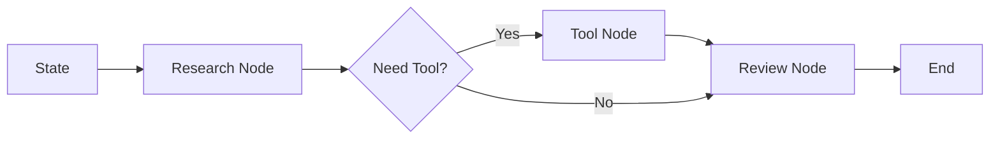

LangGraph 的核心价值是把 Agent 流程表达为图。节点负责执行动作，边负责控制流，状态贯穿整个过程。

## 适合场景

- 多步骤任务。
- 需要循环和条件分支。
- 需要人工接管。
- 需要保存和恢复状态。
- 需要清晰地调试每个节点。

## 心智模型

## 工程判断

如果你的 Agent 已经开始出现“下一步怎么选”“失败怎么回到上一步”“人工什么时候介入”这些问题，LangGraph 的图结构会比手写 while loop 更清晰。

## 注意事项

- 不要把所有逻辑塞进一个节点。
- 状态结构要尽早稳定。
- 节点输出要可测试。
- 图复杂后需要配套 trace 和可视化。
