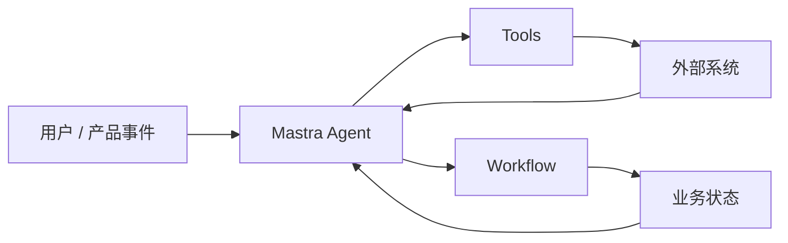

Mastra 更贴近 TypeScript 产品工程，适合把 Agent 能力嵌入 Web 应用、后台任务或业务工作流。

## 适合场景

- 项目主体是 TypeScript。
- 需要把工具、工作流和 Agent 放进一个应用工程。
- 团队更关心产品集成和部署体验。
- 需要较快搭建可维护原型。

## 与 LangGraph 的差异

| 维度 | LangGraph | Mastra |
| --- | --- | --- |
| 核心抽象 | 图、状态机 | Agent、工具、workflow |
| 语言生态 | Python / JS | TypeScript |
| 主要优势 | 可控流程和状态 | 产品集成体验 |
| 学习重点 | 图建模 | 工具与工作流组织 |

## 选型建议

如果你主要在做复杂控制流，先看 LangGraph。如果你的目标是把 Agent 放进 TypeScript 产品，并希望快速组织工具、工作流和部署，Mastra 更值得先试。

## 核心抽象

Mastra 的定位是 TypeScript AI 应用框架，常见抽象包括 agent、tool、workflow、memory、eval、deployment 等。它更像“产品工程里的 Agent 框架”，而不是单纯的研究脚本库。

| 抽象 | 作用 |
| --- | --- |
| Agent | 绑定模型、指令、工具和记忆，处理一次或多次交互。 |
| Tool | 把外部能力包装成类型化输入输出，供 Agent 调用。 |
| Workflow | 把多步骤业务流程组织成可维护的执行图。 |
| Memory | 管理对话状态、用户上下文或长期信息。 |
| Eval / Observability | 用于质量评估、trace 和运行时观察。 |

## 最小心智模型

Mastra 适合把 Agent 放进 TypeScript 应用工程里，和 API route、后台任务、数据库、产品 UI 共同演进。

## 适合场景

- 团队主栈是 TypeScript / Node.js。
- Agent 需要和产品数据库、Web API、用户会话、任务队列集成。
- 需要用 workflow 表达业务流程，而不是只做一次聊天。
- 希望工具 schema、应用类型和前后端状态共享类型约束。
- 需要快速把原型推进到可部署服务。

## 不适合场景

- 团队主要是 Python 研究栈，且任务集中在 notebook、RAG 实验、评测脚本。
- 需要非常强的图状态机语义、复杂回溯和深度定制运行时。
- 只是一次模型调用或简单摘要任务，引入完整框架会过重。

## 工程建议

- 工具输入输出使用 Zod / JSON Schema 等强约束，不要只靠自然语言描述。
- workflow 节点要小，节点间通过明确状态传递。
- 将业务状态写入自己的数据库或任务表，不要只依赖内存会话。
- 评测和 trace 尽早接入，避免 demo 阶段的隐式成功路径进入生产。
- 与 Vercel AI SDK 组合时，Mastra 可以偏后端 workflow，AI SDK 偏前端流式 UI。

## 检查清单

- 是否明确哪些逻辑放在 Agent，哪些放在 workflow。
- 是否为每个工具定义类型、权限和错误语义。
- 是否能从一次失败任务中导出 trace。
- 是否有独立评测样例，而不是只看产品 UI 里的回答。
- 是否能在未来替换模型或工具实现时保持业务状态不变。

## 参考资料

- [Mastra Documentation](https://mastra.ai/docs)
- [Mastra Workflows](https://mastra.ai/docs/workflows/overview)
- [Mastra Agents](https://mastra.ai/docs/agents/overview)
