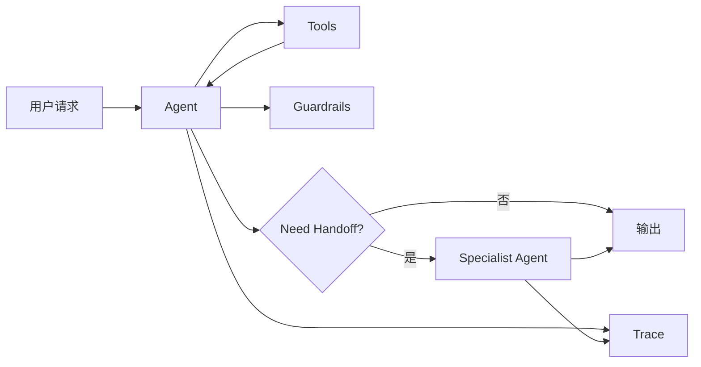

这个页面用于承载 OpenAI Agents SDK 的框架拆解，重点关注工具、交接、护栏和追踪。

## 建设边界

- Agent、tool、handoff、guardrail、trace 等核心抽象。
- 单 Agent 和多 Agent handoff 的组织方式。
- 工具调用、结构化输出和安全边界。
- 与产品后端、评测和 trace 系统的集成方式。

## 核心抽象

OpenAI Agents SDK 是用于构建 agentic apps 的工具包，官方文档强调 agent、tool、handoff、guardrail、streaming 和 tracing 等能力。它适合把 OpenAI 模型能力、工具调用、多 agent 交接和 trace 组织成统一运行时。

| 抽象 | 作用 |
| --- | --- |
| Agent | 绑定指令、模型、工具、输出类型和可交接对象。 |
| Tool | 让 agent 调用函数、API、文件或业务动作。 |
| Handoff | 让一个 agent 把任务交给另一个更合适的 agent。 |
| Guardrail | 在输入、输出或工具调用周围增加验证和安全约束。 |
| Runner | 执行 agent loop，处理模型调用、工具结果和交接。 |
| Tracing | 记录 agent 执行路径、工具调用和调试信息。 |

## 最小心智模型



Agents SDK 的重点不是只封装一次模型调用，而是把 agent 的执行路径变成可组织、可追踪、可加护栏的结构。

## 适合场景

- 你已经使用 OpenAI 模型和工具调用，并希望有统一 agent 抽象。
- 需要多个专业 agent 之间 handoff，例如 triage agent、refund agent、research agent。
- 需要 guardrail、structured output、trace 和工具调用一起工作。
- 产品后端希望把 agent loop 收敛在较小的 SDK 表面，而不是完全手写。

## 谨慎场景

- 需要跨多个 provider 的强中立框架。
- 需要复杂图状态机、持久化恢复、长任务 DAG，LangGraph 或自建 workflow 可能更清楚。
- 主要问题是前端 streaming UI，Vercel AI SDK 可能更贴近产品层。
- 高风险工具很多时，guardrail 仍需配合系统权限、审计和人工确认。

## Handoff 示例

```python
from agents import Agent, Runner

refund_agent = Agent(
    name="Refund specialist",
    instructions="处理退款政策、订单核对和人工升级。",
)

triage_agent = Agent(
    name="Triage agent",
    instructions="判断用户问题属于退款、技术支持还是普通咨询。",
    handoffs=[refund_agent],
)

result = Runner.run_sync(triage_agent, "我想申请退款")
print(result.final_output)
```

这个例子的重点是：handoff 不是让多个 agent 随便聊天，而是让入口 agent 在明确条件下把任务交给更合适的专业 agent。

## Guardrail 与安全边界

Guardrail 可以做输入验证、输出验证、政策检查或风险分流，但它不是完整安全系统。生产系统还需要：

- 工具权限和审批在代码层实现。
- 高风险工具有人工确认和审计日志。
- 敏感数据最小化注入，不写入公开 trace。
- 对输出结构做 schema 和业务规则校验。
- 把失败 trace 沉淀为评测样例。

## 与其他框架的差异

| 框架 | 差异 |
| --- | --- |
| Vercel AI SDK | 更偏 Web 产品 UI、streaming 和 React 集成；Agents SDK 更偏 agent runtime。 |
| LangGraph | 更偏显式图和状态控制；Agents SDK 更偏 agent/tool/handoff/trace 抽象。 |
| AutoGen / CrewAI | 更偏多 agent 协作模式；Agents SDK 的 handoff 更适合受控交接。 |
| Mastra | 更偏 TypeScript 产品工程和 workflow；Agents SDK 更贴近 OpenAI agent 能力。 |

## 检查清单

- 是否确实需要 handoff，而不是一个 agent 加工具就够了。
- 是否为每个 agent 写清职责、输出格式和交接条件。
- 是否把 guardrail 结果纳入 trace 和评测。
- 是否把高风险工具权限放在服务端，而不是只依赖 agent 指令。
- 是否能导出一次运行的完整 trace 做复盘。

## 参考资料

- [OpenAI Agents SDK Documentation](https://openai.github.io/openai-agents-python/)
- [Agents SDK Agents](https://openai.github.io/openai-agents-python/agents/)
- [Agents SDK Tools](https://openai.github.io/openai-agents-python/tools/)
- [Agents SDK Handoffs](https://openai.github.io/openai-agents-python/handoffs/)
- [Agents SDK Guardrails](https://openai.github.io/openai-agents-python/guardrails/)
- [Agents SDK Tracing](https://openai.github.io/openai-agents-python/tracing/)
