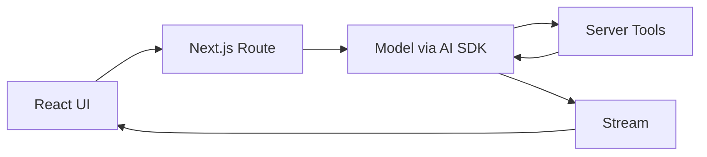

这个页面用于承载 Vercel AI SDK 的框架拆解，重点关注产品 UI、流式输出和工具调用集成。

## 建设边界

- Streaming text、tool calling、structured output、UI message。
- Next.js / React 应用中的服务端和前端协作。
- Agent 结果如何进入对话 UI、任务进度和人工确认。
- 与 LangGraph、OpenAI Agents SDK、Mastra 的组合方式。

## 核心定位

Vercel AI SDK 是面向 TypeScript / JavaScript 应用的 AI SDK，优势在于把模型调用、streaming、tool calling、structured output 和 React / Next.js UI 集成放在同一套开发体验里。它更像产品层 SDK，而不是复杂工作流引擎。

| 能力 | 用途 |
| --- | --- |
| `streamText` | 服务端流式生成文本，适合聊天和任务进度。 |
| `generateText` | 一次性文本生成，适合后台任务或脚本。 |
| `generateObject` / structured output | 生成结构化对象，适合分类、抽取和表单填充。 |
| Tools | 让模型在服务端调用受控函数。 |
| UI hooks / messages | 在 React / Next.js 中管理对话消息和流式状态。 |
| Provider adapters | 接入不同模型 provider。 |

## 最小心智模型



Vercel AI SDK 的重点是把“模型输出怎样实时进入产品界面”做好。复杂长任务仍然需要任务状态、队列、trace 和评测系统配合。

## Streaming + Tool Calling 示例

```ts
import { streamText, tool } from "ai";
import { z } from "zod";

export async function POST(req: Request) {
  const { messages } = await req.json();

  const result = streamText({
    model: "openai/<model-id>",
    messages,
    tools: {
      getWeather: tool({
        description: "查询城市天气。",
        inputSchema: z.object({
          city: z.string(),
        }),
        execute: async ({ city }) => ({ city, temperature: "23C" }),
      }),
    },
  });

  return result.toUIMessageStreamResponse();
}
```

这个示例体现了关键边界：工具在服务端执行，参数由 schema 约束，结果通过 UI message stream 返回前端。实际项目中应把 `<model-id>` 替换为当前 provider 文档支持的模型标识。

## 适合场景

- Next.js / React 产品中需要流式聊天或 Agent 任务界面。
- 需要展示工具调用状态、进度、引用和最终回答。
- 需要快速接入不同 provider，同时保持 UI 层相对稳定。
- 任务主要是交互式产品体验，而不是复杂后台 DAG。

## 谨慎场景

- 长任务需要暂停恢复、后台队列、多人协作和复杂状态机。
- 多 Agent handoff 和 guardrail 是核心需求。
- 高风险工具需要复杂审批、审计和沙箱。
- 评测、轨迹回放、成本分析还没有独立设计。

## 组合方式

| 组合 | 分工 |
| --- | --- |
| Vercel AI SDK + Mastra | AI SDK 管 UI streaming，Mastra 管 TypeScript workflow 和 tools。 |
| Vercel AI SDK + LangGraph | AI SDK 管产品界面，LangGraph 管复杂图状态和恢复。 |
| Vercel AI SDK + OpenAI Agents SDK | AI SDK 管前端流式体验，Agents SDK 管 agent/tool/handoff/trace。 |
| Vercel AI SDK + 自建后端 | AI SDK 只做模型和 UI 协议，业务状态由自建服务管理。 |

## UI 设计要点

- 工具调用要展示“正在做什么”，不要只让用户看空白加载。
- 高风险工具调用前要显示参数和确认按钮。
- 引用和证据要能点击回源。
- 任务失败要展示可恢复动作，例如重试、修改输入、转人工。
- 不要把完整工具输出直接展示给用户，先做摘要、脱敏和权限过滤。

## 检查清单

- 服务端工具是否有 schema、超时、错误语义和权限检查。
- 前端是否能展示 streaming、tool pending、tool result、error 和 final。
- 是否把任务 ID / trace ID 贯穿 UI 和后端。
- 是否有成本、延迟和失败率监控。
- 是否为长任务设计后台状态，而不是依赖单个 HTTP 请求。

## 参考资料

- [Vercel AI SDK Documentation](https://ai-sdk.dev/docs/introduction)
- [AI SDK Core](https://ai-sdk.dev/docs/ai-sdk-core)
- [AI SDK UI](https://ai-sdk.dev/docs/ai-sdk-ui)
- [AI SDK Tool Calling](https://ai-sdk.dev/docs/ai-sdk-core/tools-and-tool-calling)
- [AI SDK Structured Outputs](https://ai-sdk.dev/docs/ai-sdk-core/generating-structured-data)
