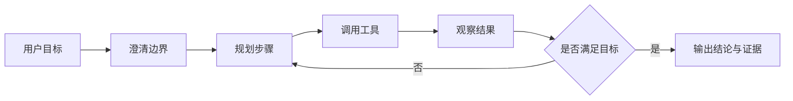

Agent Atlas 是一个面向开发者的 AI Agent 技术学习文档站。它不把智能体描述成一个单点能力，而是把它拆成可学习、可实现、可评测的工程系统。

## 你会在这里学到什么

- 如何理解 Agent Loop，以及它和普通 LLM 调用的区别。
- 如何设计工具调用、记忆、状态、上下文和人工接管。
- 如何用评测、日志、轨迹回放和权限控制让 Agent 更可靠。
- 如何比较 LangGraph、Mastra、AutoGen、CrewAI 等框架。
- 如何拆解研究型 Agent、代码 Agent 和运维 Agent 的真实工作流。

## 核心入口

- [智能体基础](/docs/concepts/agentic-basics)：从 ReAct、工具、记忆、规划到多 Agent 和 MCP。
- [Agent Loop](/docs/concepts/agent-loop)：理解观察、规划、执行、检查的循环结构。
- [工具调用与记忆](/docs/concepts/tools-and-memory)：区分工具接口、上下文、记忆和状态。
- [Harness 工程构件](/docs/practices/harness-engineering)：拆解 Session、Harness、Sandbox 等工程边界。
- [Claude Code 源码解析](/docs/cases/claude-code-source-analysis)：把代码 Agent 的查询引擎、工具系统和扩展机制放到真实案例里看。

## 一个最小心智模型



## 最小 Agent 伪代码

```ts title="agent-loop.ts" lineNumbers
type StepResult = {
  observation: string;
  done: boolean;
};

async function runAgent(goal: string) {
  const state = { goal, trace: [] as StepResult[] };

  while (state.trace.length < 8) {
    const plan = await planNextStep(state);
    const observation = await callTool(plan.tool, plan.input);
    const result = await reflect(goal, observation);

    state.trace.push(result);

    if (result.done) {
      return summarize(state);
    }
  }

  return escalateToHuman(state);
}
```

这段代码不是为了直接复制，而是提醒你：Agent 的关键是循环、状态、工具边界和停止条件。
