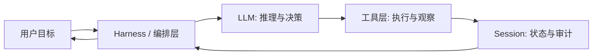

LLM（Large Language Model，大语言模型）是 Agent 的推理核心，但不是 Agent 本身。它擅长语言理解、生成、归纳和在一定约束下的推理；不擅长直接访问实时数据、持久记忆、精确计算和对外部系统产生可验证副作用。

## 一句话定义

LLM 是基于海量文本预训练的概率模型，给定上下文后预测下一个 Token 序列。它的输出是“最可能的续写”，不是数据库查询结果，也不是经过验证的执行计划。

## 能力分层

| 能力 | 模型层能做什么 | 通常需要系统层补什么 |
| --- | --- | --- |
| 语言理解与生成 | 总结、改写、分类、翻译、解释 | 任务模板、输出格式约束 |
| 推理与规划 | 分解步骤、提出假设、比较方案 | 工具验证、状态机、人工确认 |
| 工具意图识别 | 判断何时调用工具、生成参数草稿 | Schema 校验、权限、执行、重试 |
| 知识回忆 | 复述训练分布内的常识和模式 | RAG、联网检索、版本化知识库 |
| 多轮对话 | 在当前上下文中保持连贯 | Session、压缩、长期记忆、审计日志 |

## 三类典型局限

1. **幻觉（Hallucination）**：模型会生成听起来合理但不符合事实的内容。Agent 系统要用工具结果、引用来源和评测样例约束它，而不是只靠提示词“请不要说错”。
2. **静态知识截止**：模型不知道训练后的新事件，也不知道你的私有代码库。需要 RAG、MCP、API 和文件工具补足。
3. **无原生副作用**：模型本身不能改文件、发请求、跑命令。需要编排层把“工具调用意图”转成真实动作，并记录输入输出。

## LLM 与 Agent 的分工

《Claude Code Harness Engineering》把 LLM 的局限概括为三类：不能直接行动、缺少跨会话记忆、难以完成需要多步反馈的任务。Agent 的价值正在于给模型补上工具、记忆和行动-观察循环。来源：《Claude Code Harness Engineering：从入门到实战》，pp. 8-11。

## 工程师应记住的判断方式

阅读任何模型能力宣传时，先问：

1. 这是单次生成就行，还是需要外部反馈闭环。
2. 错误输出是可接受的草稿，还是会造成真实损失。
3. 失败时能否定位到模型版本、提示词、工具结果还是编排逻辑。

如果第 2 条答案是“会造成真实损失”，就不要把责任只压在模型层。权限、沙箱、人工审批和可回放 trace 必须同时存在。

## 延伸阅读

- [智能体基础](/docs/concepts/agentic-basics)：从 ReAct、工具、记忆到 MCP 的 Agent 心智模型。
- [Token 与上下文窗口](/docs/model-basics/tokens-and-context)：理解上下文预算如何约束 Agent 设计。
- [结构化输出与工具调用](/docs/model-basics/structured-output)：模型如何把意图约束成可执行接口。
