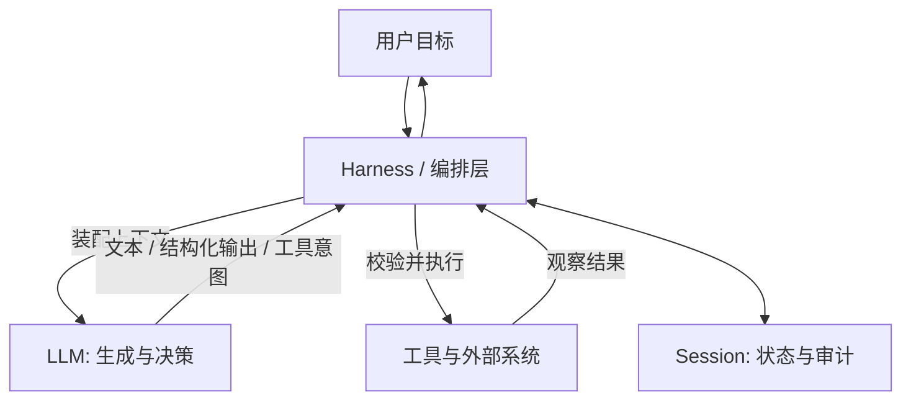

LLM（Large Language Model，大语言模型）可以承担 Agent 中的语言理解、生成和决策工作，但它不是 Agent 本身。模型层负责根据输入生成候选输出；Harness（运行与编排层）负责装配上下文、执行工具、维护状态、校验结果和控制权限。只有两者形成反馈闭环，系统才能对外部世界采取可控行动。

## 一句话定义

当前主流生成式 LLM 通常采用自回归方式：给定已有上下文，预测下一个 Token 的概率分布，再通过解码策略逐步生成文本或结构化输出。

因此，LLM 的回答不是数据库查询结果，也不是已经验证的事实或执行计划。即使某段内容读起来非常确定，它仍然需要结合证据、工具结果和业务规则进行验证。

## 一次模型调用发生了什么

从 Agent 工程视角看，一次模型调用可以简化为五步：

1. 编排层装配系统规则、用户目标、会话状态、证据片段和工具定义。
2. 模型根据上下文计算下一个 Token 的概率分布。
3. 解码策略按照 temperature、top-p 等参数逐步选择 Token。
4. 接口返回自然语言、结构化数据、工具调用意图或停止原因。
5. 编排层校验输出，决定结束、执行工具、重试、降级还是请求人工确认。

“下一个 Token 预测”描述的是生成机制，不意味着模型只会机械复读。经过大规模预训练、指令微调和对齐后，模型可以在上下文中表现出归纳、代码生成、少样本学习和一定程度的推理能力；但这些能力仍然是概率性的，也会受任务、提示、上下文位置和模型版本影响。

## 能力分层

| 能力 | 模型层能做什么 | 通常需要系统层补什么 |
| --- | --- | --- |
| 语言理解与生成 | 总结、改写、分类、翻译、解释 | 任务模板、输出约束、质量评测 |
| 推理与规划 | 给出候选步骤、提出假设、比较方案 | 外部验证、状态机、停止条件、人工确认 |
| 工具意图识别 | 判断是否需要工具，生成工具名和参数 | Schema 校验、鉴权、执行、重试与审计 |
| 参数知识回忆 | 复述训练分布中学到的常识和模式 | RAG、联网检索、版本化知识库和来源核验 |
| 多轮对话 | 利用当前上下文保持局部连贯 | Session、上下文压缩、长期记忆和恢复机制 |

模型能力不是稳定的布尔值。同一个模型可能擅长解释代码，却在跨文件修改中遗漏约束；能正确选择工具，却生成不符合业务规则的参数。工程评估应针对真实任务链路，而不是只看一次演示是否成功。

## 五类典型局限

1. **幻觉（Hallucination）**：模型可能生成缺少证据、与事实冲突或引用不存在来源的内容。系统应使用可追溯证据、工具结果和评测样例约束它，而不是只靠提示词要求“不要出错”。
2. **参数知识不是实时事实源**：模型参数中的知识来自训练与后训练数据，不保证实时、完整或适用于你的私有环境。价格、政策、版本号和账户状态应从当前数据源读取。
3. **概率性与非确定性**：生成结果受采样参数、服务端实现和模型版本影响。降低 temperature 可以减少随机性，但不能替代测试、规则和业务校验。
4. **上下文有限且位置敏感**：能放进上下文窗口，不等于模型能同等利用所有信息。长输入中的关键信息可能被忽略，尤其需要检索、分层装配、摘要和回归测试。
5. **没有自主的外部副作用**：模型可以输出“调用工具”的意图，但真正的文件修改、网络请求、数据库写入或消息发送由外部系统执行。权限、幂等、回滚和审计属于编排层责任。

## LLM 与 Agent 的分工

```mermaid
flowchart TB
  U[用户目标] --> H[Harness / 编排层]
  H -->|装配上下文| M[LLM: 生成与决策]
  M -->|文本 / 结构化输出 / 工具意图| H
  H -->|校验并执行| T[工具与外部系统]
  T -->|观察结果| H
  H <--> S[Session: 状态与审计]
  H --> U
```

模型不会因为输出了一段工具调用 JSON 就自动完成动作。编排层仍要检查工具是否存在、参数是否合法、当前用户是否有权限，以及该动作是否需要人工确认；执行结果随后作为新的观察信息进入下一轮模型调用。

这也是 Agent 相比单次 LLM 调用多出的关键部分：**行动、观察、状态和停止条件**。ReAct 将推理与行动交替组织，Toolformer 展示了模型如何学习选择和调用外部 API；在实际系统中，工具注册、执行和风险控制仍由模型之外的运行时负责。

《Claude Code Harness Engineering》把 LLM 的局限概括为三类：不能直接行动、缺少跨会话记忆、难以独立完成需要多步反馈的任务。Agent 的价值正是通过工具、Session 和行动—观察循环弥补这些工程缺口。来源：《Claude Code Harness Engineering：从入门到实战》，pp. 8-11。

## 什么时候只用 LLM，什么时候需要 Agent

并不是接入模型后都要设计 Agent Loop。可以根据任务是否需要外部反馈和持续状态来判断：

| 场景 | 更合适的形态 | 原因 |
| --- | --- | --- |
| 改写一段文字、翻译、生成草稿 | 单次 LLM 调用 | 输入和输出边界清楚，不需要外部行动 |
| 根据固定材料回答问题 | LLM + 检索工作流 | 先确定性检索，再让模型整理证据，未必需要循环 |
| 查询订单、天气或最新政策 | LLM + 实时工具 | 参数知识不可靠，应读取当前系统数据 |
| 跨文件修改代码并运行测试 | Agent Loop | 需要读取、编辑、执行、观察和多轮修正 |
| 转账、删除数据或发送通知 | 受控 Agent + 人工确认 | 存在真实副作用，需要权限、幂等和审计 |

判断重点不是“用了几个工具”，而是任务是否需要模型根据外部结果继续决策。如果流程固定且每一步都能由普通程序确定，工作流往往比开放式 Agent 更稳定。

## 工程师应记住的判断方式

阅读任何模型能力宣传时，先问：

1. 这是一次生成即可完成，还是必须获得外部反馈后继续决策。
2. 输出是可接受的草稿，还是错误会造成真实损失。
3. 结论是否能追溯到当前证据，而不是只追溯到模型回答。
4. 失败时能否定位到模型版本、上下文、提示词、工具还是编排逻辑。

如果错误会造成真实损失，就不要把责任只压在模型层。权限、沙箱、幂等控制、人工审批和可回放 trace 必须同时存在。

## 不要把 LLM 当成事实源

LLM 的强项是根据上下文组织语言、提取模式和提出候选方案，不是维护一份自动更新的事实数据库。工程上应把“事实获取”和“语言生成”分开：

| 场景 | 可以让 LLM 做 | 不应只让 LLM 做 |
| --- | --- | --- |
| 文档问答 | 总结检索结果、解释引用片段 | 凭参数记忆回答版本号、价格或政策 |
| 代码理解 | 根据已读文件归纳模块边界 | 猜测未读取文件的实现 |
| 运维排障 | 整理日志、提出排查顺序 | 不经验证直接执行高风险命令 |
| 产品客服 | 组织回答、识别用户意图 | 编造订单状态、库存和退款规则 |

RAG、数据库、搜索服务和浏览器可以提供外部证据；MCP（Model Context Protocol）则提供连接工具与资源的标准协议。MCP 本身不是数据源，也不保证数据正确。

“来自外部系统”同样不等于“已经验证”。系统还要检查来源权威性、更新时间、访问权限和多来源一致性，并防范检索文档或网页中的 Prompt Injection。更准确的目标是让事实**可追溯、可核验、可更新**。

## Agent 中的模型输入输出

生产级 Agent 通常不会把用户消息原样直接丢给模型，而是装配多层输入：

1. 系统规则：身份、权限、安全边界和输出格式。
2. 产品或开发者指令：当前任务流的流程约束；具体消息层级取决于 provider。
3. 用户目标：当前轮要完成的真实任务。
4. 状态摘要：已完成步骤、失败原因、待办项和停止条件。
5. 证据片段：文件、检索结果、工具返回和日志。
6. 工具定义：本轮可用工具的名称、用途和参数 Schema。

模型的可见输出也不只有回答文本，还可能包括结构化数据、工具调用、拒绝、停止原因或需要补充的信息。系统应审计这些可观察结果和对应证据，而不依赖模型未公开的内部推理过程。

## 调试定位流程

当 LLM 驱动的 Agent 失败时，可以按下面顺序缩小范围：

1. **输入是否足够**：关键文件、工具结果、用户约束是否真的进入上下文。
2. **指令是否冲突**：系统规则、产品指令、用户请求和外部内容是否给出矛盾目标。
3. **输出是否可验证**：自然语言结论有没有引用、Schema、测试或工具结果支撑。
4. **工具链是否可靠**：模型是否选错工具，工具是否超时、失败或返回了过长、过期、恶意内容。
5. **模型是否适配**：任务是否超过当前模型的推理、上下文、多模态或结构化输出能力。

如果没有 trace，只看最终回答很难判断是哪一层失败。至少应记录 provider、model、model version、prompt version、输入摘要、工具调用、Token 用量、停止原因、错误码和人工确认点。

## 检查清单

- 需要当前事实时，是否接入了可追溯的数据源，而不是依赖模型参数记忆。
- 需要外部动作时，是否有工具执行层、权限检查、幂等控制和回滚方案。
- 需要长任务时，是否有状态摘要、上下文压缩、停止条件和恢复机制。
- 需要高可靠结果时，是否有评测集、Schema 与业务规则校验或人工审核。
- 需要解释结论时，是否能追溯到具体证据及其时间，而不是只追溯到模型回答。
- 模型、提示词或工具变更后，是否运行了覆盖真实任务链路的回归测试。

## 延伸阅读

- [智能体基础](/docs/concepts/agentic-basics)：从 ReAct、工具、记忆到 MCP 的 Agent 心智模型。
- [Token 与上下文窗口](/docs/model-basics/tokens-and-context)：理解上下文预算如何约束 Agent 设计。
- [结构化输出与工具调用](/docs/model-basics/structured-output)：模型如何把意图约束成可执行接口。
- [模型选型与能力边界](/docs/model-basics/model-selection)：按真实任务、风险、延迟和成本评估模型。

## 参考来源

- [Language Models are Few-Shot Learners](https://arxiv.org/abs/2005.14165)：大规模自回归语言模型的少样本学习能力及其局限。
- [TruthfulQA: Measuring How Models Mimic Human Falsehoods](https://arxiv.org/abs/2109.07958)：模型生成模仿性错误信息的评测研究。
- [ReAct: Synergizing Reasoning and Acting in Language Models](https://arxiv.org/abs/2210.03629)：推理与外部行动交替进行的代表性方法。
- [Toolformer: Language Models Can Teach Themselves to Use Tools](https://arxiv.org/abs/2302.04761)：语言模型学习何时、如何调用外部 API 的研究。
- [Lost in the Middle: How Language Models Use Long Contexts](https://arxiv.org/abs/2307.03172)：长上下文中的位置信息利用问题。
- [Model Context Protocol Specification](https://modelcontextprotocol.io/specification/2026-07-28)：MCP 工具、资源与客户端—服务器协议的官方规范。
- [Claude Code Harness Engineering](/docs/resources/harness-engineering-book)：pp. 8-11，LLM 局限与 Harness 工程边界。
