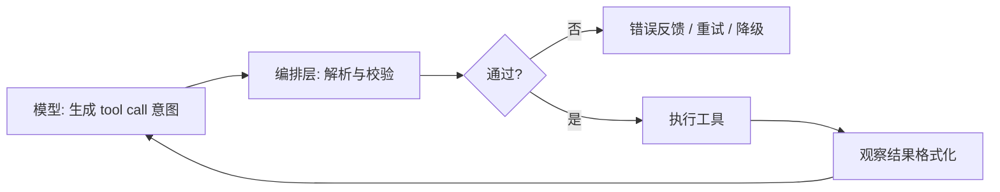

Agent 系统里，模型最重要的输出不总是自然语言，而是**可解析、可校验、可路由**的结构化片段：JSON 对象、函数名、参数、工具调用 ID 和结束原因。

结构化输出的目标不是让模型“看起来像程序”，而是让编排层能判断下一步该做什么：继续对话、调用工具、请求人工确认、重试、降级，还是结束任务。

## 为什么需要结构化输出

自然语言适合解释，不适合直接驱动程序。编排层需要稳定字段来：

- 判断是继续对话、调用工具还是结束任务。
- 校验参数类型、必填项和枚举范围。
- 记录审计日志，并在失败后重试或降级。
- 把模型意图和真实执行解耦。

《智能体设计模式》把工具使用拆成六步：定义工具、让 LLM 判断是否调用、生成结构化参数、由编排层执行、返回观察结果、再让 LLM 处理结果。模型只负责第 2、3 步的“意图生成”，执行和验证必须在系统层完成。来源：《智能体设计模式》，pp. 49-50。

## 三类常见接口

| 接口形态 | 模型做什么 | 编排层做什么 |
| --- | --- | --- |
| JSON Mode / Response Schema | 按约定字段生成 JSON 文本 | 解析 JSON、做 schema 校验 |
| Function Calling / Tool Use | 返回工具名和参数对象 | 查注册表、鉴权、执行、回填结果 |
| 文本协议（ReAct、XML 标签） | 用固定格式包裹动作 | 正则或流式解析，容错和回退 |

优先使用 provider 原生支持的 function calling 或 JSON schema 能力；文本协议适合兼容旧系统，但解析成本和脆弱性更高。

## 模型层与编排层的责任边界



模型层负责生成意图，编排层负责让意图变成安全、可审计的动作。

| 层 | 负责 | 不负责 |
| --- | --- | --- |
| 模型 | 判断是否需要工具、选择工具、生成参数草案 | 最终权限判断、真实执行、数据一致性 |
| 编排层 | schema 校验、权限、执行、重试、日志 | 代替模型理解用户意图 |
| 工具层 | 执行受控动作、返回结构化结果 | 读取聊天历史、决定下一步任务 |

调试时要先定位是哪一层出了问题，不要笼统说“模型不行”。

## 工具 Schema 设计原则

一个可上线的工具至少要定义：

| 字段 | 作用 |
| --- | --- |
| `name` | 稳定标识，供模型和注册表匹配 |
| `description` | 告诉模型何时使用，避免和功能相近工具冲突 |
| `input_schema` / `parameters` | 用 JSON Schema 约束参数形状 |
| `required` | 明确必填项，减少幻觉参数 |
| 权限与副作用标记 | 只读、可写、是否需人工审批 |

Claude Code 的工具系统让所有工具都经过查找、输入验证、Hook、权限检查、执行、格式化，再返回给模型。来源：《Demystifying Claude Code v1.8》，pp. 83-87。

设计要点：

1. **描述写给模型看，不是写给人类文档看**：说明何时用、何时不用。
2. **参数尽量小而稳**：不要把整个业务流程塞进一个巨型参数对象。
3. **输出也要结构化**：工具返回统一 envelope，包含 `ok`、`data`、`error_code`、`retryable` 等字段。
4. **不要相信自然语言参数**：即使模型返回了 JSON，也要做 schema 校验。

## 示例：搜索工具

```ts title="search-tool.ts" lineNumbers
export const searchTool = {
  name: "search_docs",
  description:
    "Search project documentation when the answer requires a source from local docs. Do not use it for general web search.",
  inputSchema: {
    type: "object",
    properties: {
      query: {
        type: "string",
        minLength: 2,
        description: "Search query in the user's language.",
      },
      limit: {
        type: "integer",
        minimum: 1,
        maximum: 10,
        default: 5,
      },
    },
    required: ["query"],
    additionalProperties: false,
  },
  riskLevel: "read",
};
```

这个 schema 同时服务三件事：帮助模型理解何时调用，帮助编排层校验参数，帮助安全层判断风险。

## 工具结果 Envelope

工具结果不要直接返回一大段字符串。推荐统一 envelope：

```ts title="tool-result.ts" lineNumbers
type ToolResult<T> =
  | {
      ok: true;
      data: T;
      summary: string;
      sourceRefs?: string[];
    }
  | {
      ok: false;
      errorCode: string;
      message: string;
      retryable: boolean;
    };
```

这样模型能区分“没有查到结果”“工具超时”“权限被拒绝”和“参数不合法”。编排层也能根据 `retryable` 决定是否自动重试。

## 失败和重试

结构化输出的失败通常有三类：

| 类型 | 示例 | 处理方式 |
| --- | --- | --- |
| 语法失败 | JSON 不合法、参数截断 | 让模型重发，或切非流式重试 |
| schema 失败 | 缺必填字段、枚举值不合法 | 把校验错误反馈给模型 |
| 业务失败 | 路径越权、资源不存在、权限不足 | 拒绝执行或请求人工确认 |

不要把所有错误都包装成“工具失败”。错误语义越清楚，模型越容易修正；审计也更容易判断问题来自模型、工具还是权限策略。

## 流式与工具调用

流式输出会让工具调用更复杂：参数可能分块到达，调用 ID 可能先出现，JSON 可能尚未闭合。编排层应该等到工具参数完整并通过校验后再执行。

建议：

- 给每次工具调用分配稳定 `tool_call_id`。
- 参数未完整前只展示“模型正在准备工具调用”，不要提前执行。
- 对同一个 `tool_call_id` 做幂等处理，避免断线重连导致重复执行。
- 对写入型工具设置人工确认，不因流式过程自动放行。

## JSON 与函数调用的常见坑

- **JSON 合法但语义错误**：字段存在，值不符合业务规则。
- **多工具冲突**：描述重叠，模型随机选择。
- **流式截断**：tool arguments 还没完整到达就开始执行。
- **循环调用**：模型反复请求同一工具，缺少停止条件。
- **大结果反灌**：工具输出过长，挤爆上下文。
- **输出 schema 过度复杂**：嵌套太深，模型很难稳定生成。

## 与 MCP 的关系

函数调用通常是应用和模型之间的集成；MCP 则是工具层的开放协议，让工具提供者实现一次 Server，多个 Agent 客户端复用。详见 [智能体基础](/docs/concepts/agentic-basics) 中的 MCP 章节。

不管工具来自本地函数、HTTP API、MCP Server 还是浏览器自动化，编排层都应该统一做 schema 校验、权限判断、审计日志和错误 envelope。

## 上线检查清单

- 工具名是否稳定，避免和其他工具语义重叠。
- 工具描述是否写清“何时用”和“何时不用”。
- 输入 schema 是否禁止未知字段。
- 输出是否有统一 envelope 和错误码。
- 写入型工具是否标记风险等级并接入人工确认。
- 工具调用是否记录 trace、参数摘要、权限结果和耗时。
- 流式工具调用是否等参数完整后再执行。

## 延伸阅读

- [工具调用与记忆](/docs/concepts/tools-and-memory)：工具接口、上下文和状态边界。
- [安全、权限与人类接管](/docs/practices/safety-and-governance)：高风险工具的审批和权限设计。
- [Harness 工程构件](/docs/practices/harness-engineering)：工具注册表与统一执行链路。
