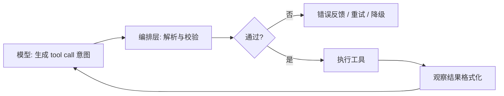

Agent 系统里，模型最重要的输出不总是自然语言，而是**可解析、可校验、可路由**的结构化片段：JSON 对象、函数名、参数、工具调用 ID 和结束原因。

## 为什么需要结构化输出

自然语言适合解释，不适合直接驱动程序。编排层需要稳定字段来：

- 判断是继续对话、调用工具还是结束任务。
- 校验参数类型、必填项和枚举范围。
- 记录审计日志，并在失败后重试或降级。

《智能体设计模式》把工具使用拆成六步：定义工具、让 LLM 判断是否调用、生成结构化参数、由编排层执行、返回观察结果、再让 LLM 处理结果。模型只负责第 2、3 步的“意图生成”，执行和验证必须在系统层完成。来源：《智能体设计模式》，pp. 49-50。

## 三类常见接口

| 接口形态 | 模型做什么 | 编排层做什么 |
| --- | --- | --- |
| JSON Mode / Response Schema | 按约定字段生成 JSON 文本 | 解析 JSON、做 schema 校验 |
| Function Calling / Tool Use | 返回工具名和参数对象 | 查注册表、鉴权、执行、回填结果 |
| 文本协议（ReAct、XML 标签） | 用固定格式包裹动作 | 正则或流式解析，容错和回退 |

优先使用 provider 原生支持的 function calling 或 JSON schema 能力；文本协议适合兼容旧系统，但解析成本和脆弱性更高。

## 工具 Schema 设计原则

一个可上线的工具至少要定义：

| 字段 | 作用 |
| --- | --- |
| `name` | 稳定标识，供模型和注册表匹配 |
| `description` | 告诉模型何时使用，避免和功能相近工具冲突 |
| `input_schema` / `parameters` | 用 JSON Schema 约束参数形状 |
| `required` | 明确必填项，减少幻觉参数 |
| 权限与副作用标记 | 只读、可写、是否需人工审批 |

Claude Code 的工具系统让所有工具都经过查找、输入验证、Hook、权限检查、执行、格式化，再返回给模型。来源：《Demystifying Claude Code v1.8》，pp. 83-87。

设计要点：

1. **描述写给模型看，不是写给人类文档看**：说明何时用、何时不用。
2. **参数尽量小而稳**：不要把整个业务流程塞进一个巨型参数对象。
3. **输出也要结构化**：工具返回统一 envelope，包含 `ok`、`data`、`error_code`、`retryable` 等字段。
4. **不要相信自然语言参数**：即使模型返回了 JSON，也要做 schema 校验。

## 模型层与编排层的责任边界

模型层失败示例：选错工具、漏填参数、编造不存在字段。
编排层失败示例：未校验参数、未做权限检查、执行超时却没有错误语义。

调试时要先定位是哪一层出了问题，不要笼统说“模型不行”。

## JSON 与函数调用的常见坑

- **JSON 合法但语义错误**：字段存在，值不符合业务规则。
- **多工具冲突**：描述重叠，模型随机选择。
- **流式截断**：tool arguments 还没完整到达就开始执行。
- **循环调用**：模型反复请求同一工具，缺少停止条件。
- **大结果反灌**：工具输出过长，挤爆上下文。

## 与 MCP 的关系

函数调用通常是应用和模型之间的集成；MCP 则是工具层的开放协议，让工具提供者实现一次 Server，多个 Agent 客户端复用。详见 [智能体基础](/docs/concepts/agentic-basics) 中的 MCP 章节。

## 延伸阅读

- [工具调用与记忆](/docs/concepts/tools-and-memory)：工具接口、上下文和状态边界。
- [安全、权限与人类接管](/docs/practices/safety-and-governance)：高风险工具的审批和权限设计。
- [Harness 工程构件](/docs/practices/harness-engineering)：工具注册表与统一执行链路。
