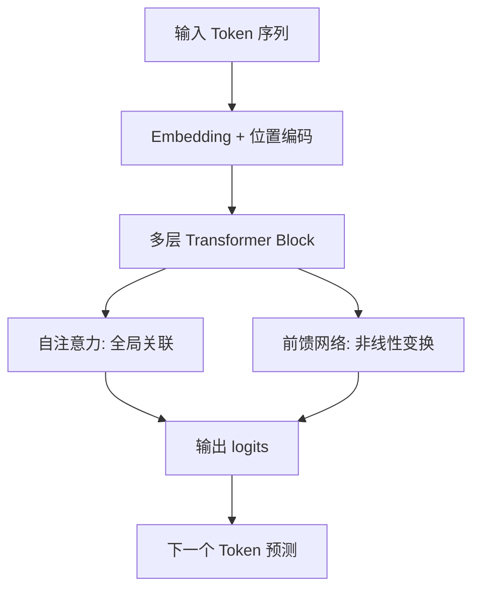

你不需要会手推反向传播，但做 Agent 工程时应理解 Transformer 为什么决定了今天 LLM 的输入输出形态、上下文机制和接口设计。

## 核心结构

Transformer 用自注意力（Self-Attention）让序列中每个位置都能直接关联其他位置的信息，而不像 RNN 那样逐步传递。这让模型能同时捕捉长距离依赖，也成为现代 LLM 能处理长上下文的基础架构。

## 工程师需要知道的四个概念

| 概念 | 含义 | 对 Agent 的影响 |
| --- | --- | --- |
| Token Embedding | 把离散 Token 映射到向量空间 | 同样文本在不同分词器下长度和成本不同 |
| 位置编码 | 告诉模型 Token 的顺序 | 影响长文档理解和代码编辑的稳定性 |
| 自注意力 | 每个 Token 关注全局上下文 | 上下文越长，计算和成本通常越高 |
| 因果掩码（Causal Mask） | 生成时只能看左侧上下文 | 决定了解码式生成和流式输出行为 |

## 预训练、对齐与工具能力

现代 LLM 通常经历多阶段训练：

1. **预训练（Pre-training）**：在海量文本上学习语言模式和世界知识。
2. **监督微调（SFT）**：学习对话格式、指令跟随和任务模板。
3. **对齐（Alignment）**：用 RLHF、DPO 等方法调整安全性、有用性和风格。
4. **工具与结构化能力**：在微调或后训练阶段学习函数调用、JSON 输出和多步推理格式。

对 Agent 工程师来说，重要的是：你调用的不是“原始预训练模型”，而是已经过对齐和工具能力增强的产品化接口。同名模型不同版本、不同 provider 的行为可能不同，必须在 Session 中记录 `model` 和 `model_version`。

## 解码式生成与 Agent Loop

LLM 在 Agent 中通常是**解码式**工作：每生成一个 Token，就把它追加到上下文，再继续预测下一个。工具调用也遵循这个节奏——模型先输出“我要调用某工具”的结构化片段，编排层执行后，再把工具结果作为新消息喂回模型。

这意味着：

- 输出是逐步展开的，适合流式 UI 和提前并行准备。
- 早前的错误 Token 可能污染后续推理，必要时需要截断、重试或换模型。
- Stop reason、finish reason 和 tool call 边界都是协议层概念，不同厂商字段名不同。

## 不需要深挖的部分

以下内容对 Agent 应用开发优先级较低，知道存在即可：

- 多头注意力的矩阵分解细节。
- LayerNorm、残差连接的具体公式。
- MoE（Mixture of Experts）的路由机制，除非你在做推理成本优化。

## 判断方式

遇到模型行为异常时，先区分：

1. 是架构/能力上限，例如长上下文尾部遗忘、复杂数学不稳定。
2. 是对齐策略，例如过度保守、拒绝执行合理工具。
3. 是接口层问题，例如 JSON 模式失效、流式截断、tool schema 不匹配。

只有分清层次，才知道该换模型、改提示词、改 schema，还是改 Harness 编排。

## 延伸阅读

- [推理参数与提示词基础](/docs/model-basics/inference-and-prompting)：控制生成长度和稳定性。
- [结构化输出与工具调用](/docs/model-basics/structured-output)：模型接口如何承载工具意图。
- [Claude Code 源码解析](/docs/cases/claude-code-source-analysis)：真实产品中的查询引擎与流式调度。
