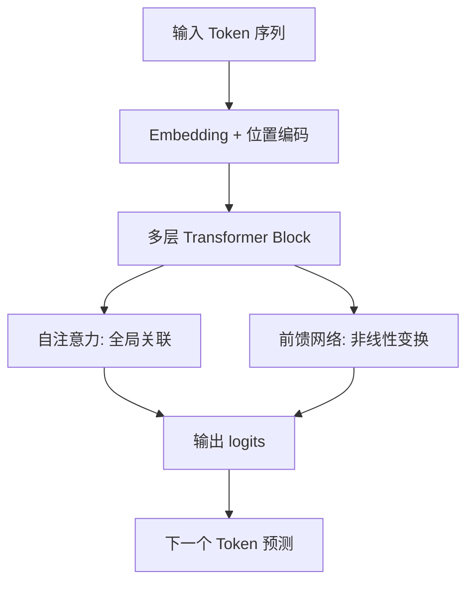

你不需要会手推反向传播，但做 Agent 工程时应理解 Transformer 为什么决定了今天 LLM 的输入输出形态、上下文机制和接口设计。

## 核心结构

Transformer 用自注意力（Self-Attention）让序列中每个位置都能直接关联其他位置的信息，而不像 RNN 那样逐步传递。这让模型能同时捕捉长距离依赖，也成为现代 LLM 能处理长上下文的基础架构。

## 工程师需要知道的四个概念

| 概念 | 含义 | 对 Agent 的影响 |
| --- | --- | --- |
| Token Embedding | 把离散 Token 映射到向量空间 | 同样文本在不同分词器下长度和成本不同 |
| 位置编码 | 告诉模型 Token 的顺序 | 影响长文档理解和代码编辑的稳定性 |
| 自注意力 | 每个 Token 关注全局上下文 | 上下文越长，计算和成本通常越高 |
| 因果掩码（Causal Mask） | 生成时只能看左侧上下文 | 决定了解码式生成和流式输出行为 |

## 预训练、对齐与工具能力

现代 LLM 通常经历多阶段训练：

1. **预训练（Pre-training）**：在海量文本上学习语言模式和世界知识。
2. **监督微调（SFT）**：学习对话格式、指令跟随和任务模板。
3. **对齐（Alignment）**：用 RLHF、DPO 等方法调整安全性、有用性和风格。
4. **工具与结构化能力**：在微调或后训练阶段学习函数调用、JSON 输出和多步推理格式。

对 Agent 工程师来说，重要的是：你调用的不是“原始预训练模型”，而是已经过对齐和工具能力增强的产品化接口。同名模型不同版本、不同 provider 的行为可能不同，必须在 Session 中记录 `model` 和 `model_version`。

## 解码式生成与 Agent Loop

LLM 在 Agent 中通常是**解码式**工作：每生成一个 Token，就把它追加到上下文，再继续预测下一个。工具调用也遵循这个节奏——模型先输出“我要调用某工具”的结构化片段，编排层执行后，再把工具结果作为新消息喂回模型。

这意味着：

- 输出是逐步展开的，适合流式 UI 和提前并行准备。
- 早前的错误 Token 可能污染后续推理，必要时需要截断、重试或换模型。
- Stop reason、finish reason 和 tool call 边界都是协议层概念，不同厂商字段名不同。

## 不需要深挖的部分

以下内容对 Agent 应用开发优先级较低，知道存在即可：

- 多头注意力的矩阵分解细节。
- LayerNorm、残差连接的具体公式。
- MoE（Mixture of Experts）的路由机制，除非你在做推理成本优化。

## 判断方式

遇到模型行为异常时，先区分：

1. 是架构/能力上限，例如长上下文尾部遗忘、复杂数学不稳定。
2. 是对齐策略，例如过度保守、拒绝执行合理工具。
3. 是接口层问题，例如 JSON 模式失效、流式截断、tool schema 不匹配。

只有分清层次，才知道该换模型、改提示词、改 schema，还是改 Harness 编排。

## 为什么这些机制会影响 Agent

Transformer 的内部细节不需要每个应用工程师都精通，但下面几条会直接影响 Agent 设计：

| 机制 | 对 Agent 的直接影响 |
| --- | --- |
| 自回归生成 | 模型一步步生成 token，早期错误会进入后续上下文，因此需要重试、截断和校验。 |
| 注意力窗口 | 模型只能在有限窗口里“看见”输入，长任务必须做检索、压缩和分层装配。 |
| 位置敏感性 | 同一段证据放在不同位置可能影响注意力分配，关键约束应放在稳定位置并重复摘要。 |
| 采样 | 输出不是数据库查询，低温度也不等于绝对确定，关键任务要用外部验证闭环。 |
| 对齐训练 | 产品化模型会有安全和风格偏好，权限、拒答和工具选择不完全由业务提示控制。 |

这意味着 Agent 不是“更长的 prompt”，而是围绕模型生成机制补上的工程系统：状态、工具、校验、回放和人工接管。

## 从机制推导接口约束

在接口层可以把模型能力拆成四个契约：

1. **上下文契约**：每轮输入必须说明目标、约束、证据和当前状态，不能假设模型知道隐藏上下文。
2. **输出契约**：关键动作必须结构化，例如 JSON、tool call 或带字段的计划，而不是自由文本。
3. **验证契约**：模型输出进入业务系统前，需要 schema、权限、单元测试或规则检查。
4. **版本契约**：记录模型 ID、provider、参数和 prompt 版本，便于回归和事故复盘。

没有这些契约，Transformer 再强也只是在做一次文本续写；有了这些契约，模型输出才会变成可维护的 Agent 行为。

## 常见误区

- **误区一：窗口变大就不需要检索。** 窗口越大，成本、延迟和注意力稀释问题越明显，检索和摘要仍然需要。
- **误区二：模型会自动遵守最新指令。** 长上下文里早期指令、系统提示和工具结果都可能影响输出，需要显式优先级。
- **误区三：温度设为 0 就完全可复现。** 服务端实现、模型版本、并发和浮点差异都可能造成漂移。
- **误区四：训练数据里见过就一定会答对。** 模型学到的是分布模式，不是可查询事实表。

## 检查清单

- 是否为每次模型调用记录上下文长度、输出长度和 stop reason。
- 是否把长文件、日志和网页内容分段加载，而不是一次性塞满窗口。
- 是否对工具调用参数做了强校验，而不是相信模型“应该会写对”。
- 是否在模型版本或 prompt 变化后跑回归样例。
- 是否区分模型能力上限、对齐策略和接口协议错误。

## 延伸阅读

- [推理参数与提示词基础](/docs/model-basics/inference-and-prompting)：控制生成长度和稳定性。
- [结构化输出与工具调用](/docs/model-basics/structured-output)：模型接口如何承载工具意图。
- [Claude Code 源码解析](/docs/cases/claude-code-source-analysis)：真实产品中的查询引擎与流式调度。
- [Attention Is All You Need](https://arxiv.org/abs/1706.03762)：Transformer 架构基础论文。
