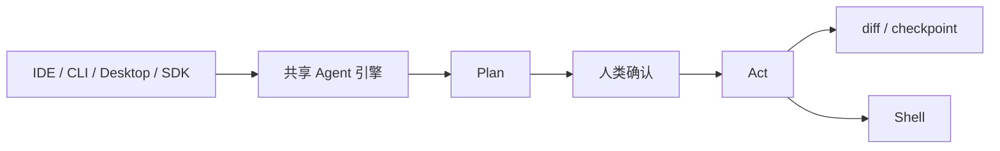

Cline 是一套开源编码 Agent，同一引擎覆盖 VS Code 扩展、终端 CLI、桌面应用和 Node.js SDK。JetBrains 插件存在，但官方 README 写明该插件目前不开源。

## 基础核验

| 字段 | 信息 |
| --- | --- |
| 最近核验 | 2026-09-22 |
| GitHub 快照 | 约 69k stars（[cline/cline](https://github.com/cline/cline)） |
| 官方仓库 | [cline/cline](https://github.com/cline/cline) |
| 文档 | [docs.cline.bot](https://docs.cline.bot/) |
| CLI | `npm i -g cline` |
| SDK | `npm install @cline/sdk` |
| 许可证 | Apache-2.0（核心仓库）；JetBrains 插件不开源 |
| 分类 | 代码智能体 / IDE + CLI + SDK |

## 一句话定位

Cline 适合观察「同一 Agent 引擎如何同时服务编辑器、终端、桌面和可编程 SDK」，以及 Plan / Act 如何把探索和改代码拆开。

## 值得学习的工程点

- Plan and Act：Plan 模式只探索、提问和出方案；Act 模式执行。默认同文件编辑和终端命令都要人批，也可打开 auto-approve。
- 检查点：VS Code / JetBrains 里每次编辑以 diff 呈现，可用 checkpoint 回滚 Agent 改动。
- 规则与技能：`.clinerules` 被 CLI、VS Code、JetBrains 客户端共同读取。
- 多入口：`apps/cli`、根目录扩展、`sdk/`、桌面示例应用；headless CLI 可进 CI。
- 多 Agent 团队：`cline --team-name` 由 coordinator 拆任务。
- 调度与渠道：cron 调度，以及 Telegram / Slack / Discord 等连接。
- 模型无关：Anthropic、OpenAI、Gemini、OpenRouter、Bedrock、Ollama 等。

## 仓库结构观察

README 把产品按目录拆开：`sdk/`、`apps/cli/`、根目录 VS Code 扩展（仍在迁移）、`docs/`。桌面应用在 `apps/examples/desktop-app/`。适合学习 monorepo 如何按入口分包，而不是只有一个 CLI。

## 最小运行路径

```bash
npm i -g cline
cline
```

可编程入口：

```bash
npm install @cline/sdk
```

IDE 路径从 VS Marketplace 安装扩展。继续深拆前，至少对比一次 Plan 模式只读探索和 Act 模式带确认的文件修改。

## 不适合直接照搬的地方

- JetBrains 体验不等于开源核心；写「Cline 全客户端开源」会不准确。
- auto-approve 和消息渠道会把外部输入接到命令执行，权限模型必须先于渠道开通。
- SDK 自定义工具若缺少 schema 和审批，等于绕开了 IDE 里的人工确认。

## 核心链路



## 拆解清单

- Plan 模式禁止了哪些写工具。
- checkpoint 存在本地还是 git。
- CLI headless 的 JSON 事件如何对接 CI。
- 消息渠道的 access control 默认有多严。

## 参考资料

- [cline/cline](https://github.com/cline/cline)
- [Cline Docs](https://docs.cline.bot/)
- [OpenCode](/docs/open-source-agents/opencode)
- [Claude Code](/docs/coding-agents/claude-code)
