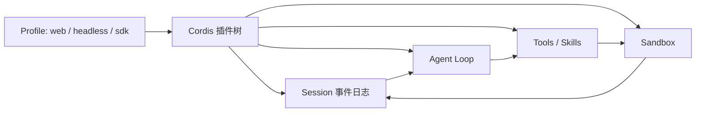

DeepSeek Harness（CLI 名 `dsh`）是 DeepSeek AI 于 2026-08-13 开源的 Agent 运行时。它不把自己定位成又一个聊天助理，而是把模型、工具、技能、session、sandbox、loop、调度和 UI 全部做成可替换插件。

## 基础核验

| 字段 | 信息 |
| --- | --- |
| 最近核验 | 2026-09-22 |
| GitHub 快照 | 约 233k stars（[deepseek-ai/deepseek-harness](https://github.com/deepseek-ai/deepseek-harness)） |
| 官方仓库 | [deepseek-ai/deepseek-harness](https://github.com/deepseek-ai/deepseek-harness) |
| 官方预览 | [deepseek.com/harness](https://www.deepseek.com/harness/en/) |
| 文档 | [deepseek-harness.github.io](https://deepseek-harness.github.io/deepseek-harness/) |
| 安全说明 | 仓库 `SAFETY.md` |
| 许可证 | MIT，另有 `THIRD_PARTY_NOTICES.md` |
| 分类 | 代码智能体 / 开源 Harness / 插件化 runtime |
| 成熟度 | Developer preview，官方声明会有破坏性变更 |

## 一句话定位

DeepSeek Harness 适合当「开源 Harness 实现」来读：把站内 [Harness 工程构件](/docs/practices/harness-engineering) 里的 Session / Harness / Sandbox 对照成 Cordis 插件，而不是再学一套聊天 UI。

## 值得学习的工程点

- Everything is a Plugin：模型适配器、工具、技能、session、sandbox、存储、agent loop、调度和 UI 都可以替换或重组，不必改核心源码。
- Cordis 内核：插件通过 typed events 和 services 协作。论文 [_A Programming Paradigm for Spatiotemporal Composability_](https://arxiv.org/abs/2608.25512) 解释设计动机。
- 多种 profile：官方以 `dsh web`、headless、sdk、sdk-minimal、acp 等命名 profile 启动不同应用形态。
- 本地 Web UI：`npx @deepseek-ai/dsh web` 默认打开 `http://127.0.0.1:3080`。
- 插件发现：社区仓库可用 GitHub topic `dsh-plugin`。
- 给 Agent 的约定：仓库自带 `AGENTS.md` 和 `CLAUDE.md`。

## 仓库结构观察

2026-09-22 核验时，顶层可见 `apps`、`packages`、`docs`、`python`、`native`、`website`、`benchmarks`、`SAFETY.md`、`AGENTS.md`。这是 monorepo 形态的 harness，不是单文件 demo。

## 最小运行路径

先读 `SAFETY.md`。官方 npm 入口：

```bash
npx @deepseek-ai/dsh web
```

从源码：

```bash
git clone https://github.com/deepseek-ai/deepseek-harness.git
cd deepseek-harness
pnpm install
pnpm run build
pnpm dsh web
```

## 不适合直接照搬的地方

- Preview 阶段，API 和插件契约会变；不要把当前版本写进生产锁文件后不再跟踪。
- 「一切皆插件」会提高组合爆炸：没有权限、schema 和审计，插件市场会变成攻击面。
- 它解决的是 runtime 可替换，不自动给你评测、产品权限模型和业务工作流。

## 核心链路



对照阅读时，把 Session 看成 append-only 事件，把 Loop 看成无状态 Harness，把 Sandbox 看成副作用边界。来源：[Harness 工程构件](/docs/practices/harness-engineering)；[DeepSeek Harness README](https://github.com/deepseek-ai/deepseek-harness)。

## 拆解清单

- 默认 agent loop 插件如何读写 Session 事件。
- 工具执行前后有没有 schema、权限和审计钩子。
- sandbox 插件如何限制文件系统和网络。
- 换模型适配器是否必须改 loop。
- preview 升级时哪些 profile / 插件会破坏兼容。

## 参考资料

- [DeepSeek Harness Repository](https://github.com/deepseek-ai/deepseek-harness)
- [DeepSeek Harness 文档](https://deepseek-harness.github.io/deepseek-harness/)
- [官方预览页](https://www.deepseek.com/harness/en/)
- [Harness 工程构件](/docs/practices/harness-engineering)
- [OpenCode](/docs/open-source-agents/opencode)：终端产品形态对照
- [Pi](/docs/open-source-agents/pi)：最小核心 harness 对照
