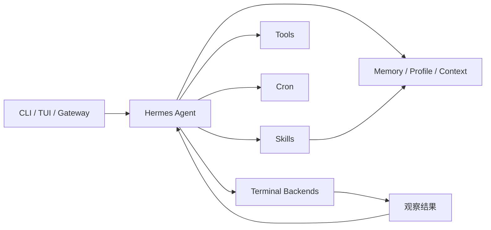

Hermes Agent 是 Nous Research 开源的通用 Agent 项目。它的学习价值集中在自改进循环、技能系统、记忆、消息网关、cron、子智能体、多运行后端和轨迹数据，而不是单一聊天界面。

## 基础核验

| 字段 | 信息 |
| --- | --- |
| 最近核验 | 2026-09-22 |
| GitHub 快照 | 约 248k stars（[NousResearch/hermes-agent](https://github.com/NousResearch/hermes-agent)） |
| 官方仓库 | [NousResearch/hermes-agent](https://github.com/NousResearch/hermes-agent) |
| 自进化扩展 | [NousResearch/hermes-agent-self-evolution](https://github.com/NousResearch/hermes-agent-self-evolution) |
| 官方站点 | [hermes-agent.nousresearch.com](https://hermes-agent.nousresearch.com) |
| 官方文档 | [hermes-agent.nousresearch.com/docs](https://hermes-agent.nousresearch.com/docs/) |
| Quickstart | [getting-started/quickstart](https://hermes-agent.nousresearch.com/docs/getting-started/quickstart) |
| Security | [user-guide/security](https://hermes-agent.nousresearch.com/docs/user-guide/security) |
| 许可证 | MIT，已核验仓库 `LICENSE` 文件 |
| 分类 | 通用任务智能体 / 自改进 Agent / 消息网关 |

## 一句话定位

Hermes Agent 适合被当成“长期个人 Agent 如何积累技能和记忆”的样本来学习：它把 CLI/TUI、消息平台、工具集、技能、记忆、cron、子智能体和运行后端整合到同一个 Agent 产品里。

## 值得学习的工程点

- 自改进循环：从复杂任务创建技能、在使用中改进技能、主动提示持久化知识、搜索历史会话。
- 技能和记忆：procedural memory、skills hub、context files、memory 和 user profile 是一等能力；技能声明兼容 [agentskills.io](https://agentskills.io)。
- OpenClaw 迁移：`hermes claw migrate` 可导入 SOUL.md、记忆、技能、allowlist、消息配置和 API key。
- 消息网关：Telegram、Discord、Slack、WhatsApp、Signal、Email 等入口共用一个 gateway 进程。
- 多运行后端：local、Docker、SSH、Singularity、Modal、Daytona、Vercel Sandbox；后两者强调空闲休眠。
- 自动化调度：内置 cron，可把自然语言任务变成定时执行和平台投递。
- 子智能体与并行：隔离 subagent，以及用 Python RPC 把多步工具调用压成低上下文成本回合。
- 研究数据：batch trajectory generation 和 trajectory compression；另有独立仓库做 DSPy + GEPA 自进化实验。

## 仓库结构观察

2026-09-22 核验时，仓库顶层仍覆盖 `agent`、`gateway`、`tools`、`skills`、`cron`、`providers`、`hermes_cli`、`tui_gateway`，并新增 `apps`、`plugins`、`plugin-catalog`、`acp_adapter`、`evals`、`web`、`AGENTS.md`。它同时覆盖运行时、CLI、网关、工具、技能、调度、文档和研究数据链路。

## 最小运行路径

官方 README 给出 Linux、macOS、WSL2、Termux 的安装入口：

```bash
curl -fsSL https://hermes-agent.nousresearch.com/install.sh | bash
source ~/.bashrc
hermes
```

Windows native 路径使用 PowerShell installer。安装后可从这些命令开始核验：

```bash
hermes
hermes model
hermes tools
hermes gateway
hermes setup
hermes doctor
hermes claw migrate --dry-run
```

若从 OpenClaw 迁来，先 dry-run 再决定是否导入密钥。继续深拆前，建议至少跑通 CLI 对话、模型选择、工具配置、gateway setup、一次 cron 示例和 `hermes doctor`。

## 不适合直接照搬的地方

- 自改进和长期记忆很容易沉淀隐私、偏好、密钥线索和错误经验，必须配套审计、删除、导出和人类确认机制。
- 消息平台入口会把外部输入接到工具执行链路，安全边界要先于功能体验设计。
- 多运行后端会扩大调试和权限面，不能只看 CLI 成功路径。
- 技能自创建如果缺少评审，可能把临时 workaround 固化为长期行为。
- 轨迹数据用于训练时，需要单独处理敏感数据、许可证、用户授权和可复现性。
- 社区里常把 OpenClaw 和 Hermes 绑成“双栈”。这是运维组合，不是官方单一产品；先分清渠道广度 vs 自进化深度，再决定是否同时跑两套系统。

## 后续深拆问题

- Agent loop 的状态对象、工具调用和中断恢复如何组织。
- Skills 如何创建、版本化、检索、启用和自我改进。
- Memory、session search、user profile 和 context files 的边界如何划分。
- Gateway 如何把不同平台消息映射到统一会话。
- Cron 任务如何保存、触发、投递和失败重试。
- terminal backend 如何处理文件系统、Shell、容器、远程主机和 serverless 持久化。

## 核心链路


```mermaid
flowchart LR
  UI[CLI / TUI / Gateway] --> A[Hermes Agent]
  A --> M[Memory / Profile / Context]
  A --> SK[Skills]
  A --> T[Tools]
  A --> CR[Cron]
  A --> B[Terminal Backends]
  B --> O[观察结果]
  O --> A
  SK --> M
```

Hermes Agent 的学习重点是长期运行：任务经验如何沉淀成 skill 和 memory，外部消息如何进入统一 agent，cron 如何把一次性对话变成自动化任务。

## 拆解清单

- skill 创建是否需要人工确认和版本记录。
- memory、profile、context file 是否有边界和过期机制。
- gateway 消息是否会触发高风险工具。
- cron 任务是否记录触发、失败、重试和投递结果。
- 多 terminal backend 是否隔离文件系统、密钥和网络。
- 轨迹数据用于训练时是否做脱敏和授权。

## 参考资料

- [Hermes Agent GitHub Repository](https://github.com/NousResearch/hermes-agent)
- [Hermes Agent self-evolution](https://github.com/NousResearch/hermes-agent-self-evolution)
- [Hermes Agent Documentation](https://hermes-agent.nousresearch.com/docs/)
- [Hermes Agent Security](https://hermes-agent.nousresearch.com/docs/user-guide/security)
- [Agent Skills](https://agentskills.io)
- [OpenClaw](/docs/open-source-agents/openclaw)
