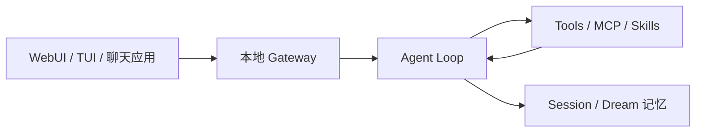

nanobot 是香港大学数据科学实验室（HKUDS）维护的轻量自托管个人 Agent。它用较小的 Python 核心把 WebUI、终端、聊天渠道、工具、长期记忆、MCP、定时任务和 OpenAI 兼容 API 串起来，适合当 OpenClaw 的「可读对照样本」。

## 基础核验

| 字段 | 信息 |
| --- | --- |
| 最近核验 | 2026-09-22 |
| GitHub 快照 | 约 48k stars（[HKUDS/nanobot](https://github.com/HKUDS/nanobot)） |
| 官方仓库 | [HKUDS/nanobot](https://github.com/HKUDS/nanobot) |
| 稳定文档 | [nanobot.wiki](https://nanobot.wiki/docs/latest/getting-started/nanobot-overview) |
| 最新发布 | v0.3.5（2026-09-15） |
| PyPI | `nanobot-ai` |
| 许可证 | 以仓库 `LICENSE` 为准 |
| 分类 | 通用任务智能体 / 轻量自托管助理 |

## 一句话定位

nanobot 适合学习「个人助理最小可运行核心」：消息进来、模型决定是否用工具、记忆和技能按需注入，而不是先上庞大的技能市场。

## 值得学习的工程点

- 小核心：官方强调渠道、工具、记忆都挂在同一条 agent loop 上，避免变成编排平台。
- 共享 Gateway：WebUI、TUI、聊天应用共用本地 gateway；`nanobot gateway --background` 在客户端退出后仍跑自动化。
- Dream 长期记忆：会话历史和长期记忆分开，临时聊天可以不写入记忆。
- 工作区与权限：composer 里选择 workspace 和 access mode，而不是默认全盘可写。
- 渠道覆盖：Telegram、Discord、Slack、微信 / 飞书、Email、Mattermost、Linear 等。
- 集成面：Python SDK 与 OpenAI 兼容 API，方便嵌进已有脚本。

## 仓库结构观察

README 把安装、WebUI、架构、聊天应用、部署拆成 `docs/` 下的任务型指南。源码安装需要 Python 3.11+；WebUI 打进 wheel，不强制单独前端构建。这和 OpenClaw 的大型 TypeScript monorepo 形成对照。

## 最小运行路径

```bash
curl -fsSL https://raw.githubusercontent.com/HKUDS/nanobot/main/scripts/install.sh | sh
nanobot webui
```

浏览器默认 `http://127.0.0.1:8765`。首次在 **Settings → Models** 配置供应商后，发一条 `Hello!` 确认链路。长期运行：

```bash
nanobot gateway --background
nanobot gateway status
```

## 不适合直接照搬的地方

- 「轻量」不等于默认安全：Shell、文件、MCP 仍然是真实副作用。
- 聊天渠道会把外部用户接到同一 gateway，需要先读安全与渠道文档。
- 不要按星标把它写成 OpenClaw 替代品；它的价值是核心可读、便于改，不是生态规模。

## 核心链路



## 拆解清单

- access mode 实际限制了哪些路径和命令。
- Dream 记忆如何写入、检索和过期。
- 临时聊天与持久 topic 的数据边界。
- 定时任务在 gateway 停止后是否丢失。

## 参考资料

- [HKUDS/nanobot](https://github.com/HKUDS/nanobot)
- [nanobot 文档](https://nanobot.wiki/docs/latest/getting-started/nanobot-overview)
- [OpenClaw](/docs/open-source-agents/openclaw)
- [Hermes Agent](/docs/open-source-agents/hermes-agent)
