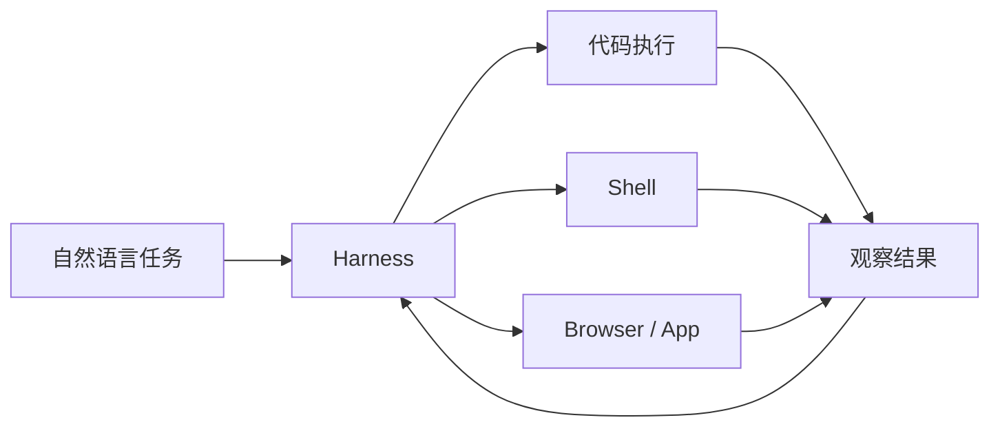

Open Interpreter 是开源的本地 computer use / code execution agent。它让语言模型通过自然语言接口在本地运行代码、调用 Shell，并在一定场景下操作浏览器或原生应用。

## 基础核验

| 字段 | 信息 |
| --- | --- |
| 最近核验 | 2026-06-13 |
| 官方仓库 | [openinterpreter/openinterpreter](https://github.com/openinterpreter/openinterpreter) |
| 官方站点 | [openinterpreter.com](https://www.openinterpreter.com/) |
| 分类 | 计算机使用智能体 / 本地 code execution agent |
| 许可证 | Apache-2.0 |

## 一句话定位

Open Interpreter 适合学习“本地 Agent 如何安全地使用计算机”：包括运行代码、访问文件、调用 Shell、切换 harness、测试网页或原生应用，以及处理本地权限风险。

## 值得学习的工程点

- 本地执行：Agent 可以在用户机器上运行 Python、JavaScript、Shell 等代码。
- Harness emulation：官方 README 展示了多种 harness 选择，适合研究不同 agent harness 对模型能力的影响。
- Computer use：项目包含网页和原生应用测试相关能力，适合和 Browser Use 对照。
- Rust 化趋势：新版本强调 Rust 实现，适合观察 Agent runtime 和 CLI 的底层重构。
- 权限边界：本地文件、Shell、浏览器和系统应用都需要明确的确认和隔离策略。

## 不适合直接照搬的地方

- 本地 computer use 风险高，不能默认允许访问敏感目录、密钥、账号或付费服务。
- 代码执行和 Shell 调用必须有日志、确认、取消和回滚策略。
- Harness 兼容不是目的，关键是是否能稳定完成任务并被用户理解和控制。

## 后续深拆问题

- Open Interpreter 如何切换和模拟不同 harness。
- 本地 code execution 如何控制权限和工作目录。
- 它如何驱动浏览器或原生应用进行 QA。
- 它和 Codex/Claude Code/aider 等工具的边界是什么。

## 核心链路

Open Interpreter 的学习重点是本地执行边界：模型能运行代码和 Shell 后，系统必须把工作目录、命令、网络、密钥和用户确认纳入同一套安全模型。

## 拆解清单

- 执行目录和可访问文件范围是否明确。
- 代码执行是否有超时、取消、日志和依赖隔离。
- Shell 命令是否区分只读、写入和危险操作。
- 浏览器或原生应用测试是否需要用户确认。
- 本地隐私和长期历史是否可删除、导出和审计。

## 参考资料

- [Open Interpreter GitHub Repository](https://github.com/openinterpreter/openinterpreter)
- [Open Interpreter Website](https://www.openinterpreter.com/)
