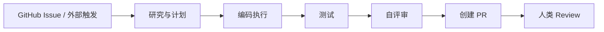

Open SWE 是 LangChain 开源的异步 coding agent。它的重点不是终端里即时 pair programming，而是把 GitHub issue、计划、编码、测试、自评审、PR 和团队协作串成一个长任务工作流。

## 基础核验

| 字段 | 信息 |
| --- | --- |
| 最近核验 | 2026-06-13 |
| 官方仓库 | [langchain-ai/open-swe](https://github.com/langchain-ai/open-swe) |
| 官方介绍 | [Introducing Open SWE](https://www.langchain.com/blog/introducing-open-swe-an-open-source-asynchronous-coding-agent) |
| 分类 | 代码智能体 / 异步云端 coding agent |
| 许可证 | MIT |

## 一句话定位

Open SWE 适合学习“把 coding agent 当作团队里的异步工程成员”来设计：它从 issue 或外部触发开始，先研究和计划，再编码、测试、复查并创建 PR。

## 值得学习的工程点

- 异步任务模型：Agent 可以在后台处理 GitHub task，而不是要求用户全程盯着终端。
- GitHub 协作：issue、label、PR、review 这些现有协作对象成为 Agent 的工作界面。
- LangGraph / Deep Agents 架构：适合观察状态化长任务和子智能体编排。
- 触发来源：GitHub、Slack、Linear 等外部工作流可以统一进入 Agent。
- 人类审核：长任务 Agent 的结果最终仍然要落到 PR 和 review 上。

## 不适合直接照搬的地方

- 云端 coding agent 需要处理仓库权限、密钥、沙箱、CI 成本和审计。
- 异步自动 PR 不应绕过测试和 code review。
- 团队接入前需要定义清楚哪些 issue 可以交给 Agent，哪些必须人类处理。

## 后续深拆问题

- Open SWE 如何从 issue 生成计划。
- 它如何组织子智能体、sandbox、测试和自评审。
- PR 创建前有哪些自动验证。
- 它如何处理失败、取消和人工接管。

## 核心链路

Open SWE 的关键学习点是异步：用户不需要在终端里一轮轮确认，但系统必须用计划、测试、PR 和 review 保留人类控制权。

## 拆解清单

- issue 到计划的转换是否可见、可修改。
- sandbox 是否隔离仓库、依赖、密钥和网络。
- 自动测试失败后是否会重规划。
- PR 描述是否包含计划、变更、验证和风险。
- 何时停止、取消、转人工或重新排队。

## 参考资料

- [Open SWE GitHub Repository](https://github.com/langchain-ai/open-swe)
- [Introducing Open SWE](https://www.langchain.com/blog/introducing-open-swe-an-open-source-asynchronous-coding-agent)
