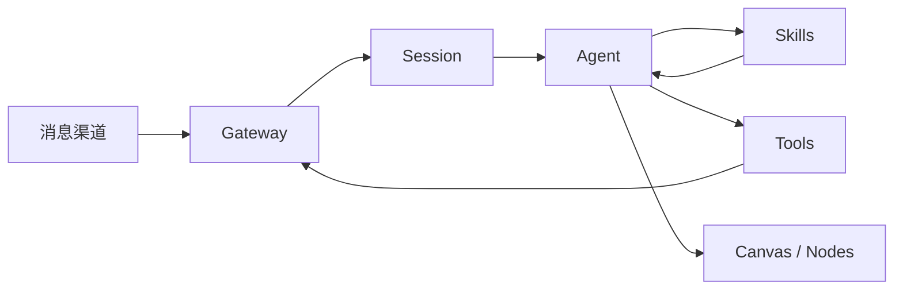

OpenClaw 是一个本地优先的个人 AI 助理项目，核心看点不是单次对话，而是把用户已有消息渠道、Gateway、工具、技能、Canvas、桌面和移动节点连接成一个长期运行的助理系统。

## 基础核验

| 字段 | 信息 |
| --- | --- |
| 最近核验 | 2026-06-13 |
| 官方仓库 | [openclaw/openclaw](https://github.com/openclaw/openclaw) |
| 官方站点 | [openclaw.ai](https://openclaw.ai) |
| 官方文档 | [docs.openclaw.ai](https://docs.openclaw.ai) |
| Getting Started | [docs.openclaw.ai/start/getting-started](https://docs.openclaw.ai/start/getting-started) |
| Security | [docs.openclaw.ai/gateway/security](https://docs.openclaw.ai/gateway/security) |
| 许可证 | MIT，已核验仓库 `LICENSE` 文件 |
| 分类 | 通用任务智能体 / 个人助理 / 多渠道 Gateway |

## 一句话定位

OpenClaw 适合被当成“个人助理产品化样本”来学习：它关心多渠道入口、长期运行、设备节点、工具权限、用户数据归属和远程暴露安全，而不只是 prompt 或一次性的 demo。

## 值得学习的工程点

- Gateway 作为控制面：统一承载 sessions、channels、tools 和 events，避免每个渠道各自实现一套 Agent 流程。
- 多渠道入口：README 中列出 WhatsApp、Telegram、Slack、Discord、Google Chat、Signal、iMessage、Teams、Matrix、飞书、微信、QQ 等入口，适合观察“同一 Agent 如何面对不同消息平台”。
- Onboarding 和 doctor：推荐通过 `openclaw onboard` 配置 gateway、workspace、channels 和 skills，说明项目把安装体验作为工程能力的一部分。
- DM 安全默认值：官方安全说明强调把外部私信视为不可信输入，并通过 pairing、allowlist 和 `openclaw doctor` 降低误暴露风险。
- Sandbox 边界：项目区分 main session 和非 main session 的工具权限，适合学习“个人主会话”和“外部渠道会话”权限不一致时如何建模。
- Live Canvas 和节点：Canvas、桌面伴随应用、移动节点让 Agent 不只停留在文本聊天，也能进入可视化工作区和设备侧能力。

## 仓库结构观察

2026-06-13 核验时，仓库顶层能看到 `apps`、`packages`、`src`、`skills`、`ui`、`docs`、`deploy`、`security`、`qa`、`test`、`Dockerfile`、`docker-compose.yml` 等目录和文件。它不是单文件 demo，而是包含应用、包、文档、部署、安全、测试和技能体系的产品型仓库。

## 最小运行路径

官方 README 推荐 Node 24，或 Node 22.19+。新用户路径以 CLI onboarding 为主：

```bash
npm install -g openclaw@latest
openclaw onboard --install-daemon
openclaw gateway status
```

调试前台 Gateway 时可参考：

```bash
openclaw gateway stop
openclaw gateway --port 18789 --verbose
```

继续深拆前，需要在本地或隔离环境跑通 onboarding、gateway status、一个安全的测试 channel，以及 `openclaw doctor`。

## 不适合直接照搬的地方

- 多渠道助理会连接真实账号、消息、cookie、API key 和本地文件，安全风险比普通文档站或聊天 demo 高。
- “外部用户发消息触发工具调用”是高风险场景，必须先理解 pairing、allowlist、sandbox 和 gateway exposure runbook。
- OpenClaw 的价值来自 Gateway、节点、渠道、技能和配置体系的组合，拆其中一个模块时不能脱离整体权限模型。
- 二次分发时除 MIT 许可证外，还需要核对 `THIRD_PARTY_NOTICES.md`。

## 后续深拆问题

- Gateway 内部如何把 channel message 变成 agent session。
- 多 agent routing 如何隔离不同 workspace、channel 和 peer。
- Skills 如何被安装、发现、调用和更新。
- Canvas 与普通文本回复之间如何交换状态。
- 非 main session 的 sandbox deny/allow 列表如何影响工具调用。
- `openclaw doctor` 能检测哪些真实风险，哪些风险还需要部署侧检查。

## 核心链路



OpenClaw 的价值在于把个人助理的入口统一到 Gateway：不同消息渠道进入同一套 session、工具、技能和安全控制，而不是每个渠道单独实现 Agent。

## 拆解清单

- channel message 如何映射到用户、workspace 和 session。
- 外部私信和主会话是否使用不同工具权限。
- Gateway 暴露到公网时，pairing、allowlist 和 token 如何生效。
- Skills 是否能声明权限、依赖、版本和更新策略。
- Canvas / 节点能力是否会产生额外数据同步和隐私风险。

## 参考资料

- [OpenClaw GitHub Repository](https://github.com/openclaw/openclaw)
- [OpenClaw Documentation](https://docs.openclaw.ai)
- [OpenClaw Security](https://docs.openclaw.ai/gateway/security)
