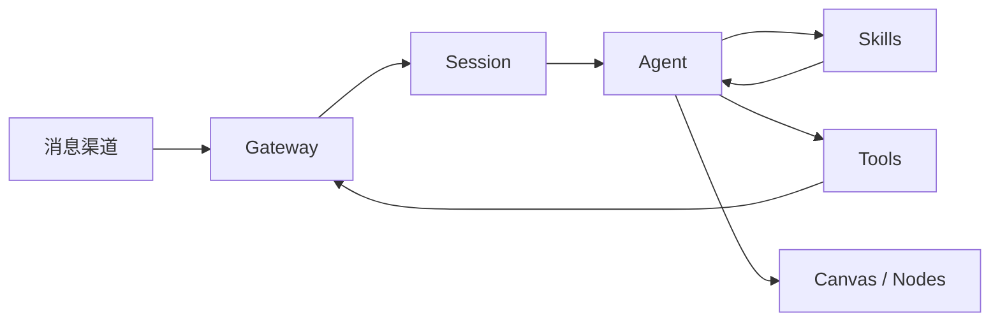

OpenClaw 是一个本地优先的个人 AI 助理项目，核心看点不是单次对话，而是把用户已有消息渠道、Gateway、工具、技能、Canvas、桌面和移动节点连接成一个长期运行的助理系统。

## 基础核验

| 字段 | 信息 |
| --- | --- |
| 最近核验 | 2026-09-22 |
| GitHub 快照 | 约 390k stars（[openclaw/openclaw](https://github.com/openclaw/openclaw)） |
| 官方仓库 | [openclaw/openclaw](https://github.com/openclaw/openclaw) |
| 官方站点 | [openclaw.ai](https://openclaw.ai) |
| 官方文档 | [docs.openclaw.ai](https://docs.openclaw.ai) |
| Getting Started | [docs.openclaw.ai/start/getting-started](https://docs.openclaw.ai/start/getting-started) |
| 技能目录 | [ClawHub](https://clawhub.ai) |
| Security | [docs.openclaw.ai/gateway/security](https://docs.openclaw.ai/gateway/security) |
| 治理 | [OpenClaw Foundation](https://openclaw.org)（独立 501(c)(3)） |
| 许可证 | MIT，已核验仓库 `LICENSE`（Copyright 2026 OpenClaw Foundation） |
| 分类 | 通用任务智能体 / 个人助理 / 多渠道 Gateway |

## 一句话定位

OpenClaw 适合被当成“个人助理产品化样本”来学习：它关心多渠道入口、长期运行、设备节点、工具权限、用户数据归属和远程暴露安全，而不只是 prompt 或一次性的 demo。

## 值得学习的工程点

- Gateway 作为控制面：统一承载 sessions、channels、tools 和 events，避免每个渠道各自实现一套 Agent 流程。
- 多渠道入口：README 中列出 Discord、iMessage、Slack、Teams、Telegram、WhatsApp 等 20+ 渠道，以及 macOS、iOS、Android、Windows、Linux 原生应用。
- 技能发行网络：官方把新能力优先放到 [plugin SDK](https://docs.openclaw.ai/plugins/building-plugins) 和 [ClawHub](https://clawhub.ai)，适合观察“助理产品如何把扩展从核心仓库拆出去”。
- Harness 可替换：README 把 Claude、Codex、本地模型描述为可替换插件，Gateway 本身不绑定单一模型厂商。[Pi](/docs/open-source-agents/pi) 官方文档把 OpenClaw 列为 SDK 嵌入样本，适合对照 Gateway 如何消费最小 harness，而不是把 `pi` CLI 当成又一个渠道。
- Onboarding 和 doctor：`openclaw onboard --install-daemon` 配置 gateway、workspace、channels 和 skills；`openclaw dashboard` 打开 Control UI。
- DM 安全默认值：把外部私信视为不可信输入，未知发送者默认 pairing，用 `openclaw pairing approve` 放行。
- Sandbox 边界：主会话工具默认跑在 host 上，除非显式配置 sandbox；远程暴露 Gateway 前必须读 security / exposure runbook。
- Live Canvas 和节点：Companion apps 增加 voice、Canvas、camera、screen 和设备侧动作。

## 仓库结构观察

2026-09-22 核验时，仓库顶层能看到 `apps`、`packages`、`src`、`skills`、`ui`、`docs`、`deploy`、`security`、`qa`、`test`、`crates`、`extensions`、`AGENTS.md`、`Dockerfile`、`docker-compose.yml` 等。它仍是产品型仓库，并已把技能/插件和原生运行时继续拆分。

## 最小运行路径

官方推荐安装脚本（会按需安装受支持的 Node.js）。已自行管理 Node 时，要求 Node 24.16+ 或 26.1+，推荐 Node 26：

```bash
curl -fsSL https://openclaw.ai/install.sh | bash
```

或：

```bash
npm install -g openclaw@latest --allow-scripts=openclaw
openclaw onboard --install-daemon
openclaw gateway status
openclaw dashboard
```

调试前台 Gateway 时可参考：

```bash
openclaw gateway stop
openclaw gateway --port 18789 --verbose
```

继续深拆前，需要在本地或隔离环境跑通 onboarding、gateway status、一个安全的测试 channel，以及 `openclaw doctor`。

## 不适合直接照搬的地方

- 多渠道助理会连接真实账号、消息、cookie、API key 和本地文件，安全风险比普通文档站或聊天 demo 高。
- “外部用户发消息触发工具调用”是高风险场景，必须先理解 pairing、allowlist、sandbox 和 gateway exposure runbook。
- OpenClaw 的价值来自 Gateway、节点、渠道、技能和配置体系的组合，拆其中一个模块时不能脱离整体权限模型。
- 二次分发时除 MIT 许可证外，还需要核对 `THIRD_PARTY_NOTICES.md`。
- PicoClaw、NanoClaw、ZeroClaw 等社区分叉大多是发行形态或硬件套件，学习价值应回到 Gateway、权限和技能模型，不要把每个分叉当成独立产品页。

## 后续深拆问题

- Gateway 内部如何把 channel message 变成 agent session。
- 多 agent routing 如何隔离不同 workspace、channel 和 peer。
- Skills 如何被安装、发现、调用和更新。
- Canvas 与普通文本回复之间如何交换状态。
- 非 main session 的 sandbox deny/allow 列表如何影响工具调用。
- `openclaw doctor` 能检测哪些真实风险，哪些风险还需要部署侧检查。

## 核心链路


```mermaid
flowchart LR
  CH[消息渠道] --> G[Gateway]
  G --> S[Session]
  S --> A[Agent]
  A --> SK[Skills]
  A --> T[Tools]
  A --> C[Canvas / Nodes]
  T --> G
  SK --> A
```

OpenClaw 的价值在于把个人助理的入口统一到 Gateway：不同消息渠道进入同一套 session、工具、技能和安全控制，而不是每个渠道单独实现 Agent。

## 拆解清单

- channel message 如何映射到用户、workspace 和 session。
- 外部私信和主会话是否使用不同工具权限。
- Gateway 暴露到公网时，pairing、allowlist 和 token 如何生效。
- Skills 是否能声明权限、依赖、版本和更新策略。
- Canvas / 节点能力是否会产生额外数据同步和隐私风险。

## 参考资料

- [OpenClaw GitHub Repository](https://github.com/openclaw/openclaw)
- [OpenClaw Documentation](https://docs.openclaw.ai)
- [OpenClaw Security](https://docs.openclaw.ai/gateway/security)
- [ClawHub](https://clawhub.ai)
- [OpenClaw Foundation](https://openclaw.org)
- [Hermes Agent](/docs/open-source-agents/hermes-agent)：自进化对照；官方提供 `hermes claw migrate`
- [nanobot](/docs/open-source-agents/nanobot)：轻量自托管对照
- [Pi](/docs/open-source-agents/pi)：Pi 官方文档引用的 SDK 嵌入样本
