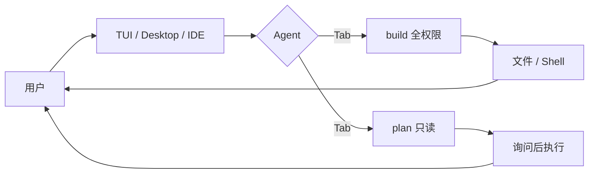

OpenCode 是目前社区最常用的开源终端编码 Agent 之一。它强调自带密钥、多模型供应商、终端优先，并提供桌面应用和 IDE 扩展。仓库必须写死为 [`anomalyco/opencode`](https://github.com/anomalyco/opencode)；较早期的 [`opencode-ai/opencode`](https://github.com/opencode-ai/opencode) 已归档，不要拿去当活跃上游。

## 基础核验

| 字段 | 信息 |
| --- | --- |
| 最近核验 | 2026-09-22 |
| GitHub 快照 | 约 209k stars（[anomalyco/opencode](https://github.com/anomalyco/opencode)） |
| 官方仓库 | [anomalyco/opencode](https://github.com/anomalyco/opencode) |
| 官方站点 | [opencode.ai](https://opencode.ai) |
| 文档 | [opencode.ai/docs](https://opencode.ai/docs) |
| 许可证 | MIT |
| 分类 | 代码智能体 / 终端编码 Agent |
| 注意 | `opencode-ai/opencode` 已 archived，不是本页对象 |

## 一句话定位

OpenCode 适合学习「开源、供应商无关的终端编码 Agent」如何组织 Build/Plan 权限、子 Agent 和本地安装体验，用来对照 Claude Code / Codex 的产品封闭实现。

## 值得学习的工程点

- 双内置 Agent：`build` 是默认全权限开发 Agent；`plan` 默认只读、改文件拒绝、跑 bash 要问。用 `Tab` 切换。
- 子 Agent：`@general` 处理复杂搜索和多步任务。
- 安装面宽：官方 install 脚本、npm 包名 `opencode-ai`、Homebrew tap、桌面 DMG/EXE。
- 运行时：仓库用 Bun workspace（`bun.lock`、`packages/`），不是 Python 研究原型。
- 跨工具约定：根目录有 `AGENTS.md`。

## 仓库结构观察

2026-09-22 核验时，顶层可见 `packages`、`sdks`、`specs`、`infra`、`install`、`AGENTS.md`、`SECURITY.md`。产品代码在包里，安装器单独存在。

## 最小运行路径

```bash
curl -fsSL https://opencode.ai/install | bash
```

或：

```bash
npm i -g opencode-ai@latest
opencode
```

官方提示先卸掉 0.1.x 之前的旧版本。桌面端从 [releases](https://github.com/anomalyco/opencode/releases) 或 [opencode.ai/download](https://opencode.ai/download) 获取。

## 不适合直接照搬的地方

- npm 包名是 `opencode-ai`，GitHub 组织是 `anomalyco`，早期 Go 仓库已归档。写文档和脚本时三者不要混。
- 第三方项目若名字带 opencode，官方要求在 README 声明非官方、无隶属关系。
- Plan 模式降低误改风险，但 auto-approve 仍会把 Shell 和文件写入交给模型。

## 核心链路



## 拆解清单

- Plan 和 Build 的工具白名单差在哪里。
- 多 provider 配置如何落到一次会话。
- LSP / MCP 如何进入工具池。
- headless / `opencode serve` 是否适合 CI。

## 参考资料

- [anomalyco/opencode](https://github.com/anomalyco/opencode)
- [OpenCode Docs](https://opencode.ai/docs)
- [Claude Code](/docs/coding-agents/claude-code)
- [Cline](/docs/open-source-agents/cline)
- [DeepSeek Harness](/docs/open-source-agents/deepseek-harness)
- [Pi](/docs/open-source-agents/pi)：更小的终端 harness 对照
