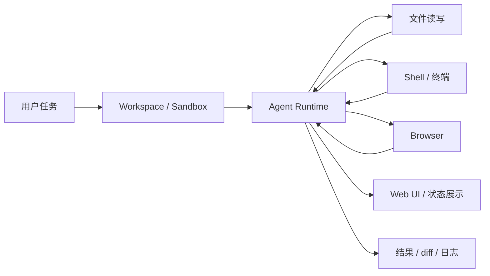

OpenHands 是面向软件开发任务的开源 Agent 平台。它适合被当作“工程型 Coding Agent 产品”的样本来学习：Agent 不只是给出代码建议，而是进入仓库、运行命令、修改文件、浏览网页，并在受控工作区里完成软件工程任务。

## 基础核验

| 字段 | 信息 |
| --- | --- |
| 最近核验 | 2026-06-13 |
| 官方仓库 | [OpenHands/OpenHands](https://github.com/OpenHands/OpenHands) |
| 官方站点 | [openhands.dev](https://www.openhands.dev/) |
| Software Agent SDK | [OpenHands/software-agent-sdk](https://github.com/OpenHands/software-agent-sdk) |
| 分类 | 代码智能体 / 软件工程 Agent 平台 |
| 许可证 | GitHub API 返回 `NOASSERTION`，需要按仓库许可证文件继续复核 |

## 一句话定位

OpenHands 适合学习“可产品化的软件工程 Agent”如何组织 sandbox、终端、浏览器、代码工作区、用户交互和 SDK，而不只是一次性的代码生成。

## 值得学习的工程点

- 软件开发动作空间：代码编辑、终端命令、浏览器和任务执行被放进同一 Agent 工作流。
- Sandbox：软件工程 Agent 必须隔离仓库、依赖安装、命令执行和网络访问。
- SDK 化：OpenHands Software Agent SDK 将底层 agentic 能力抽成可组合的 Python / REST API。
- 云端和本地边界：同一个软件开发 Agent 需要兼容本地 workspace、Docker/Kubernetes 等临时工作区。
- 企业协作：OpenHands 的价值不只在单人 demo，还在安全、透明、可控地完成复杂工程任务。

## 不适合直接照搬的地方

- 代码 Agent 平台的复杂度较高，直接复制全套 sandbox、UI、SDK 和部署形态成本很大。
- 自动执行命令和改代码必须先有权限、审计、回滚和人工评审边界。
- OpenHands 更适合学习平台级架构；小项目可以只借鉴其中的 sandbox、工具接口和任务状态设计。

## 后续深拆问题

- Agent 如何选择要读的文件和要执行的命令。
- Sandbox 如何隔离依赖安装、网络、文件系统和密钥。
- SDK 如何把 agent、tool、workspace 和执行后端解耦。
- Web UI 如何展示计划、执行、错误、diff 和人工确认。

## 核心链路

OpenHands 的学习重点是“软件工程动作空间”如何被统一管理：读仓库、改文件、跑命令、浏览网页和向用户解释进度都在同一个任务上下文中发生。

## 拆解清单

- Workspace 是否一次任务一个隔离环境，还是复用长期环境。
- 命令执行是否有限制、超时、日志和取消机制。
- 浏览器能力是否和文件/终端共享同一个任务状态。
- 用户能否看到计划、当前动作、失败原因和最终 diff。
- SDK 是否能把平台能力拆出来供其他产品复用。

## 参考资料

- [OpenHands GitHub Repository](https://github.com/OpenHands/OpenHands)
- [OpenHands Website](https://www.openhands.dev/)
- [OpenHands Software Agent SDK](https://github.com/OpenHands/software-agent-sdk)
