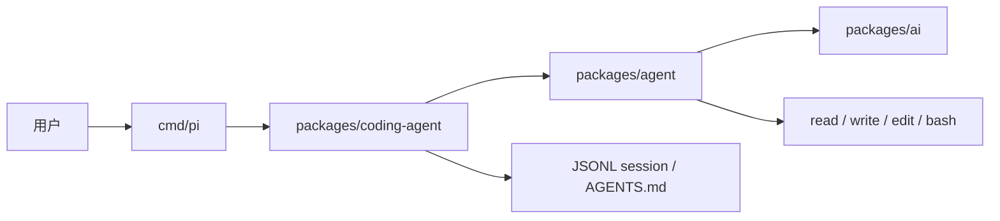

pi-go 不是 Earendil 官方产品，而是把 [Pi](/docs/open-source-agents/pi) 的 TypeScript harness 迁到 Go 的社区尝试。2026-09-22 没有单一「官方 pi-go」。本页以字面仓库 [`guanshan/pi-go`](https://github.com/guanshan/pi-go) 为拆解对象：它声明兼容上游 CLI、JSONL session 和工具语义，但仍标 Alpha。其它活跃移植（如 [`sky-valley/pi`](https://github.com/sky-valley/pi)、[`OrdalieTech/orb`](https://github.com/OrdalieTech/orb)）不要当成同一个上游。

## 基础核验

| 字段 | 信息 |
| --- | --- |
| 最近核验 | 2026-09-22 |
| GitHub 快照 | 约 2 stars（[guanshan/pi-go](https://github.com/guanshan/pi-go)）；星标只是快照，不当选型结论 |
| 本页仓库 | [guanshan/pi-go](https://github.com/guanshan/pi-go) |
| 上游 | [earendil-works/pi](https://github.com/earendil-works/pi)（TypeScript） |
| 许可证 | MIT；NOTICE 保留上游版权行 |
| 成熟度 | Alpha，README 写明不是 1:1 替代 |
| 分类 | 代码智能体 / 社区 Go 移植 |
| 其它同名方向 | [sky-valley/pi](https://github.com/sky-valley/pi)（README 自称 “pi-go”）、[OrdalieTech/orb](https://github.com/OrdalieTech/orb) |

## 一句话定位

pi-go 适合观察「一份最小 TS harness 如何被翻译成 Go 包边界」，而不是当作生产编码 Agent 来装。

## 值得学习的工程点

- 镜像 monorepo：`packages/ai`、`packages/agent`、`packages/tui`、`packages/coding-agent`，对应上游 `pi-ai` / `pi-agent-core` / `pi-tui` / `pi-coding-agent`。
- 兼容面写进目标：CLI 参数、print / JSON / RPC、JSONL session v3、默认工具 `read` `write` `edit` `bash` `grep` `find` `ls`、以及 `AGENTS.md` / `CLAUDE.md`。
- 配置路径刻意与上游相同：`~/.pi/agent/settings.json`、`.pi/settings.json`、同样的 session 目录环境变量。
- 差距也文档化：`docs/TS_COMPATIBILITY.md` 跟踪交互 UI、`.ts` / `.js` 扩展、部分 OAuth。交互 UI 用 Bubble Tea，不是上游 TUI 的逐行移植。
- 二进制分发：`go install github.com/guanshan/pi-go/cmd/pi@latest` 或 release 里的静态文件。二进制名仍是 `pi`，会和官方 CLI 抢 PATH。

## 仓库结构观察

README 把包依赖边界放到 `docs/ARCHITECTURE.md`，把与 TypeScript 的差集放到 `docs/TS_COMPATIBILITY.md`。这比再抄一套 agent loop 更有学习价值：先看哪些语义必须对齐，哪些 UI 允许分叉。

## 最小运行路径

先读兼容性文档，再在隔离目录验证，不要覆盖已安装的官方 `pi`：

```bash
go install github.com/guanshan/pi-go/cmd/pi@latest
go run github.com/guanshan/pi-go/cmd/pi@latest --help
go run github.com/guanshan/pi-go/cmd/pi@latest --model faux/faux -p "hello"
```

Linux / macOS 也可用仓库 `scripts/install.sh`。官方 Pi 仍应走 [pi.dev/install.sh](https://pi.dev/install.sh) 或 `@earendil-works/pi-coding-agent`。

## 不适合直接照搬的地方

- 不要把任意名为 pi-go 的仓库写成 Earendil 官方 Go 版。
- Alpha 缺口包括完整交互 UI 和 TypeScript 扩展运行时；能跑 print 模式不等于能替换日常 `pi`。
- 与官方 CLI 同命令名。同时安装时先确认 `which pi`。
- 其它 Go 移植（sky-valley/pi 的差分 HTTP 对照、orb 的 `UPSTREAM.lock`）值得对照阅读，但本页不逐个收录。

## 核心链路



## 拆解清单

- `docs/TS_COMPATIBILITY.md` 里哪些行为已对齐、哪些仍缺口。
- session 文件能否被官方 `pi` 接着读。
- 扩展是 Go 插件、脚本桥，还是尚未支持。
- 与 sky-valley/pi、orb 的保真策略差在哪里（文档审计 vs HTTP 差分 vs UPSTREAM.lock）。

## 参考资料

- [guanshan/pi-go](https://github.com/guanshan/pi-go)
- [earendil-works/pi](https://github.com/earendil-works/pi)
- [Pi](/docs/open-source-agents/pi)
- [sky-valley/pi](https://github.com/sky-valley/pi)
- [OrdalieTech/orb](https://github.com/OrdalieTech/orb)
- [Harness 工程构件](/docs/practices/harness-engineering)
