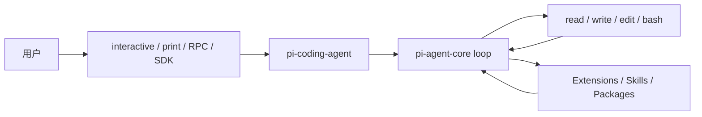

Pi（社区常叫 Pi Agent / Pi Coding Agent）是 Mario Zechner 发起、现由 Earendil Works 维护的最小终端编码 Harness。它默认只给模型 `read`、`write`、`edit`、`bash` 四个工具，不把 Plan、子 Agent、MCP、权限弹窗做进核心，而是用 TypeScript 扩展、Skills、Prompt Templates 和 Pi Packages 按需补。仓库必须写死为 [`earendil-works/pi`](https://github.com/earendil-works/pi)；2026 年 5 月从 `badlogic/pi-mono` / `@mariozechner` 迁到这个组织和 `@earendil-works` 命名空间。

## 基础核验

| 字段 | 信息 |
| --- | --- |
| 最近核验 | 2026-09-22 |
| GitHub 快照 | 约 108k stars（[earendil-works/pi](https://github.com/earendil-works/pi)） |
| 官方仓库 | [earendil-works/pi](https://github.com/earendil-works/pi) |
| 官方站点 | [pi.dev](https://pi.dev) |
| 文档 | [pi.dev/docs/latest](https://pi.dev/docs/latest) |
| npm | `@earendil-works/pi-coding-agent` |
| 许可证 | MIT |
| 分类 | 代码智能体 / 最小终端 Harness |
| 注意 | 旧仓库名 `badlogic/pi-mono`、旧 npm 作用域 `@mariozechner` 不要当活跃上游 |

## 一句话定位

Pi 适合学习「刻意做小的 Agent Harness」：核心可读、可扩展、可嵌入，而不是再堆一个全功能编码产品。

## 值得学习的工程点

- 最小工具面：默认四个工具，其它能力用扩展或 `pi install` 安装的包补上。
- 四种运行模式：交互 TUI、print / JSON、stdin/stdout RPC、Node.js SDK。官方把 [OpenClaw](/docs/open-source-agents/openclaw) 当作 SDK 嵌入的真实例子。
- 包拆分：`pi-ai`（多供应商 LLM API）、`pi-agent-core`（agent loop）、`pi-coding-agent`（CLI / SDK）、`pi-tui`（终端 UI），另外还有 `chord`、`durable`、`telemetry`。
- 会话是树：JSONL session、分支、compaction；配置在 `~/.pi/agent/`。
- 跨工具约定：分层读取 `AGENTS.md`；仓库自带 `AGENTS.md`、`SECURITY.md`。
- 供应链约束：官方安装走 `--ignore-scripts`，lockfile 视为代码变更。

## 仓库结构观察

2026-09-22 核验时，顶层可见 `packages`、`scripts`、`AGENTS.md`、`SECURITY.md`、`CONTRIBUTING.md`。产品不在单文件里，而在 monorepo 包中；聊天自动化另见 `earendil-works/pi-chat`。

## 最小运行路径

```bash
curl -fsSL https://pi.dev/install.sh | sh
```

或：

```bash
npm install -g --ignore-scripts @earendil-works/pi-coding-agent
pi
```

用 `/login` 接订阅供应商，或先导出 `ANTHROPIC_API_KEY` 一类密钥。官方明确：**Pi 没有内置文件系统 / 进程 / 网络权限系统**，默认等于启动它的那个用户。需要隔离时读 [containerization](https://github.com/earendil-works/pi/blob/main/packages/coding-agent/docs/containerization.md)（Gondolin、Docker、OpenShell）。

## 不适合直接照搬的地方

- 没有 Plan 模式或权限弹窗，不是缺陷，是设计。拿它当 Claude Code / OpenCode 的功能清单会对齐失败。
- 默认全权限 bash / 写文件。不要在未沙箱的生产仓库里开 auto 跑。
- Go 移植不是官方产品。社区常叫 pi-go 的仓库见 [pi-go](/docs/open-source-agents/pi-go)，不要和 `earendil-works/pi` 混成同一个上游。

## 核心链路



## 拆解清单

- 四个默认工具的 schema 和截断规则。
- session JSONL 如何表达分支和 compaction。
- 扩展如何注册工具、命令和 TUI，而不改核心。
- OpenClaw 为何用 SDK 嵌入而不是子进程或 RPC。
- 无内置权限时，容器化方案各自挡住什么。

## 参考资料

- [earendil-works/pi](https://github.com/earendil-works/pi)
- [Pi Docs](https://pi.dev/docs/latest)
- [What I learned building an opinionated and minimal coding agent](https://mariozechner.at/posts/2025-11-30-pi-coding-agent/)
- [OpenClaw](/docs/open-source-agents/openclaw)
- [pi-go](/docs/open-source-agents/pi-go)
- [Harness 工程构件](/docs/practices/harness-engineering)
- [OpenCode](/docs/open-source-agents/opencode)
