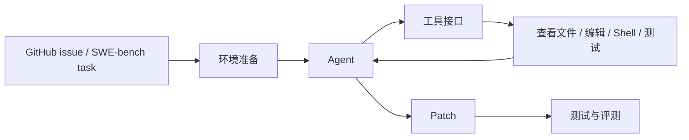

SWE-agent 是面向真实 GitHub issue 的开源软件工程 Agent。它的学习价值在于把“让模型修 bug”拆成了可配置工具接口、真实仓库环境、问题定位、代码修改、测试验证和评测流程。

## 基础核验

| 字段 | 信息 |
| --- | --- |
| 最近核验 | 2026-06-13 |
| 官方仓库 | [swe-agent/SWE-agent](https://github.com/swe-agent/SWE-agent) |
| 官方文档 | [swe-agent.com/latest](https://swe-agent.com/latest/) |
| 相关组织 | [SWE-agent](https://github.com/SWE-agent) |
| 分类 | 代码智能体 / GitHub issue 修复 Agent |
| 许可证 | MIT，已通过 GitHub API 核验 |

## 一句话定位

SWE-agent 适合学习“围绕真实软件问题构建 Agent 评测和工具接口”的方法，尤其适合拆解 SWE-bench、仓库修复、配置文件和工具使用策略。

## 值得学习的工程点

- 真实 issue 驱动：任务不是写 toy code，而是定位真实仓库里的问题。
- 工具接口简单明确：让语言模型通过工具和环境交互，而不是依赖隐藏魔法。
- 配置可控：官方文档强调通过配置文件治理模型、工具和任务行为。
- 研究友好：适合观察 Agent 在 SWE-bench 这类软件工程评测中的表现。
- 简化变体：mini-SWE-agent 展示了极简 coding agent 也能保留关键 loop。

## 不适合直接照搬的地方

- 评测环境和真实生产仓库不同，不能把 benchmark 成绩直接等同于线上开发效率。
- 自动修 issue 必须接入测试、review、CI 和回滚，不应直接把 patch 合并进主分支。
- 工具接口越自由，越需要严格记录执行轨迹和失败原因。

## 后续深拆问题

- SWE-agent 如何把 issue 转换为可执行任务。
- 它如何组织 shell、文件查看、编辑和测试工具。
- 配置文件如何影响 Agent 的行为边界。
- 它和 OpenHands、aider、Open SWE 的核心差异是什么。

## 核心链路

SWE-agent 的价值在于把代码修复任务变成可重复实验：同一个 issue、同一份仓库、同一组工具、同一套配置，可以用来比较模型和策略。

## 拆解清单

- 任务描述如何进入 prompt，是否保留 issue 原文和约束。
- 工具接口是否足够小，模型能否稳定使用。
- 测试失败如何回到下一轮行动，而不是直接结束。
- 配置文件如何控制模型、工具、步数、环境和评测。
- benchmark trace 如何转化为真实工程改进。

## 参考资料

- [SWE-agent GitHub Repository](https://github.com/SWE-agent/SWE-agent)
- [SWE-agent Documentation](https://swe-agent.com/latest/)
- [SWE-agent Organization](https://github.com/SWE-agent)
