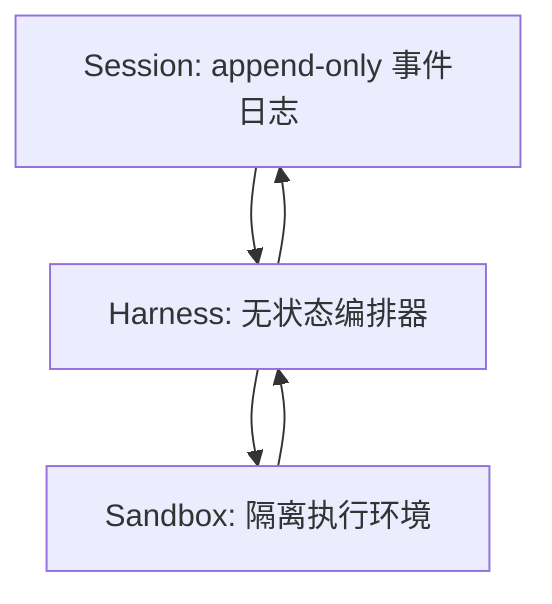
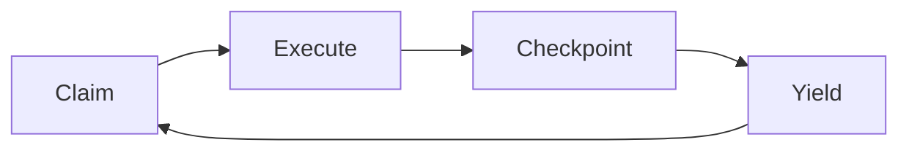

Harness 工程的核心不是“多包一层框架”，而是把 Agent 系统拆成可恢复、可替换、可审计的工程构件。它适合那些会运行很久、会调用真实工具、需要权限和审计的 Agent。

> 引句：“解耦大脑与双手。” 来源：《Claude Code Harness Engineering：从入门到实战》，p. 79。

## 为什么需要 Harness

传统 Agent 原型常把 LLM 调用、工具执行、状态管理放在同一进程里。这样做原型很快，但长任务会遇到三个问题：进程崩溃导致状态丢失，工具环境无法共享，工具调用散落各处导致审计困难。Harness 模式把状态、编排和执行拆开，降低这些系统性风险。来源：《Claude Code Harness Engineering：从入门到实战》，pp. 80-81。

## 三个核心构件

| 构件 | 责任 | 不应该做什么 | 工程价值 | 来源 |
| --- | --- | --- | --- | --- |
| Session | 记录用户消息、模型输出、工具调用、工具结果 | 不执行业务逻辑 | 可恢复、可回放、可审计 | 《Claude Code Harness Engineering：从入门到实战》，pp. 51-56；pp. 80-87 |
| Harness | 读取 Session，调用模型，路由工具，写回事件 | 不保存不可恢复的本地状态 | 可水平扩展、崩溃可重启 | 《Claude Code Harness Engineering：从入门到实战》，pp. 80-87 |
| Sandbox | 执行 Shell、文件、网络等真实动作 | 不保存长期身份和全局状态 | 隔离副作用、控制凭证和资源 | 《Claude Code Harness Engineering：从入门到实战》，pp. 43-50 |

Session 的设计要点是 append-only。用户消息、工具调用和工具结果都只追加不修改，这让 Session 能被序列化、迁移和回放，也让 Harness 不必把关键状态藏在内存里。来源：《Claude Code Harness Engineering：从入门到实战》，pp. 52-56。

Harness 的设计要点是无状态。它每次从 Session 日志重建当前上下文，决定下一步调用模型还是执行工具；进程崩溃后，新实例只要读取同一份 Session 日志就能继续。来源：《Claude Code Harness Engineering：从入门到实战》，pp. 80-87。

Sandbox 的设计要点是默认不信任。执行环境要做到文件系统、网络和进程隔离，凭证外置，资源限额明确；安全边界不依赖模型“会不会自觉”。来源：《Claude Code Harness Engineering：从入门到实战》，pp. 43-50。

## Session 是事实来源

把 Session 当成事件日志，而不是聊天历史。一个 Turn 可以包含用户输入、模型文本、工具调用、工具结果、错误和结束状态；事件日志把这些内容线性化为可重放序列。来源：《Claude Code Harness Engineering：从入门到实战》，pp. 52-55。

这会带来三个直接收益：

- 崩溃恢复：Harness 崩溃后从最后事件继续。
- 负载迁移：长任务可以迁移到另一个 Harness 实例。
- 调试复盘：失败任务可以通过回放 Session 复现行为轨迹。

来源：《Claude Code Harness Engineering：从入门到实战》，pp. 55-56。

## Sprint Contract 让长任务可接管

长任务不应该无限运行在一个进程里。Sprint Contract 把长任务拆成多个短 Sprint：Claim 当前进度，Execute 若干 Turn，Checkpoint 写入摘要，Yield 释放资源。只要每个 Sprint 幂等，下一个 Harness 实例就能从最近检查点继续。来源：《Claude Code Harness Engineering：从入门到实战》，pp. 81-87。

## 工具系统是 Harness 的手

工具注册表应该统一管理工具定义和执行。一个工具要声明名称、描述、input schema、handler、是否只读、是否可并发。Claude Code 的源码解析中也能看到类似结构：所有工具都经过查找、输入验证、前置 Hook、权限检查、执行、后置 Hook、结果格式化，再返回给模型。来源：《Claude Code Harness Engineering：从入门到实战》，pp. 119-125；《Demystifying Claude Code v1.8》，pp. 83-87。

| 工具属性 | 设计含义 | 为什么重要 |
| --- | --- | --- |
| `input_schema` | 限制模型生成的参数形状 | 减少幻觉参数和执行异常 |
| `is_read_only` | 标记是否会改变外部状态 | 决定权限、并发和审批 |
| `is_concurrency_safe` | 标记能否并行执行 | 避免两个写操作互相覆盖 |
| `timeout` | 限制工具运行时间 | 防止任务无限卡死 |
| `audit_event` | 记录输入、输出、决策 | 支撑复盘和合规 |

## 权限和沙箱要内建

Agent 安全不能事后补丁式添加。建议至少做四层：

1. 工具 schema：先阻止明显错误参数。
2. 权限策略：按工具、参数、路径、账号和风险级别决策。
3. Hook 或 policy：执行前后接入业务检查。
4. Sandbox：用隔离环境限制真实副作用。

Claude Code 的 Bash 工具案例说明，真正危险的不是 `spawn` 本身，而是围绕命令解析、危险模式检测、权限规则、沙箱、输出截断和超时的整套防护。来源：《Demystifying Claude Code v1.8》，pp. 88-94。

## 上下文工程是预算系统

上下文窗口是硬约束。《Claude Code Harness Engineering》估算，一个活跃编码 Agent 每轮可能消耗数千 token，复杂重构会很快逼近上限。因此需要压缩、记忆、缓存三类策略共同工作。来源：《Claude Code Harness Engineering：从入门到实战》，pp. 88-95。

| 策略 | 作用 | 适用场景 | 来源 |
| --- | --- | --- | --- |
| Compaction | 用摘要替换旧消息 | 长会话、接近窗口上限 | 《Claude Code Harness Engineering：从入门到实战》，pp. 89-95 |
| Memory Extraction | 把跨会话经验沉淀到长期记忆 | 用户偏好、项目约定、外部参考 | 《Claude Code Harness Engineering：从入门到实战》，pp. 96-106 |
| Prompt Cache | 复用稳定前缀 | 系统提示、工具定义、CLAUDE.md | 《Claude Code Harness Engineering：从入门到实战》，pp. 91-95 |
| Output Truncation | 控制工具输出进入上下文的体积 | 大日志、大搜索结果、大命令输出 | 《Demystifying Claude Code v1.8》，pp. 92-94；pp. 157-158 |

## 记忆要分类和限量

Claude Code Harness Engineering 提到四类记忆：User、Feedback、Project、Reference，并通过阈值触发后台提取，再由 autoDream 做整理。这个思路可以迁移为：只保存不能从代码和日志重新推导的内容，只注入与当前任务相关的少量记忆。来源：《Claude Code Harness Engineering：从入门到实战》，pp. 96-106。

## 多 Agent 需要 Coordinator

多 Agent 的关键不是“启动多个模型”，而是让 Coordinator 做计划、分配、综合，让 Worker 执行具体任务并汇报。写入型任务要通过 worktree、文件锁或串行调度避免冲突；只读任务才适合并行。来源：《Claude Code Harness Engineering：从入门到实战》，pp. 107-116；《Demystifying Claude Code v1.8》，pp. 150-154。

给 Worker 的 prompt 必须自包含：背景、目标、文件路径、禁止事项、输出格式都要写清楚。子 Agent 不知道主对话历史，也不知道其他 Agent 正在做什么。来源：《Claude Code Harness Engineering：从入门到实战》，p. 116。

## 可观测性是生产入口

Agent 生产化需要 Trace、Metrics、Logs 三层覆盖。Session 的 append-only 事件日志天然适合作为审计日志，能记录工具调用、权限决策、错误栈和成本数据。来源：《Claude Code Harness Engineering：从入门到实战》，pp. 145-149。

| 层面 | 记录内容 | 关键指标 |
| --- | --- | --- |
| Trace | LLM 调用、工具决策、Sandbox 执行、结果返回 | 每个 Turn 的完整链路 |
| Metrics | token、延迟、工具成功率、压缩频率、成本 | p95 延迟、预算消耗 |
| Logs | Session 事件、权限决策、错误栈 | 可审计、可回放 |

## 最小数据模型

落地 Harness 时，先把核心对象建清楚，比先选框架更重要：

| 对象 | 必要字段 | 说明 |
| --- | --- | --- |
| Session | `id`、`user_id`、`status`、`created_at`、`updated_at` | 一次可恢复任务或会话 |
| Event | `id`、`session_id`、`type`、`payload`、`created_at` | append-only 事件日志 |
| ToolCall | `id`、`tool_name`、`input`、`risk_level`、`status` | 模型生成的外部动作意图 |
| ToolResult | `tool_call_id`、`ok`、`output_ref`、`error` | 工具执行结果和错误语义 |
| Checkpoint | `session_id`、`summary`、`plan`、`open_questions` | 长任务恢复所需的压缩状态 |
| Artifact | `id`、`kind`、`uri`、`metadata` | 文档、diff、报告、截图等产物 |

这些对象不要求一开始都进入数据库，但应该在代码里有稳定结构。否则后续做回放、评测、权限和多 Agent 协作时会不断补字段、改历史数据。

## 落地顺序

建议按风险从低到高推进：

1. 先实现只读工具和 append-only Session。
2. 加入工具 schema、输入校验和统一错误 envelope。
3. 接入 trace，把模型调用、工具调用和成本串起来。
4. 为写入型工具增加审批、沙箱和回滚说明。
5. 引入 checkpoint，让长任务可以中断后恢复。
6. 最后再做多 Agent、分布式 worker 和复杂路由。

不要从“多 Agent 自治协作”开始。没有 Session、工具注册表、权限和 trace，多 Agent 只会放大不可复现的问题。

## 最小落地清单

1. 先做 append-only Session，而不是只保留最后一轮消息。
2. 工具统一走 registry、schema、权限和审计。
3. Shell、文件写入、部署、外部发送类工具默认需要审批。
4. 设计压缩阈值、工具输出截断和缓存稳定前缀。
5. 为长任务引入 checkpoint，并让 Harness 可重启。
6. 如果用多 Agent，先用 Coordinator 模式，不做自由聊天式协作。
7. 所有工具调用和权限决策进入结构化日志。

## 反查资料

- [下载《Claude Code Harness Engineering：从入门到实战》](/resources/books/harness-engineering-book.pdf)
- [下载《Demystifying Claude Code v1.8》](/resources/books/demystifying-claude-code-v1.8.pdf)
- [下载《智能体设计模式》](/resources/books/agentic-design-patterns-chinese.pdf)
