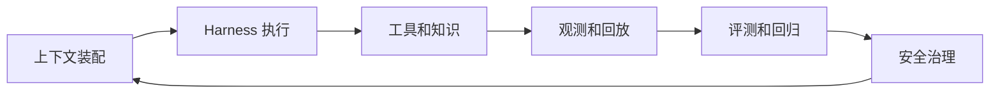

智能体能跑只是起点。真正进入工程阶段，需要把行为、成本、失败和权限都变得可观察、可回放、可约束。

## 阅读入口

| 主题 | 解决的问题 |
| --- | --- |
| [Harness 工程构件](/docs/practices/harness-engineering) | 用 Session、Harness、Sandbox 拆分状态、编排和执行边界。 |
| [上下文工程](/docs/practices/context-engineering) | 把任务背景、约束、工具结果和历史状态组织成稳定输入。 |
| [RAG 与知识系统](/docs/practices/rag-and-knowledge) | 处理外部知识的采集、切分、索引、召回、重排和引用。 |
| [可观测性与轨迹回放](/docs/practices/observability) | 记录 trace、日志、指标、错误和成本，让任务可以复盘。 |
| [评测与回归](/docs/practices/evaluation) | 用样例集、轨迹回放和指标看住 Agent 的质量变化。 |
| [安全、权限与人类接管](/docs/practices/safety-and-governance) | 管住工具权限、敏感信息、高风险动作和事故处理。 |

## 工程判断

上线前至少要确认：

1. 工具调用是否有输入 schema、权限和失败语义。
2. 长任务是否能恢复、回放和审计。
3. 输出质量是否有可重复的评测方式。
4. 高风险动作是否需要人工确认。
5. 外部知识是否有来源、更新时间和引用证据。

## 工程闭环

Agent 工程实践可以理解为一条闭环：

这条闭环里的每一环都在回答同一个问题：模型输出怎样从“看起来合理”变成“可执行、可验证、可恢复、可治理”。

## 成熟度分层

| 层级 | 特征 | 典型风险 |
| --- | --- | --- |
| Demo | 单轮 prompt、手工看结果 | 无法复现，失败难定位 |
| Prototype | 有工具、有简单状态、有人工操作 | 权限粗糙，成本和错误不可观测 |
| Beta | 有 trace、评测集、上下文压缩、审批 | 样例覆盖不足，发布回归风险高 |
| Production | 有灰度、告警、回放、审计、事故流程 | 需要持续治理和成本优化 |

本站第一阶段文档重点覆盖 Prototype 到 Beta：让读者能把“能跑”的 Agent 推进到“能维护”的 Agent。

## 交付清单

一个 Agent 功能准备交付前，至少应留下这些证据：

- 功能说明：目标、边界、用户路径、失败路径。
- 上下文策略：系统提示、状态摘要、证据注入、压缩规则。
- 工具清单：schema、权限、超时、错误码、是否需要人工确认。
- 观测字段：trace id、模型版本、token、工具调用、错误和成本。
- 评测结果：核心样例、失败样例、回归阈值。
- 安全记录：敏感数据处理、越权防护、事故回滚方案。

缺少这些证据时，Agent 功能即使演示成功，也不应被当作可维护交付。

## 参考来源

- [Claude Code Harness Engineering](/docs/resources/harness-engineering-book)：Session、Harness、Sandbox、上下文压缩和生产化实践。
- [Demystifying Claude Code v1.8](/docs/resources/demystifying-claude-code)：工具系统、Hook、MCP、Bash 安全和性能优化案例。
- [OpenTelemetry Documentation](https://opentelemetry.io/docs/)：trace、metrics、logs 的可观测性基础。
- [OWASP Top 10 for LLM Applications](https://owasp.org/www-project-top-10-for-large-language-model-applications/)：LLM 应用安全风险分类。
