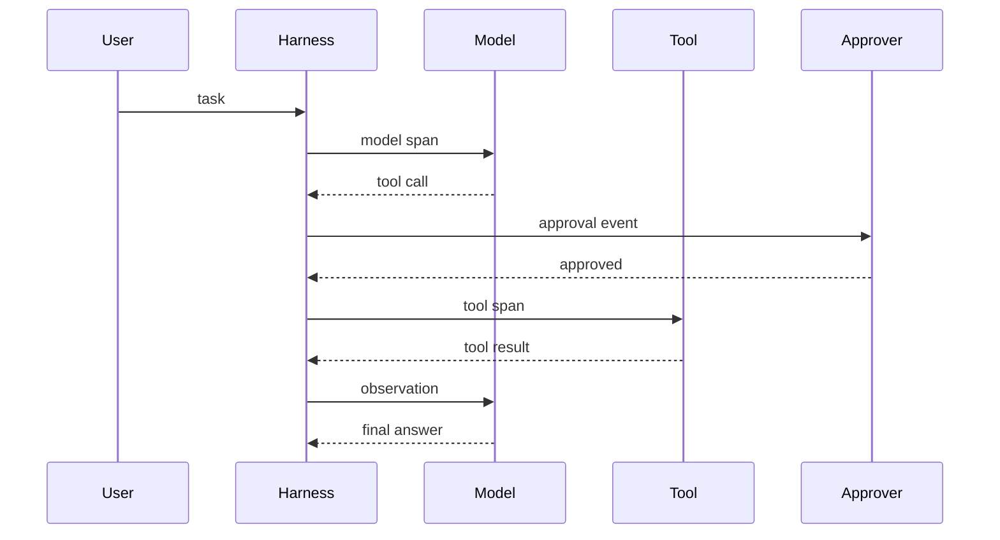

评测告诉我们质量是否变化，可观测性告诉我们一次具体任务为什么成功或失败。Agent 系统如果没有可观测性，线上失败通常只能靠猜：是模型没理解、上下文缺失、工具参数错、权限误判，还是外部系统返回异常。

普通软件的可观测性关注请求、数据库、缓存、队列和服务调用。Agent 系统还要额外记录模型输入输出、工具选择、权限决策、上下文压缩、人工接管和成本变化。

## 观察对象

一个 Agent 任务至少包含四类对象：

| 对象 | 需要观察什么 | 常见问题 |
| --- | --- | --- |
| 模型 | 输入、输出、stop reason、token、延迟、模型版本 | 格式漂移、上下文不足、成本异常 |
| 工具 | 工具名、参数、权限、耗时、结果、错误 | 参数错误、超时、越权、外部服务失败 |
| 状态 | plan、checkpoint、memory、artifact、任务状态 | 状态丢失、重复执行、恢复失败 |
| 人 | 审批、驳回、接管、反馈、标注 | 高风险动作缺确认、反馈无法进入改进循环 |

这些对象要能被串成同一个 trace。只看单条日志很难解释 Agent 为什么绕路、重试或误用工具。

## Trace 结构

推荐把一次用户任务建成一个 `trace`，每次模型调用、工具调用和人工动作是其中的 `span` 或事件。

建议字段：

| 字段 | 说明 |
| --- | --- |
| `trace_id` | 一次用户任务的全局 ID |
| `session_id` | 可恢复会话或事件日志 ID |
| `span_id` / `parent_span_id` | 串联模型、工具和子任务 |
| `actor` | user、agent、tool、system、human_reviewer |
| `event_type` | message、model_call、tool_call、approval、checkpoint、error |
| `input_ref` / `output_ref` | 大输入输出的存储引用，避免日志过大 |
| `model` / `tool_name` | 具体模型或工具 |
| `token_usage` / `cost` | 输入、输出、缓存和费用估算 |
| `status` | started、succeeded、failed、cancelled、blocked |
| `risk_level` | read、write、delete、deploy、sensitive |

敏感内容不一定要直接写入日志，但必须留下可审计引用。否则事故复盘时会丢失关键证据。

## 日志分层

日志不要只有一份大 JSON。更稳妥的做法是分层：

| 层 | 内容 | 用途 |
| --- | --- | --- |
| 业务日志 | 用户任务、业务对象、交付物 | 判断任务是否达成 |
| 模型日志 | prompt 摘要、模型版本、token、stop reason | 定位模型行为 |
| 工具日志 | 工具参数、权限、返回、超时、重试 | 定位外部动作 |
| 系统日志 | worker、队列、沙箱、网络、存储 | 定位基础设施 |
| 安全审计日志 | 高风险动作、敏感数据访问、审批 | 合规和事故复盘 |

日志需要可关联。每一层都至少带上 `trace_id`、`session_id`、`span_id` 和时间戳。

## 核心指标

Agent 指标要同时看质量、效率和风险：

| 指标 | 解释 |
| --- | --- |
| 任务成功率 | 用户目标是否完成，不等于模型是否输出答案 |
| 首次成功率 | 不靠人工修复、不靠多次重试的成功比例 |
| 工具调用成功率 | 工具参数合法、权限通过、执行成功的比例 |
| 平均轮数 / p95 轮数 | 多步任务是否失控 |
| token 与成本 | 输入、输出、缓存命中和外部 API 成本 |
| 人工接管率 | 任务需要人介入的比例 |
| 高风险动作拦截率 | 安全策略是否真的触发 |
| 回归失败数 | 新版本相对固定样例集的质量变化 |

不要只看平均值。Agent 线上问题通常藏在长尾：极长任务、极大上下文、罕见工具错误和少数高风险用户路径。

## 轨迹回放

轨迹回放不是把日志按时间倒出来。一个可用的回放界面应该帮助工程师回答：

1. 用户最初要什么。
2. Agent 看到哪些上下文。
3. Agent 为什么选择这个工具。
4. 工具真实返回了什么。
5. 权限策略是否放行。
6. 失败发生在哪个 span。
7. 如果重跑，哪些输入必须固定。

回放视图可以包含 timeline、span 树、工具 I/O、diff、成本曲线、错误聚合和人工标注。对 Coding Agent 来说，还应该保留文件 diff、命令输出、测试结果和 commit 信息。

## 错误归因

失败不要只标记为 “LLM failed”。至少拆成以下类型：

| 类型 | 示例 |
| --- | --- |
| 上下文问题 | 缺少文件、旧摘要误导、检索结果不相关 |
| 模型问题 | 不遵守格式、选错工具、推理路径错误 |
| 工具问题 | schema 不清、超时、返回结构不稳定 |
| 权限问题 | 误拦截、误放行、审批链路太慢 |
| 状态问题 | checkpoint 丢失、重复执行、恢复后计划漂移 |
| 外部系统问题 | 第三方 API、网络、数据库、浏览器页面变化 |

只有错误类型足够细，评测和修复才会有效。否则团队会把所有问题都归因到“换个更强模型”。

## 成本观测

Agent 成本不只是模型 token。还包括：

- 模型输入、输出和缓存费用。
- 检索、重排、向量数据库和外部 API。
- 沙箱、浏览器、worker、队列和存储。
- 人工审批、人工标注和事故处理。

建议在 trace 中记录 `estimated_cost`，并按用户、任务类型、模型、工具和版本聚合。成本异常通常意味着上下文膨胀、工具循环或路由策略失效。

## 最小落地方案

原型阶段可以先做四件事：

1. 给每个任务生成 `trace_id`，贯穿模型、工具和日志。
2. 每次模型调用记录模型名、输入摘要、输出摘要、token 和 stop reason。
3. 每次工具调用记录工具名、参数摘要、权限结果、耗时和错误。
4. 把失败任务保存成可重跑样例，进入 [评测与回归](/docs/practices/evaluation)。

## 发布前检查

- 线上任务是否都有 trace id。
- 高风险工具调用是否能在审计日志中找到审批记录。
- 模型版本、工具版本和 prompt 版本是否能追踪。
- 失败任务是否能导出为评测样例。
- token 和成本是否有预算、告警和趋势图。
- 日志是否脱敏，敏感字段是否有访问控制。

## 延伸阅读

- [评测与回归](/docs/practices/evaluation)：把失败轨迹变成可重复样例。
- [上下文工程](/docs/practices/context-engineering)：观察上下文选择和压缩是否正确。
- [安全、权限与人类接管](/docs/practices/safety-and-governance)：审计高风险动作和人工接管。
