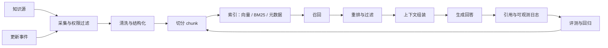

RAG（Retrieval-Augmented Generation，检索增强生成）不是“给模型接一个向量库”这么简单。它是一套让 Agent 在回答前检索外部知识、把证据带入上下文、生成可追溯回答，并持续处理知识更新的工程系统。

好的 RAG 系统要同时回答三个问题：

1. 该从哪里取可信知识？
2. 该把哪些片段交给模型？
3. 该如何证明回答来自这些片段，而不是模型临场编造？

## 定义与边界

RAG 的核心边界是：把可更新、可审计、可引用的外部知识放在模型上下文之外，在需要时检索并注入上下文。它补充模型参数中的通用知识，但不等同于训练、微调或完整知识图谱。

| 概念 | 解决的问题 | 不适合承担的职责 |
| --- | --- | --- |
| RAG | 让模型基于外部资料回答，并保留来源 | 替代权限系统、替代人工审批、保证所有事实永远正确 |
| 微调 | 改变模型行为风格、输出格式或稳定技能 | 高频更新的事实库、长尾内部文档检索 |
| 工具调用 | 查询实时系统、执行动作、读写业务状态 | 承载大量非结构化背景材料 |
| 知识图谱 | 表达实体、关系、规则和推理链路 | 直接替代自然语言文档证据 |
| 长上下文 | 临时塞入大量材料，减少检索复杂度 | 解决权限、freshness、证据定位和成本控制 |

在 Agent 系统里，RAG 更像“证据供应链”：它从知识源开始，到用户看到带引用的回答结束。只要其中任何一环没有记录来源、版本和处理方式，系统就很难排查错误。

## 工程流程

一个可维护的 RAG pipeline 通常分成离线知识处理、在线检索生成、质量评估和更新治理四层。



### 1. 采集与权限过滤

先明确知识源的权威等级，而不是把所有文档直接入库。常见来源包括产品文档、工单、代码仓库、数据库导出、PDF、会议纪要、网页和人工维护的 FAQ。

采集阶段至少记录：

- `source_id`：稳定来源标识。
- `source_type`：网页、PDF、代码、表格、数据库记录等。
- `owner`：资料负责人或系统。
- `acl`：可见范围，避免检索时越权泄露。
- `version` / `updated_at`：用于判断 freshness。
- `canonical_url`：用户能打开或系统能追溯的来源地址。

### 2. 清洗与结构化

清洗不是把文本“弄干净”就完事。它要保留标题层级、表格、代码块、页码、行号、章节路径和时间戳。很多 RAG 误答来自清洗阶段丢掉了上下文，例如表格列名、警告块、代码注释或“本规则仅适用于旧版本”。

推荐做法：

- HTML 保留 `h1` 到 `h6` 的章节路径。
- PDF 保留页码、段落顺序和表格边界。
- 代码保留文件路径、符号名、起止行号。
- 表格按行记录字段名，不要只拼成无列名纯文本。
- 对重复页眉、页脚、导航和版权声明做去噪。

### 3. 切分 chunk

Chunk 的目标不是平均切 token，而是让每个片段在被单独召回时仍然可理解、可引用、可合并。切分策略应该随材料类型变化。

| 材料类型 | 推荐切分方式 | 关键元数据 |
| --- | --- | --- |
| 产品文档 | 按标题层级和段落切分，必要时带父标题摘要 | 章节路径、URL、更新时间 |
| API 文档 | 一个 endpoint、参数表或返回结构为单元 | 方法、路径、版本、语言 |
| 代码 | 按文件、类、函数、相邻注释切分 | repo、commit、path、line_start、line_end |
| 工单 / 对话 | 按问题、结论、操作记录切分 | 时间、参与人、状态、系统 |
| 表格 | 按行或业务实体切分，字段名随内容一起进入文本 | sheet、row_id、字段名 |

一个常用原则是：chunk 可以重叠，但引用不能含糊。重叠内容用于提升召回，最终展示引用时仍应指向原文的明确位置。

### 4. 索引与召回

RAG 检索通常不只用一种方式：

- 向量检索：适合语义相近但措辞不同的问题。
- BM25 / 关键词检索：适合版本号、错误码、函数名、产品名、精确术语。
- 混合检索：把语义召回和关键词召回合并，提升稳定性。
- 元数据过滤：按权限、时间、产品线、语言、版本过滤。
- Query rewrite：把用户问题改写成更适合检索的查询。
- Multi-query：为同一问题生成多个检索角度，覆盖别名和近义表达。

工程上通常先做宽召回，再做重排。召回阶段追求不要漏，重排阶段再判断哪些片段真正能支撑答案。

### 5. 重排、过滤与上下文组装

重排模型或规则应该关注“是否能回答这个问题”，而不只是文本相似度。进入模型上下文前，还要过滤掉低分、过期、权限不匹配、互相冲突或来源质量较低的片段。

上下文组装时建议显式区分：

- 用户问题。
- 检索到的证据片段。
- 每个片段的来源、时间和可信等级。
- 回答规则，例如“没有证据时说明缺失，不要猜测”。
- 引用格式，例如 `[source:doc-17#L20-L35]`。

### 6. 生成、引用与日志

生成阶段要让模型知道：答案必须由证据支持，无法从证据推出的内容要标注不确定或拒答。引用不应该在生成后靠字符串匹配补上，而应该从上下文中的 source metadata 传递到最终答案。

日志至少记录：

- 原始问题和改写后的 query。
- 召回结果、分数和过滤原因。
- 最终注入上下文的片段。
- 模型输出和引用列表。
- 用户反馈、人工修正和失败标签。

这些日志是后续调参、回归测试和问题复盘的基础。

## 关键例子

### 文档切分结构

下面是一个面向产品文档的 chunk 结构。重点是同时保存“可检索文本”和“可追溯引用”。

```json title="knowledge-chunk.json"
{
  "chunk_id": "billing-docs:v3:refund-policy:002",
  "source_id": "billing-docs",
  "title": "退款规则",
  "section_path": ["计费", "退款", "退款规则"],
  "text": "企业版客户可在订单创建后 7 天内申请退款。已使用的增值服务费用不退还。",
  "canonical_url": "https://example.com/docs/billing/refund",
  "updated_at": "2026-05-18T10:20:00+08:00",
  "line_start": 42,
  "line_end": 45,
  "acl": ["support", "sales", "admin"],
  "metadata": {
    "product": "billing",
    "version": "v3",
    "language": "zh-CN"
  }
}
```

### 检索配置示例

```ts title="retrieval-policy.ts"
export const retrievalPolicy = {
  queryRewrite: true,
  recall: {
    vectorTopK: 40,
    keywordTopK: 20,
    metadataFilters: ["acl", "product", "version", "language"],
  },
  rerank: {
    topK: 8,
    minScore: 0.62,
  },
  context: {
    maxChunks: 6,
    maxTokens: 3500,
    requireCitation: true,
    preferFreshWithinDays: 90,
  },
};
```

### 回答引用示例

用户问：“企业版订单超过一周还能退款吗？”

好回答：

> 根据当前计费文档，企业版客户只能在订单创建后 7 天内申请退款；超过一周通常不符合退款窗口。已使用的增值服务费用也不退还。  
> 来源：计费 / 退款 / 退款规则，2026-05-18，`billing-docs:v3:refund-policy:002`

坏回答：

> 一般来说企业版可以联系客服特殊处理。

坏回答的问题是：它可能符合客服经验，但没有来自当前证据的支持。如果确实存在人工特批流程，应检索到相应 SOP 后再回答。

## 常见坑

### 把向量库当成完整 RAG

向量库只解决“相似片段查找”的一部分问题。没有清洗、权限、重排、引用、日志和更新机制，系统上线后很难解释为什么答错。

### Chunk 太碎或太大

太碎会丢掉标题、条件和例外；太大会让召回分数变钝，并浪费上下文窗口。切分后要抽样检查：单个 chunk 是否能独立回答一个小问题，多个 chunk 是否能组合回答复杂问题。

### 只评估最终回答，不评估召回

如果没有单独评估召回命中率和引用正确率，生成模型可能用“看起来合理”的语言掩盖检索失败。RAG 评测至少要拆成检索、重排、生成和引用四段。

### 忽略权限和多租户

检索前后都要做权限过滤。只在最终展示层过滤是不够的，因为模型可能已经在上下文里看到了不该看的片段。

### Freshness 没有产品语义

不是所有资料都按时间越新越好。法规、合同、版本化 API 和历史工单都可能需要按适用范围选择知识。更新策略要同时考虑发布时间、版本、状态和业务生效范围。

### 引用不可打开或不可定位

“来源：内部文档”不是合格引用。用户或审核系统应能定位到 URL、页码、行号、章节或记录 ID。否则引用无法支撑信任。

### 让模型自己判断冲突事实

当多个来源冲突时，系统应该提供来源优先级、时间规则或人工仲裁机制。不要只把冲突片段全部塞给模型，让它自由选择。

## 检查清单

上线前可以用下面的清单做一次最小审查。

### 知识源

- 是否列出了所有知识源、负责人和更新方式？
- 是否区分权威来源、辅助来源和过期来源？
- 是否记录了 `source_id`、版本、更新时间和 canonical URL？
- 是否能从最终答案反查到原始材料？

### 切分与索引

- Chunk 是否保留标题、表格字段、代码路径、页码或行号？
- 是否针对不同材料类型使用不同切分策略？
- 是否同时支持语义检索和关键词检索？
- 是否有元数据过滤，例如权限、版本、语言、产品线？

### 检索与生成

- 是否记录 query rewrite、召回分数、重排分数和过滤原因？
- 是否有“召回为空”或“证据不足”的回答策略？
- 是否限制模型只能基于证据回答事实问题？
- 是否在答案中展示可定位引用？

### 评测与回归

- 是否有覆盖高频问题、长尾问题、反例问题和权限问题的测试集？
- 是否分别评估召回命中率、引用准确率、答案正确率和拒答质量？
- 是否保存失败样例，并能在改索引、改 prompt、换模型后回归？
- 是否有人审流程处理冲突事实和高风险回答？

### 运维与治理

- 是否有增量更新、全量重建和回滚方案？
- 是否监控索引延迟、检索耗时、空召回率和引用缺失率？
- 是否能删除、下线或更正错误知识？
- 是否有敏感信息脱敏和访问审计？

## 延伸阅读与来源

- [Retrieval-Augmented Generation for Knowledge-Intensive NLP Tasks](https://arxiv.org/abs/2005.11401)：RAG 经典论文，提出把参数化模型与外部非参数记忆结合。
- [OpenAI Cookbook: Question answering using embeddings](https://cookbook.openai.com/examples/question_answering_using_embeddings)：使用 embeddings 做问答检索的工程示例。
- [OpenAI Cookbook: Retrieval augmented generation with a vector database](https://cookbook.openai.com/examples/vector_databases/readme)：向量数据库与 RAG 示例集合。
- [LlamaIndex Docs: Evaluation](https://docs.llamaindex.ai/en/stable/module_guides/evaluating/)：检索和生成质量评估方法。
- [LangChain Docs: Retrieval](https://python.langchain.com/docs/concepts/retrieval/)：检索组件、retriever 和 RAG 应用结构说明。
- [NIST AI Risk Management Framework](https://www.nist.gov/itl/ai-risk-management-framework)：用于思考 AI 系统治理、风险管理和可审计性的通用框架。
