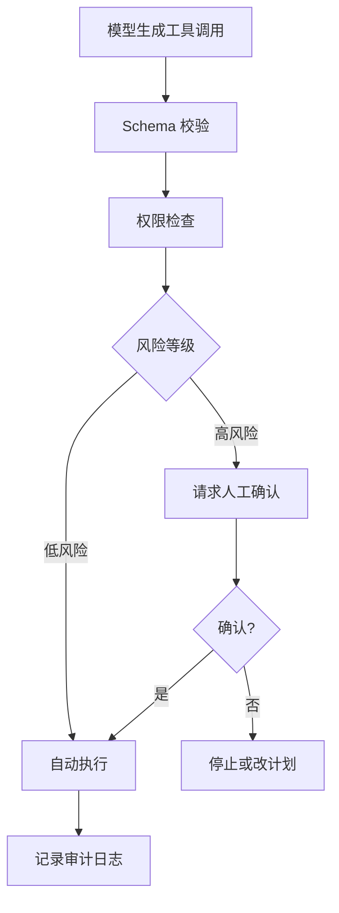

这个页面用于承载 Agent 安全和治理。Agent 一旦能调用工具，风险就不再只是回答错误，而是可能产生真实外部动作。

## 建设边界

- 权限分级：只读、建议、可写、可删除、可部署、可访问敏感数据。
- Human-in-the-loop：低风险自动执行，高风险人工批准，异常情况人工接管。
- 沙箱边界：文件系统、Shell、浏览器、网络、容器、远程节点。
- 攻击面：Prompt Injection、Tool Injection、Data Exfiltration、越权操作。
- 敏感信息：密钥、cookie、账号、个人信息、业务数据、日志脱敏。
- 事故处理：冻结、回滚、通知、审计、复盘。

## 权限分级

| 等级 | 示例 | 默认策略 |
| --- | --- | --- |
| Read | 读文件、查文档、检索、列目录 | 自动执行，记录 trace |
| Suggest | 生成方案、生成 diff、写草稿 | 自动执行，但不产生外部副作用 |
| Write | 修改文件、写数据库草稿、创建 issue | 需要明确任务授权和可回滚记录 |
| Destructive | 删除、覆盖、批量修改、重置状态 | 默认人工确认 |
| External Side Effect | 发邮件、转账、部署、推送、调用生产 API | 人工确认、审计、必要时双人审批 |
| Sensitive Access | 密钥、cookie、个人信息、业务机密 | 最小授权、脱敏、访问留痕 |

权限不要只写进提示词。提示词可以告诉模型“不要做”，但真正的控制必须在工具层和执行环境里。

## 审批流程

人工确认页应展示工具名、参数、目标资源、预期副作用、回滚方式和来源证据，而不是只问“是否继续”。

## Prompt Injection 与工具风险

OWASP LLM Top 10 把 Prompt Injection、敏感信息泄露、供应链、输出处理不当、过度代理等列为生成式 AI 应用的重要风险。Agent 场景里最危险的是模型能调用工具：恶意网页、文档或工具返回可能试图覆盖系统指令、窃取数据或触发越权动作。

防护思路：

- 外部内容进入上下文时标注来源和可信级别。
- 工具返回内容不能提升自身权限，也不能改写系统规则。
- 高风险工具必须经过权限检查和人工确认。
- 模型输出进入下游系统前要做编码、校验和脱敏。
- 审计日志要能还原恶意输入、模型决策和工具动作。

## 敏感信息处理

| 数据类型 | 风险 | 处理方式 |
| --- | --- | --- |
| API key / token | 被模型输出、日志保存或发送给外部服务 | 运行时注入、脱敏显示、禁止入库 |
| Cookie / Session | 账号接管 | 浏览器隔离、最小权限、操作审计 |
| 个人信息 | 合规和隐私风险 | 数据最小化、脱敏、访问记录 |
| 业务机密 | 商业泄露 | 权限分组、检索过滤、水印或审计 |
| 生产日志 | 包含隐私、密钥、内部路径 | 采集前清洗，回放时按权限展示 |

不要把密钥、cookie、完整用户数据写入长期记忆或公开 trace。

## 事故处理

Agent 事故处理至少包括：

1. 冻结：暂停相关工具、模型路由或自动执行权限。
2. 定位：拉取 trace、审计日志、模型版本、prompt version 和工具输入输出。
3. 控制损失：回滚代码、撤销外部动作、通知受影响用户。
4. 修复：补权限、补 schema、补评测样例、补监控。
5. 复盘：记录触发条件、遗漏防线、下次如何提前发现。

事故复盘不要只写“模型不稳定”。要定位是哪条防线没有发挥作用。

## 高风险工具检查清单

- 是否有明确的风险等级和权限声明。
- 是否展示完整参数、目标资源和副作用。
- 是否需要人工确认，确认记录是否进入审计日志。
- 是否有 dry-run、preview 或 diff 模式。
- 是否有超时、幂等、重试限制和回滚方案。
- 是否阻止外部内容直接影响高风险参数。
- 是否有异常调用告警。

## 延伸阅读

- [OWASP Top 10 for LLM Applications](https://owasp.org/www-project-top-10-for-large-language-model-applications/)：生成式 AI 应用风险分类。
- [LLM01:2025 Prompt Injection](https://genai.owasp.org/llmrisk/llm01-prompt-injection/)：Prompt Injection 风险说明。
- [可观测性与轨迹回放](/docs/practices/observability)：安全审计和事故复盘依赖 trace。
- [结构化输出与工具调用](/docs/model-basics/structured-output)：工具调用前后的校验边界。
