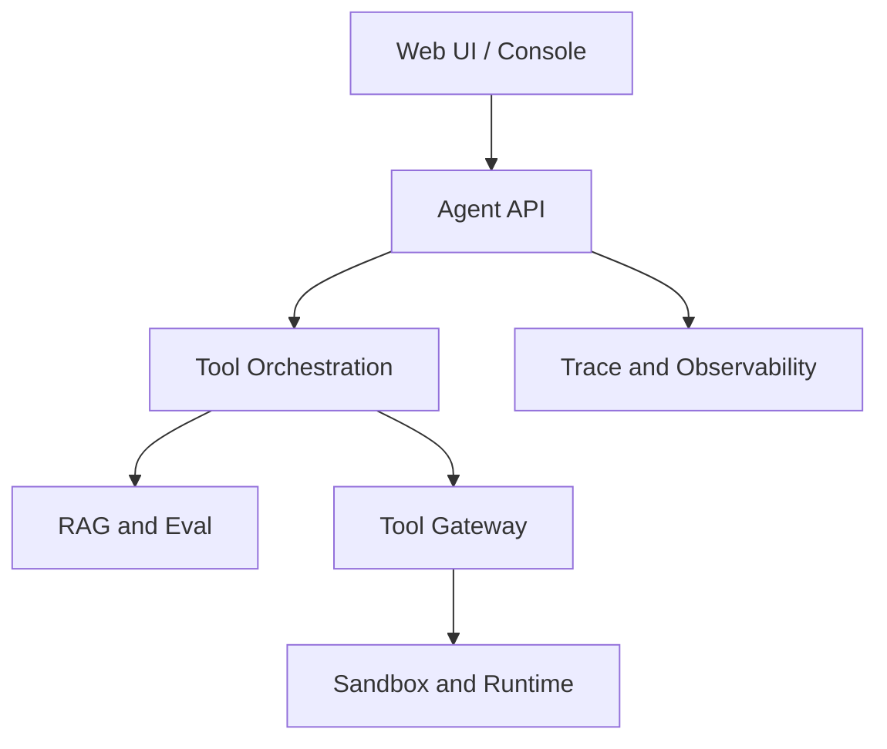

这个板块不做普通语法教程，而是回答一个更工程化的问题：做 AI Agent 项目时，不同语言分别该学到什么程度、放在什么系统边界里、什么时候不该用它。

一个真正能落地的 Agent 系统通常不只有“模型调用”这一层。它会同时包含用户界面、流式输出、工具调用、记忆、RAG、评测、任务调度、队列、节点控制、沙箱、CLI、可观测性和部署脚本。把这些都塞进一种语言不是不可能，但通常会让系统边界变得模糊。更稳妥的方式是：用合适的语言承载合适的层。

## 学习优先级

| 优先级 | 语言 | 为什么重要 |
| --- | --- | --- |
| 1 | [TypeScript](/docs/programming-languages/typescript) | Agent 产品、Web UI、工具编排、SDK 集成、Vercel AI SDK、Mastra、MCP client/server 都高度依赖 TypeScript 生态。 |
| 2 | [Node.js 与 TypeScript 生态](/docs/programming-languages/nodejs-ecosystem) | TypeScript 落地 Agent 产品离不开 Node.js runtime、包管理器、CLI/TUI、MCP、AI SDK 和框架生态。 |
| 3 | [Python](/docs/programming-languages/python) | 模型实验、RAG、数据处理、评测、notebook、LangGraph、LlamaIndex、AutoGen、CrewAI 等生态更成熟。 |
| 4 | [Go](/docs/programming-languages/go) | 适合 AI infra 中的服务端、任务调度、队列、网关、爬虫调度、节点控制面和高并发工具服务。 |
| 5 | [Rust](/docs/programming-languages/rust) | 适合 sandbox、runtime、CLI、解析器、高性能安全边界、跨平台本地工具和底层组件。 |

## 推荐阅读顺序

1. 先读 [语言选型方法](/docs/programming-languages/language-selection)，建立“系统边界优先”的判断方式。
2. 读 [TypeScript](/docs/programming-languages/typescript)，理解类型系统如何把工具、消息、状态和接口变成契约。
3. 读 [Node.js 与 TypeScript 生态](/docs/programming-languages/nodejs-ecosystem)，理解运行时、包管理、Agent 框架、MCP、CLI/TUI 如何组合成产品工程。
4. 读 [Python](/docs/programming-languages/python)，掌握 RAG、评测、数据处理和模型实验的常见工程边界。
5. 按 infra 需要读 [Go](/docs/programming-languages/go) 和 [Rust](/docs/programming-languages/rust)：Go 更适合控制面和高并发服务，Rust 更适合安全边界和本地运行时。

## 系统层与语言

| 系统层 | 默认语言 | 学习目标 |
| --- | --- | --- |
| Agent 产品 UI | TypeScript | 能写 React/Next.js、流式 UI、工具调用展示、人工确认、trace viewer。 |
| Agent 编排与产品后端 | TypeScript 优先 | 能定义 tool schema、message state、server action/API route、MCP client/server。 |
| RAG、数据与评测 | Python 优先 | 能处理文档、embedding、rerank、评测集、LLM-as-Judge 和批处理脚本。 |
| 工具服务与调度控制面 | Go | 能写稳定的 HTTP/gRPC 服务、worker、队列消费、节点健康检查和限流。 |
| Sandbox、CLI、runtime | Rust | 能写安全、快、可分发的本地工具、执行器、解析器和隔离边界。 |

## 本板块的写法

每个语言页都按同一条线展开：先说明它在 Agent 工程中的位置，再讲基础特性、高级特性、工程生态、适用边界和延伸阅读。目标不是让读者背语法，而是让读者能读懂开源 Agent 项目、拆清系统边界、写出可维护的第一版实现。

内容主要参考各语言和工具的官方文档，包括 [TypeScript Handbook](https://www.typescriptlang.org/docs/handbook/intro.html)、[Node.js Learn](https://nodejs.org/learn)、[Python Tutorial](https://docs.python.org/3/tutorial/index.html)、[Go Documentation](https://go.dev/doc/) 和 [The Rust Programming Language](https://doc.rust-lang.org/book/)。

## 语言不是能力替代品

语言选型不能替代系统设计。Agent 项目里经常出现两种误判：

- 以为换成某种语言，工具调用、状态管理、评测和权限问题就会自动解决。
- 以为一种语言能覆盖所有层，于是把 UI、RAG、调度、沙箱和批处理都写进同一个运行时。

更稳妥的做法是先划清系统边界，再决定每个边界用什么语言。语言只是承载边界的工具，真正需要被设计的是数据契约、失败语义、部署方式和可观测性。

## 推荐架构切分

| 模块 | 推荐语言 | 原因 |
| --- | --- | --- |
| Web UI / Console | TypeScript | React、Next.js、流式 UI、状态展示和用户确认体验成熟。 |
| Agent API / 编排 | TypeScript | 与 UI、SDK、工具 schema 和 MCP 生态衔接紧密。 |
| RAG and Eval | Python | 文档处理、向量检索、评测和数据分析生态完整。 |
| Tool Gateway | Go | HTTP/gRPC、并发、限流、超时、部署和运维成本低。 |
| Sandbox and Runtime | Rust | 本地执行、安全边界、解析器、CLI 和跨平台分发更可靠。 |
| Trace and Observability | TypeScript / Go | 产品侧展示用 TypeScript，采集和服务端管道可用 Go。 |

这不是强制组合，而是一个默认起点。小项目可以只用 TypeScript 或 Python；只有当边界变复杂时，才需要引入 Go 或 Rust。

## 入门路线

1. 用 TypeScript 写一个最小 Agent 产品：聊天界面、工具调用卡片、人工确认、trace 展示。
2. 用 Python 写一个离线 RAG 或评测脚本：从文档解析到检索、生成报告。
3. 用 Go 写一个只读工具服务：HTTP API、超时、错误码、日志和指标。
4. 用 Rust 写一个本地 CLI：读取文件、解析输入、输出结构化 JSON。
5. 把四者通过明确协议连接，而不是共享隐式全局状态。

如果只能先学一门，优先 TypeScript；如果目标是研究和评测，优先 Python；如果已经在做 infra，再补 Go 和 Rust。

## 评审清单

- 这个模块的主要风险是 UI 状态、模型实验、并发服务还是安全边界。
- 语言选择是否匹配团队已有能力和部署环境。
- 是否有跨语言数据契约，例如 JSON Schema、OpenAPI、protobuf 或事件格式。
- 是否能在本地和 CI 中分别测试每个语言模块。
- 是否避免让 TypeScript 调 Python、Python 调 Go、Go 调 Rust 形成不可维护的环形依赖。
- 是否为跨语言错误定义统一语义，而不是各层随意抛异常或打印文本。

## 参考来源

- [TypeScript Handbook](https://www.typescriptlang.org/docs/handbook/intro.html)
- [Node.js Learn](https://nodejs.org/learn)
- [Python Tutorial](https://docs.python.org/3/tutorial/index.html)
- [Go Documentation](https://go.dev/doc/)
- [The Rust Programming Language](https://doc.rust-lang.org/book/)
